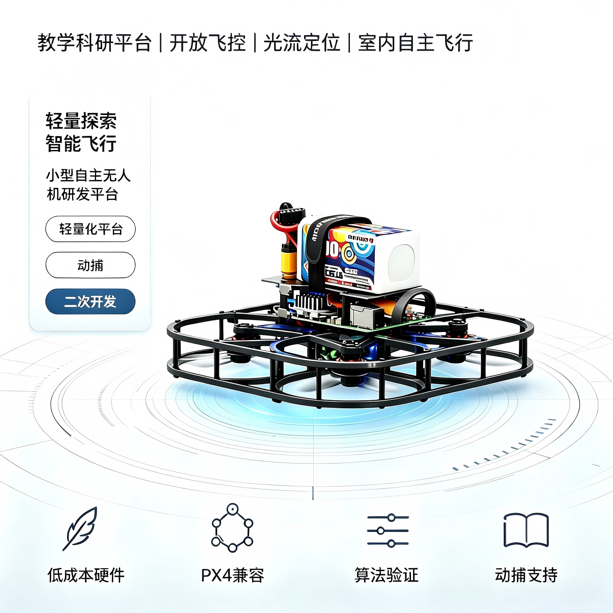

# 非凸\-lite介绍

非凸\-lite 是一款高度集成的智能化飞行平台，采用安全可靠的包围式纯碳纤机身设计。它将强大的动力系统、一体式飞控、高算力机载电脑、高精度动捕系统完美融合，并在其上深度适配了ArduPilot / PX4 开源飞控固件，兼顾稳定飞行性能与高精度定位能力，适配室内精准飞行、轨迹复现等各类智能飞行场景。

### 核心硬件：

- 机身与动力： 138mm 圈圈式纯碳纤机架（设计开源），搭配 3\.5 寸无刷动力系统

- 飞行控制： H743v2\-AIO 飞控电调一体板

- 机载计算： 香橙派 4 高算力微型机载电脑（配备专用电源板）

- 感知系统：MTF\-02P 光流测距一体传感器

- 通信链路： Radiomaster T8L遥数一体数据链路

- 动捕定位系统：适配高精度光学动作捕捉模块，支持主流动捕基站联动，可实现厘米级实时位置、姿态数据输出，能够精准修正飞行姿态、锁定飞行坐标，有效弥补传统光流、GPS定位的误差缺陷，满足室内无GPS环境、高精度定点悬停、精准轨迹飞行、编队飞行等场景需求，可无缝对接飞控与机载电脑完成数据融合。

### 软件生态：

- 底层控制： ArduPilot / PX4 开源飞控固件，支持动捕数据接入与融合适配

- 运动规划： 搭载 PX4 CTRL 运动控制算法，深度适配PX4原生控制逻辑，可依托动捕高精度定位数据，完成高精度姿态解算、轨迹跟踪与闭环控制，实现稳定精准的自主路径规划、动态避障与飞行轨迹复现，适配各类高精度智能飞行控制场景。
