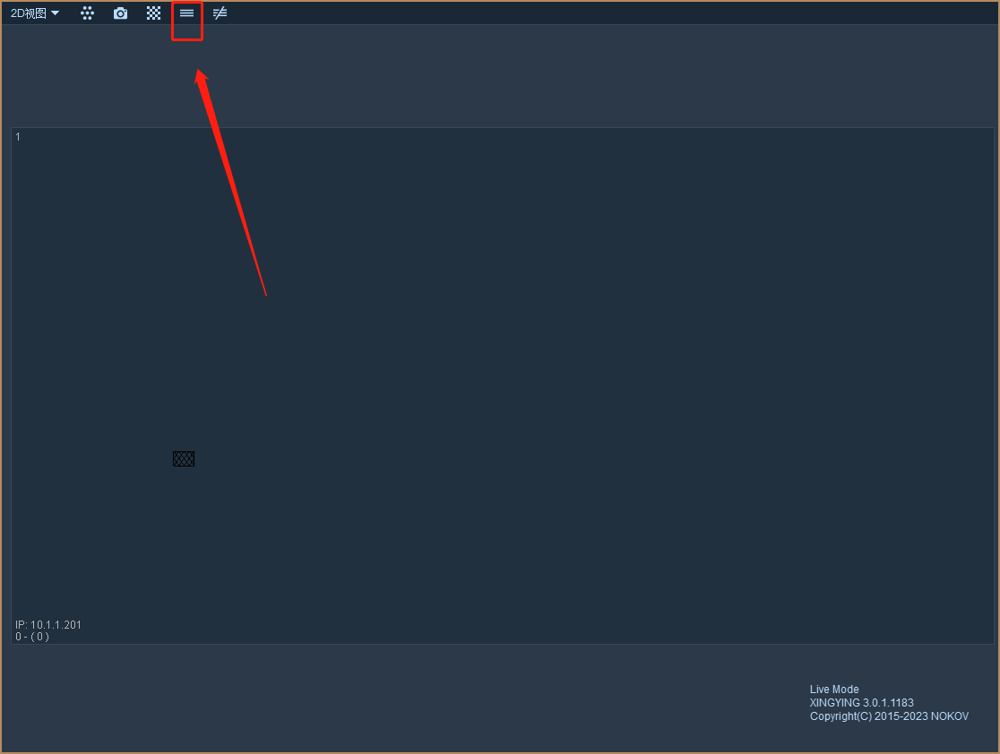
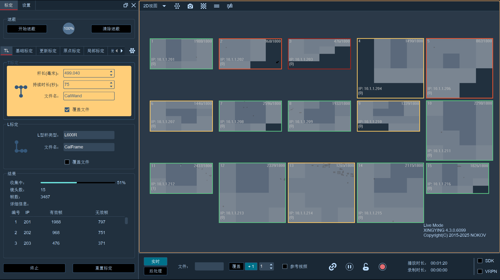
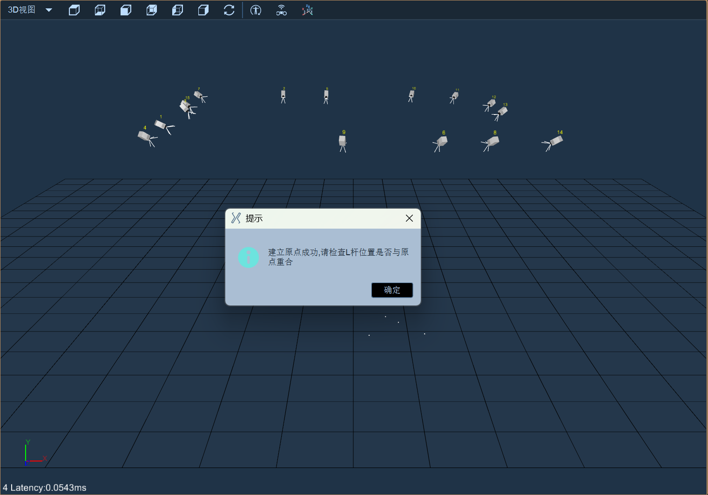
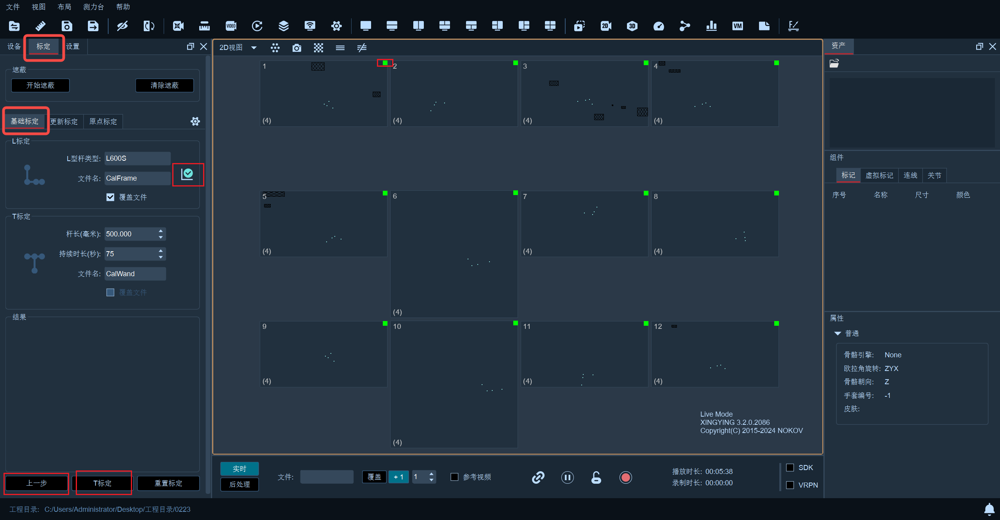
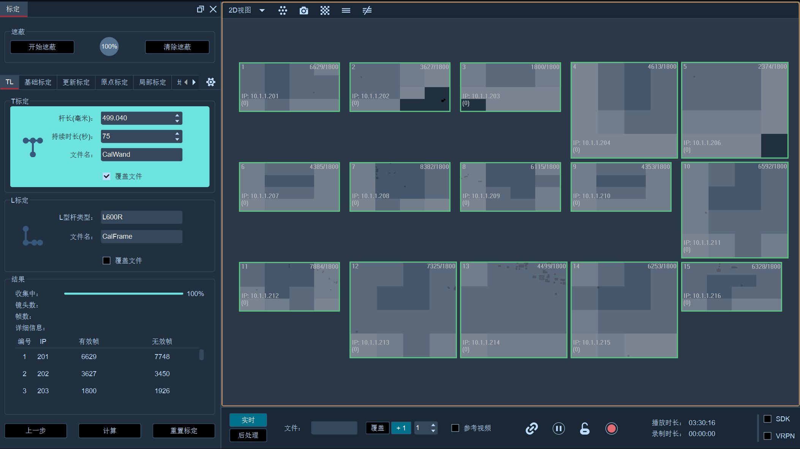
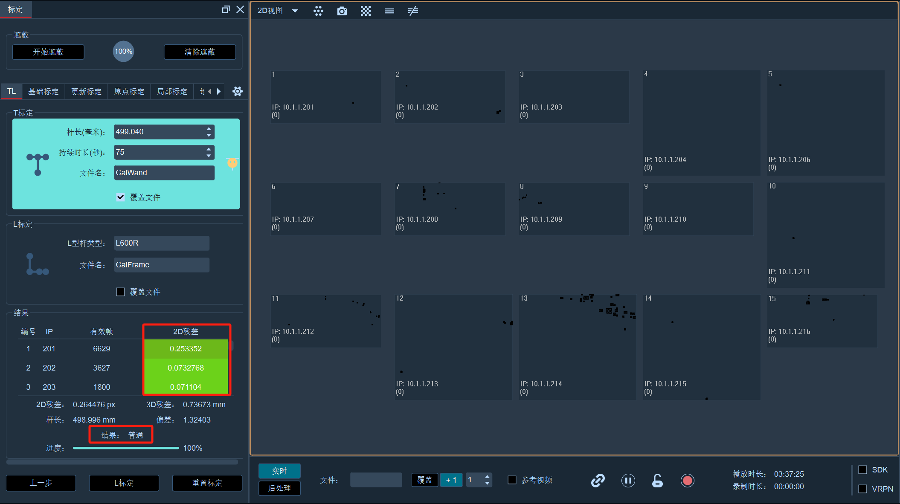
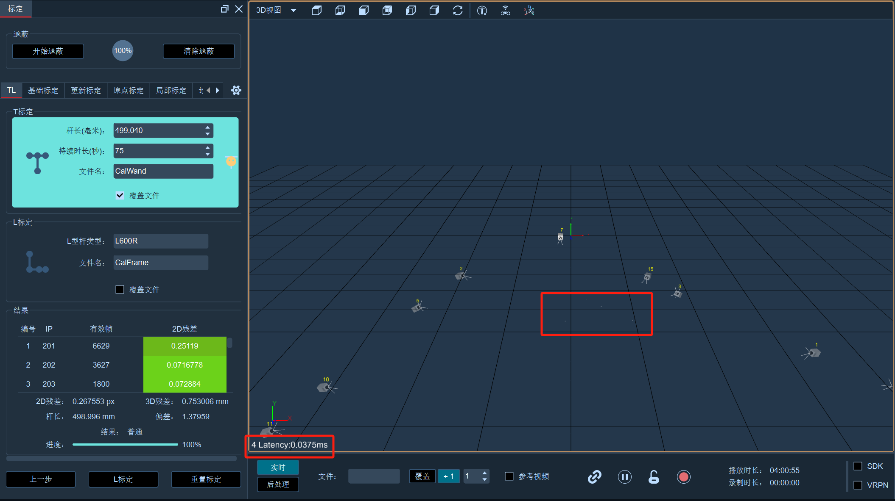
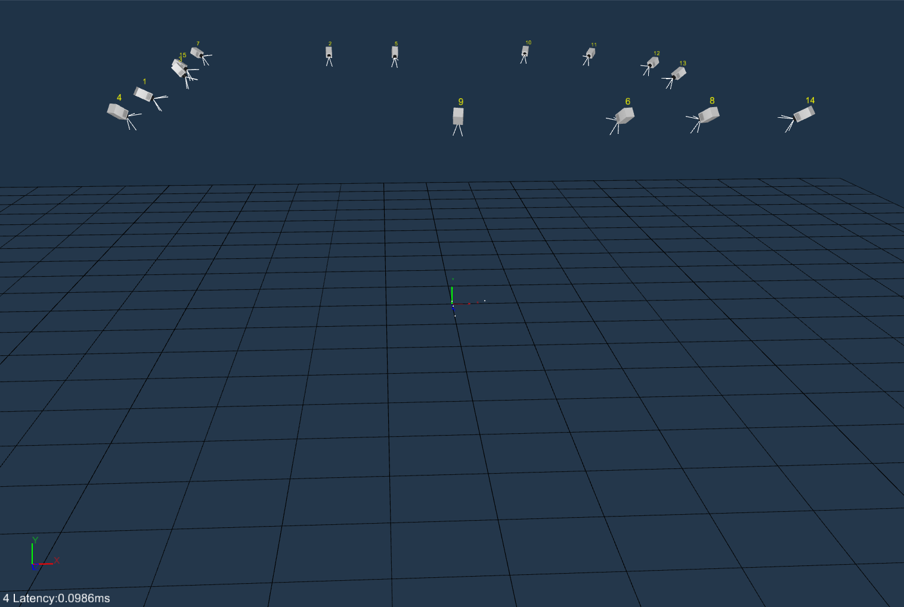
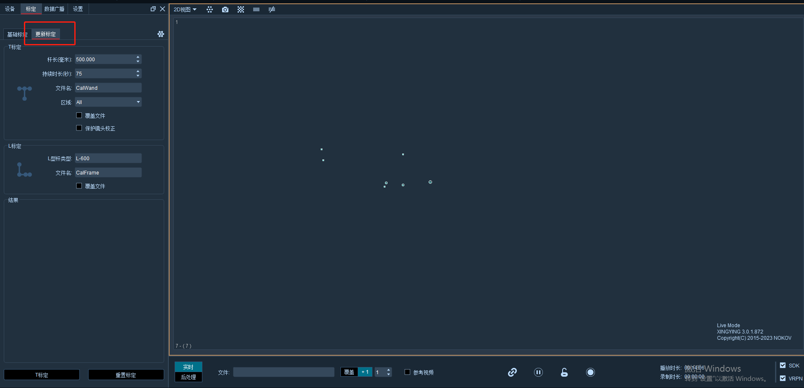

# 第10周：NOKOV动捕标定

# 实践课程大纲

  📌 本文档详细介绍NOKOV光学动作捕捉系统的标定操作流程，包括标定准备、先T后L标定、基础标定和更新标定，适用于日常动捕系统的校准与维护。

## 官方操作视频

  <video width="950" controls>
    <source src="https://diffrobots.oss-cn-hangzhou.aliyuncs.com/nju-wiki/10/%E4%B8%89%E3%80%81%E7%B3%BB%E7%BB%9F%E6%A0%87%E5%AE%9A.mp4" type="video/mp4">
  </video>

# 实践一：标定准备工作

## 1\.1 环境准备

首先连接镜头，使软件处于播放状态，切换到2D视图，将场地内的反光标记点遮挡或移出场地。

可通过点击2D视图上方的"显示所有镜头"按钮，同时观察全部镜头，或双击2D视图中各个镜头，只观察指定的镜头。每个镜头左下角括号里的数表示镜头所能看到的反光标记点数量。

## 1\.2 常见杂点及去除方法

对场地中的杂点进行去除，常发生的杂点情况有：

- 阳光照射

- 金属桌椅货架、地面反光

- 衣服鞋帽上的反光贴/标志、首饰

- 散落于捕捉场景中的反光标记点（Marker）

通常去除杂点的方法：

1. 拉上窗帘遮蔽阳光

2. 移除场景中的反光物体

3. 调节镜头的光圈

4. 在软件中2D视图下调节设备的阈值参数（通常在200\-600之间进行调整）

5. 在软件中2D视图下调节镜头的亮度

6. 使用软件进行Mask处理

  💡 <strong>提示：</strong>可在设备面板下方的最小点直径/最大点直径区域设置Marker点的最大值与最小值，用以筛选2D视图中标记点的直径范围。

## 1\.3 Mask处理

### \(1\) 手动模式

2D视图下双击需要处理的镜头进行单画面放大，在"2D视图"中摁住鼠标滚轮进行拖拉，框住有杂点的区域，杂点即被屏蔽掉。可反复多次进行框选，直至框中视图中的全部杂点被移出。

### \(2\) 自动模式

点击2D视图上方工具栏中的自动遮蔽按钮，2D视图中所有的2D点都被Mask屏蔽。点击清除遮蔽，则所有Mask都会被删除，在单视图下使用清除遮蔽只会清除当前视图中的Mask。

  💡 <strong>注意：</strong>选择自动mask时需要清除场地内有用的真实存在的反光标记点（Marker）。

### \(3\) 误操作恢复

对于误操作导致Mask框选错误区域，想删掉特定的框中区域，则用鼠标左键点击选中该区域，再点击鼠标右键即可。

<figure style="flex:1; text-align:center;">
    
    <figcaption>自动遮蔽按钮位置</figcaption>
</figure>

## 1\.4 标定前最终检查

以上操作完成后，标定人员可先持T型标定杆在场地内挥动，另一人观察2D视图下左下角括号里数字是否有大于3的情况（因为T型杆上面有三个反光球）。若有则表示该镜头视野内有杂点，可重复上述杂点处理步骤进行处理，直至镜头达到最佳标定状态。

# 实践二：先T后L标定

## 2\.1 T标定

<figure style="flex:1; text-align:center;">
    
    <figcaption>T标定进行中界面</figcaption>
</figure>

1. 保持镜头处于实时播放状态，点击软件界面上方的"标定"按钮打开标定浮窗面板，在面板中设置好标定参数后，选择"TL标定"。

2. 在标定窗口中，"杆长"表示所用T型杆两端反光标记点的距离，输入T型杆上标签所标注的数字即可；"持续时间"为标定时间，一般为60\-120s。设置完毕后点击"下一步"按钮，挥杆人员手持T型标定杆，在捕捉区域内反复挥动，开始采集数据。

3. 标定过程中显示进度条，进度条随着挥杆的时间逐渐向前移动。当进度条进行到50%时，T标定背景色会由橙黄色变为绿色。挥动T型杆，尽可能覆盖到镜头可见的每个角落，所有镜头的2D视图中都至多看到T型杆的三个marker（即所有镜头的2D视图中左下角的数字均小于等于3，尽量使尽可能多的镜头数字等于3）。标定过程中，2D界面中显示标定杆扫过的区域，可实时显示可用的数据量及杂质情况。当对话框显示达到预定帧数时，会有声音提示，也就是进度条100%时浮窗下方出现计算按钮。

4. 点击"计算"按钮，软件进入计算过程。计算结束后，软件会反馈出标定结果：较差/普通/良好/完美（此时显示的标定结果并不是最终结果，待L标定完成后，会结合L标定的结果，更新为最终的标定结果）。镜头列表处会显示每个镜头的2D残差数据。计算过程中，会通过进度条显示当前的计算进度。

## 2\.2 L标定

<figure style="flex:1; text-align:center;">
    
    <figcaption>L标定成功提示</figcaption>
</figure>

T标定完成后，在3D视图中，已经可以正常显示镜头和提取的点，但是因为没有进行原点标定，所以镜头的位置是不正确的，需要进行一次原点标定，指定原点。

1. 将L型杆放置在场地中央

2. Mask所有的杂点，保证每个镜头里面都只显示L型杆的4个点

3. 切换到3D视图，确认3D视图中只重建了L型杆的4个点

4. 点击"L标定"按钮

L标定完成后，保存标定文件，即可正常使用系统。

# 实践三：基础标定

## 3\.1 L标定

1. 保持镜头处于实时播放状态，点击软件界面上方的"标定"按钮打开标定浮窗面板，在面板中设置好标定参数后，选择"基础标定"。

2. 接下来进行L标定，在场地中央放置选择的L型杆，确认坐标朝向：

    - Z轴朝上时，L杆的长边方向为X轴正方向，短边方向为Y轴正方向（无人机通常选择这个）

    - Y轴朝上时，L杆的长边方向为Z轴正方向，短边方向为X轴正方向

3. 确认2D视图下各个镜头左下角括号内数字稳定为4后，点击标定面板底部的"L标定"按钮。

4. 若通过标定，窗口下方将显示出"T标定"的标定按钮；若L型标定未通过则会弹窗提示标定失败，不会出现"T标定"按钮。

### \(1\) L标定结果说明

<figure style="flex:1; text-align:center;">
    
    <figcaption>L标定成功界面（全部通过）</figcaption>
</figure>

|结果类型|判定条件|图标颜色|后续操作|
|---|---|---|---|
|全部通过|所有镜头都标定通过|绿色|可继续进行T标定|
|部分通过|通过镜头占总镜头比例超过1/8且数量≥2|黄色|可继续进行T标定|
|标定失败|不满足上述条件|红色|需重新进行L标定|

  📝 只有在全部通过或部分通过的情况下，可以继续进行T标定，否则需要继续进行L标定，直到L标定通过。

## 3\.2 T标定

1. 进行T标定，在基础标定T标定窗口中，"杆长"表示所用T型杆两端反光标记点的距离，输入T型杆上标签所标注的数字即可；"持续时间"为标定时间，一般为60\-120s。设置完毕后点击"下一步"按钮，挥杆人员手持T型标定杆，在捕捉区域内反复挥动。镜头采集到有效数据则相应的区域会变成灰色，保证每个镜头有效数据量足够即每个镜头随着采集数据量的增加，颜色由浅变深。

2. T标定中显示出进度条，进度条随着挥杆的时间逐渐向前移动。当进度条进行到50%时，T标定背景色会由橙黄色变为绿色。挥动T型杆，尽可能覆盖到镜头可见的每个角落，所有镜头的2D视图中都至多看到T型杆的三个marker（即所有镜头的2D视图中左下角的数字均小于等于3，尽量使尽可能多的镜头数字等于3）。标定过程中，2D界面中显示标定杆扫过的区域，可实时显示可用的数据量及杂质情况。当对话框显示达到预定帧数时，会有声音提示，也就是进度条100%时浮窗下方出现计算按钮。

3. 点击计算，软件进入计算过程。计算结束后，软件会反馈出标定结果（评价为较差/普通/良好/完美），T标定右侧也会根据标定结果显示出不同的图标。

  💡 <strong>注意：</strong>若标定结果显示"较差"建议重新标定，其他则可正常保存使用。点击"保存标定文件"输入文件点击完成。

### \(1\) 挥杆过程操作

T标定挥杆过程中，可以随时点击"中止"按钮，停止挥杆流程；停止后可以再次点击"T标定"开始挥杆流程。挥杆完成后，如果对挥杆数据不满意，可以点击"上一步"按钮，返回T标定挥杆动作开始之前，重新开始挥杆操作。

### \(2\) 计算过程操作

计算过程中可以随时点击中止按钮停止计算流程。如果计算结果为较差或者普通，可以直接点击页面上的"上一步"返回到计算前页面，再次计算结果；或者直接点击两次"上一步"按钮，返回到T挥杆开始前状态，重新进行挥杆。

<figure style="flex:1; text-align:center;">
    
    <figcaption>T标定数据采集完成</figcaption>
</figure>

<figure style="flex:1; text-align:center;">
    
    <figcaption>T标定计算结果</figcaption>
</figure>

## 3\.3 3D视图操作

<figure style="flex:1; text-align:center;">
    
    <figcaption>3D视图界面</figcaption>
</figure>

点击软件视图左上角"2D视图 – 3D视图"选项，使软件仅显示三维界面。该三维界面可通过Ctrl/Shift配合鼠标左键/鼠标中键/鼠标右键，进行旋转、平移、缩放等效果。同时点击界面下方的播放按钮，使镜头处于实时运行状态。

### \(1\) 3D视图操作快捷键

<figure style="flex:1; text-align:center;">
    
    <figcaption>标定完成后3D视图镜头布局</figcaption>
</figure>

|操作|快捷键/鼠标操作|说明|
|---|---|---|
|旋转视图|按住鼠标左键拖动|自由旋转3D视图|
|固定方向旋转|Ctrl \+ 鼠标左键|朝着固定的一个方向使视图旋转|
|平移视图|按住鼠标中键拖动|拖动视图平移|
|缩放视图|滚动鼠标中键|放大或缩小视图|
|选中命名点|Shift \+ 鼠标左键|非冻结帧状态下选中命名点|
|还原视角|空格键|一键还原3D原始视角|
|功能菜单|鼠标右键|调出功能菜单|

# 实践四：更新标定

## 4\.1 适用场景

标定完成后3D视图中如果"marker"点分裂效果不好，或者标定时间与使用时间间隔了很久导致效果不好的时候，可以进行更新标定。

## 4\.2 更新标定流程

1. 保持镜头处于实时播放状态，打开标定面板，在窗口选择"更新标定"选项。更新标定不要求先放置L型杆，但要确保场地内除T型杆外无其他杂点。若镜头视野中有杂点，可重复"标定准备工作"中的杂点处理步骤进行处理。

2. 点击"下一步"后进入T型标定。在T型标定窗口中，若加载的是分区标定合并后的标定文件，"区域"中则选择要进行更新标定的区域数字；若想要将整个区域进行更新标定则选择"All"。同时勾选"Protect Current Lens Correction"选项，防止更新标定过程中镜头的参数被修改。

3. 重复基础标定中的T型标定步骤，标定时间到后，点击"下一步"，软件会自动计算，完成后窗口内会显示标定结果（如：差/普通/好/非常好）。

<figure style="flex:1; text-align:center;">
    
    <figcaption>更新标定选项</figcaption>
</figure>

  💡 <strong>注意：</strong>若标定结果显示"差"建议重新标定，其他则可正常保存使用。点击"下一步"进行L型标定。

4. 将L型杆放入场地中，确保场地中除L型杆四个点无其他杂点，点击"Next"进行L型标定。标定成功后点击"完成"按钮完成标定，点击软件界面右下角"文件–保存标定文件"选项以保存更新标定的配置文件。若L型标定失败则会弹窗提示。

  💡 <strong>提示：</strong>在更新标定时，T型标定完成后若用户不需要更新3D视图中的坐标系位置，则无需进行L型标定，点击Finish后保存更新标定的标定文件即可。L型标定完成后3D视图中坐标系会和L型标定时L型杆的摆放位置一致。

## 4\.3 L标定失败排查

### \(1\) 失败原因

- 场地中除了L型杆的四个点还有其他杂点存在导致软件无法正确识别出L型杆

- 2D视图中显示出的L型杆上的点少于四个

### \(2\) 解决方法

1. 排除环境因素，清除场地中除L型杆四个点以外的其他杂点

2. 自检软件设置中的L型杆参数与实际使用的L型杆是否一致

3. 点击Previous返回上一步重新进行L型标定

4. 若仍旧标定失败请咨询技术工程师

---

  💡 <strong>标定完成检查清单</strong>
  <ul style="margin:8px 0 0 20px; padding:0;">
    <li>所有镜头2D视图杂点已清除</li>
    <li>T标定结果为普通及以上</li>
    <li>L标定全部通过或部分通过</li>
    <li>3D视图中marker点重建正常，无明显分裂</li>
    <li>已保存标定文件</li>
  </ul>

# 总结

## 1\.课程要点回顾

本实践课程围绕双目相机 L 标定、T 标定完整流程开展，系统学习相机标定前置准备、多种标定方案实操、可视化查看以及标定迭代优化与故障排查，整体分为四大实践环节：

1. 实践一：标定准备工作 开展标定前期环境搭建，学习图像杂点识别与消除手段；掌握 Mask 掩码处理，熟练使用手动模式、自动模式划定有效成像区域，并掌握误操作撤销恢复方法；完成图像质量、掩码范围、设备状态等标定前逐项检查，保障原始图像素材满足标定要求。

2. 实践二：先 T 后 L 标定 学习先执行 T 标定、再执行 L 标定的标定流程，依次完成外参 T 标定计算与双目 L 标定，理解该标定顺序对应的适用场景、操作步骤与数据逻辑。

3. 实践三：基础标定 开展标准基础标定流程，先进行 L 标定并读懂标定输出结果；随后完成 T 标定，规范挥杆采集图像与参数计算全流程；同时熟悉 3D 视图交互方式，掌握视图操控快捷键，直观观察双目相机相对位姿、空间点云分布。

4. 实践四：更新标定 明确更新标定方法对应的适用场景，掌握增量更新标定完整操作步骤；针对 L 标定失败问题进行专项学习，梳理各类常见失败诱因，配套对应的排查思路与解决办法，提升调试排故能力。

