# 第11周：XINGYING 刚体创建与数据采集

# 实践课程大纲

<div style="background-color: #fffbdbff; border: 2px solid #f2e270ff; padding: 10px 15px; margin: 15px 0; border-radius: 12px;">
  <strong>​​​💡 本文档介绍：如何在 XINGYING 动捕软件中创建刚体，并通过 VRPN 实现与 ROS 的通信及数据采集。
  </strong>
</div>

## 官方操作视频

<p >
  <video width="950" controls>
    <source src="https://diffrobots.oss-cn-hangzhou.aliyuncs.com/nju-wiki/11/%E5%9B%9B%E3%80%81%E5%88%9A%E4%BD%93%E5%88%9B%E5%BB%BA%E4%B8%8E%E6%95%B0%E6%8D%AE%E9%87%87%E9%9B%86.mp4" type="video/mp4">
  </video>
</p>

# 实践一：创建刚体

## 1\.1 前置条件

XINGYING 软件支持在实时下创建 Markerset，需在场地内放置已贴好反光标记点的无人机，并且能在软件中的 3D 视图下看到每一个反光标记点。

## 1\.2 操作步骤

### \(1\) 冻结 3D 视图

确认软件处于播放状态，点击软件界面下方的"冻结"按钮，将 3D 视图冻结。

<figure style="flex:1; text-align:center;">
    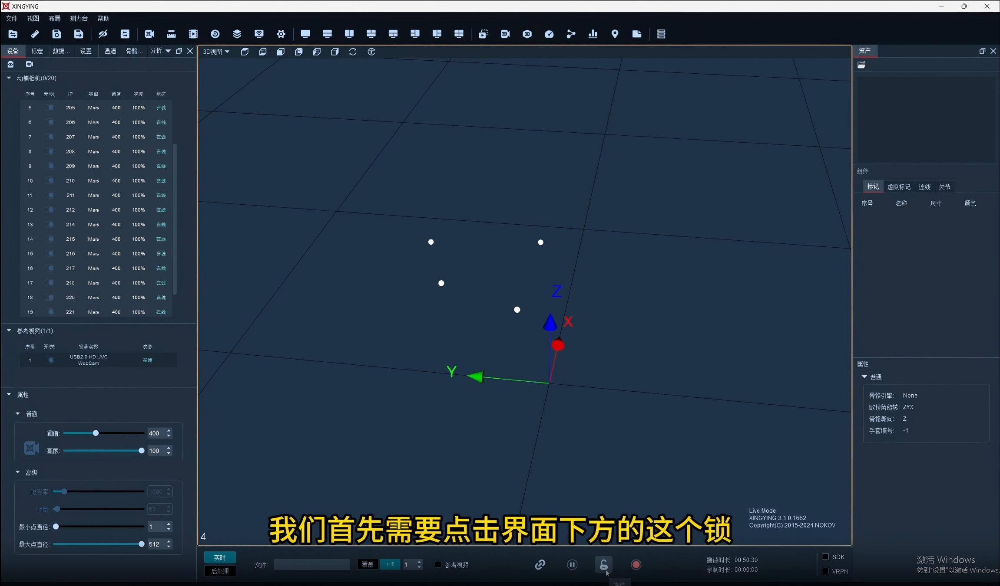
    <figcaption>图1：点击冻结按钮</figcaption>
</figure>

### \(2\) 选中反光标记点

选中 3D 视图中的反光标记点有以下两种方法：

- **框选**：按住 `Shift` 键的同时，按住鼠标左键拖动框选，选中需要创建刚体的反光标记点

- **点选**：按住 `Ctrl` 或 `Shift` 键，使用鼠标左键逐个点击选中需要创建刚体的反光标记点

<div style="background-color: #fffbdbff; border: 2px solid #f2e270ff; padding: 10px 15px; margin: 15px 0; border-radius: 12px;">
  <strong>💡 注意事项：</strong>
  <ul style="margin:8px 0;padding-left:20px;">
    <li>一个刚体至少需要有 3 个反光标记点</li>
    <li>冻结帧框选未命名点后，3D 视图左下角实时显示框选的未命名点数量</li>
    <li>括号内的数字代表框选点的数量，括号左侧的数字代表 3D 视图中 Marker 点的总数</li>
  </ul>
</div>

<figure style="flex:1; text-align:center;">
    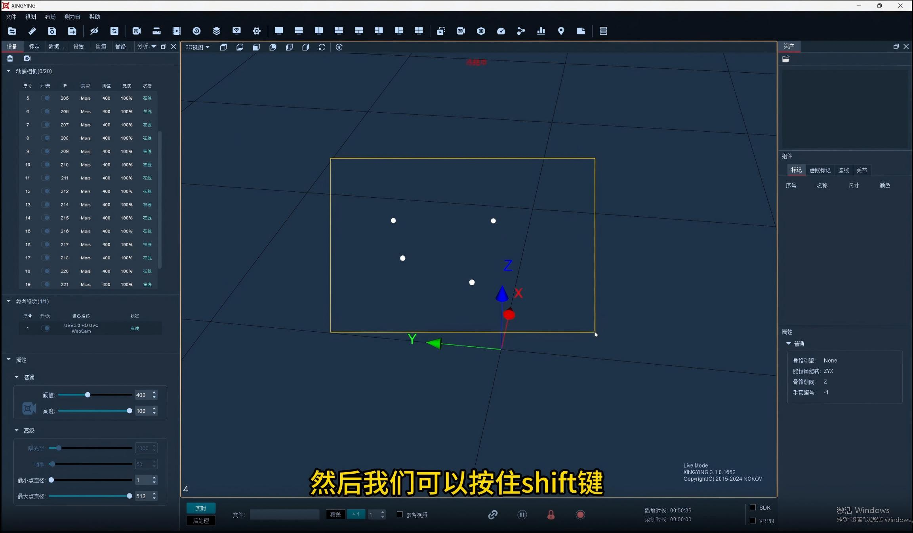
    <figcaption>图2：框选反光标记点</figcaption>
</figure>

<figure style="flex:1; text-align:center;">
    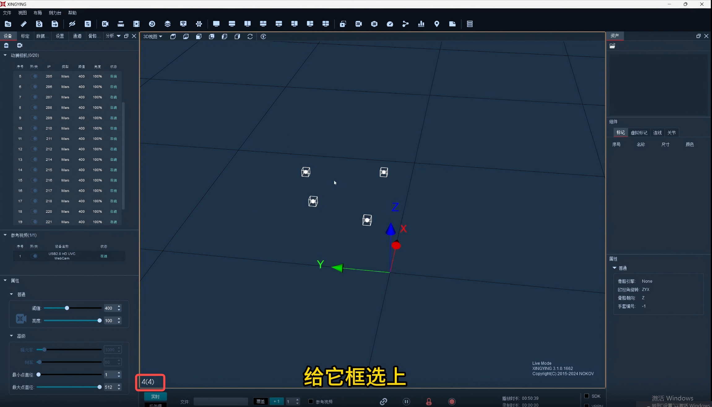
    <figcaption>图3：左下角显示框选点数量</figcaption>
</figure>

### \(3\) 创建刚体

选中标记点后，点击鼠标右键，选择"创建刚体"。

<figure style="flex:1; text-align:center;">
    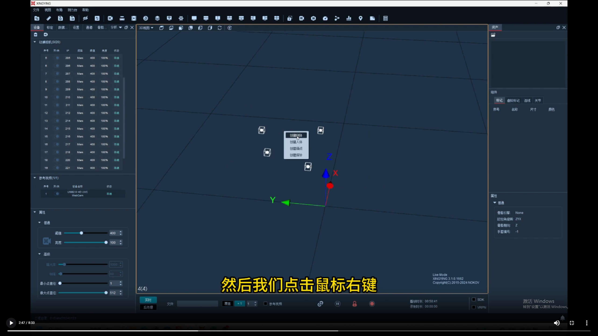
    <figcaption>图4：右键创建刚体</figcaption>
</figure>

### \(4\) 命名刚体

为创建的刚体命名，单击单个刚体，朝向为 x 并解除冻结。

<figure style="flex:1; text-align:center;">
    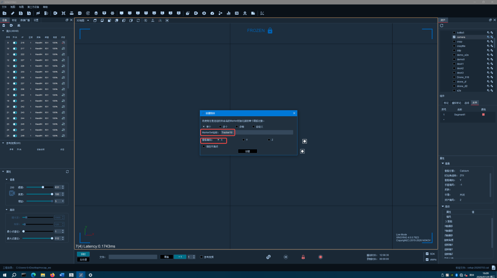
    <figcaption>图5：刚体命名设置</figcaption>
</figure>

### \(5\) 开启数据广播

实时获取刚体的数据，在视图里面点击广播，设置网卡地址，开启 VRPN。

<figure style="flex:1; text-align:center;">
    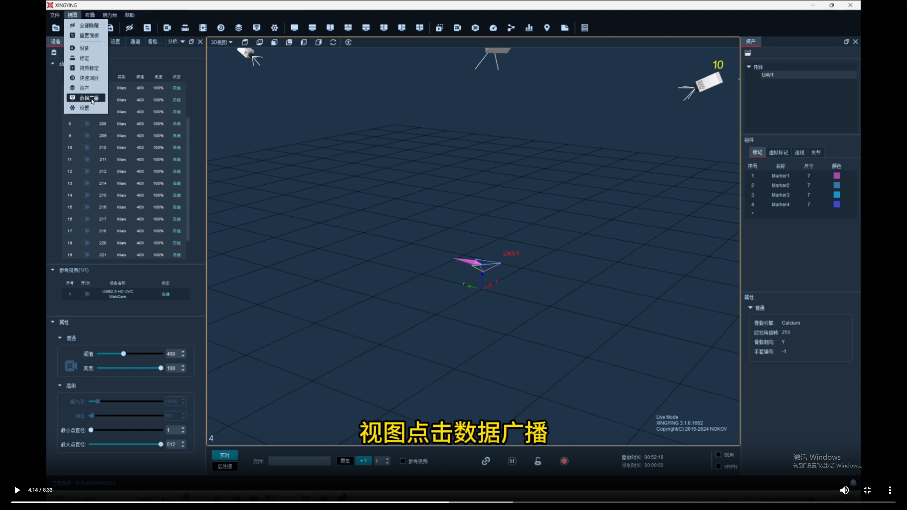
    <figcaption>图6：广播设置界面</figcaption>
</figure>

<figure style="flex:1; text-align:center;">
    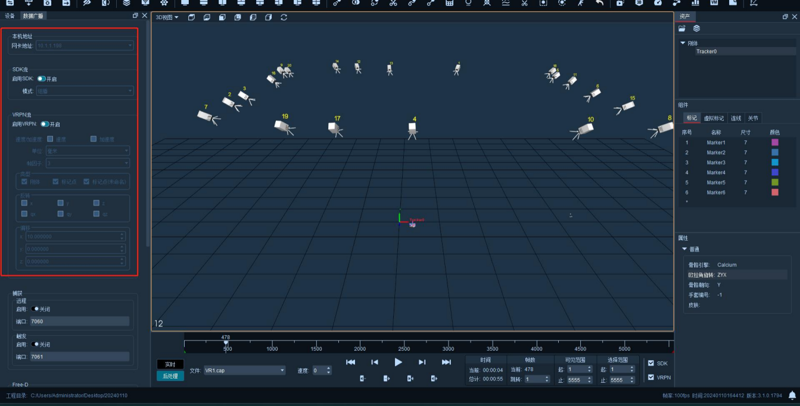
    <figcaption>图7：VRPN 设置</figcaption>
</figure>

---

# 实践二：ROS 与 XINGYING 软件的通信

## 2\.1 使用版本

|软件|版本|说明|
|---|---|---|
|ROS|Noetic|机器人操作系统|
|Ubuntu|20\.04|操作系统|
|VRPN|对应版本|虚拟现实外设网络协议|

**目的**：通过 XINGYING 软件和 VRPN 获取 Markerset 或者刚体等的信息，并传给 ROS。

可以在 Ubuntu 的终端中输入以下命令，查询当前 Ubuntu 版本可支持安装的 VRPN 版本：

```bash
sudo apt search vrpn
```


## 2\.2 VRPN 的下载安装及其网络配置

### \(1\) 软件源安装（推荐）

```bash
sudo apt-get install ros-noetic-vrpn-client-ros
```

### \(2\) 源码安装

1\. 在 Home 目录下新建文件夹 "catkin\_ws"，进入路径后编译：

```bash
cd ~/catkin_ws
catkin_make -DCATKIN_WHITELIST_PACKAGES="vrpn_client_ros"
```

2\. 在 "catkin\_ws" 目录下新建文件夹 "src"，克隆源码：

```bash
cd ~/catkin_ws/src
git clone https://github.com/ros-drivers/vrpn_client_ros.git
```

## 2\.3 测试网络连通

使用 ping 命令测试 Ubuntu 是否跟 XINGYING 软件所在主机的网络连通：

```bash
ping 10.1.1.198
```
<div style="background-color: #F0FBEB; border: 2px solid #86DD86; padding: 10px 15px; margin: 15px 0; border-radius: 12px;">
  <strong>💡 网络配置要点：</strong>
  <ul style="margin:8px 0;padding-left:20px;">
    <li>Ubuntu 的 IP 可以设置为 `10.1.1.196`</li>
    <li>两台电脑的 IP 地址必须在同一个网段</li>
    <li>若 PING 不通，请检查电脑的 IP 地址是否设置正确</li>
  </ul>
</div>

<figure style="flex:1; text-align:center;">
    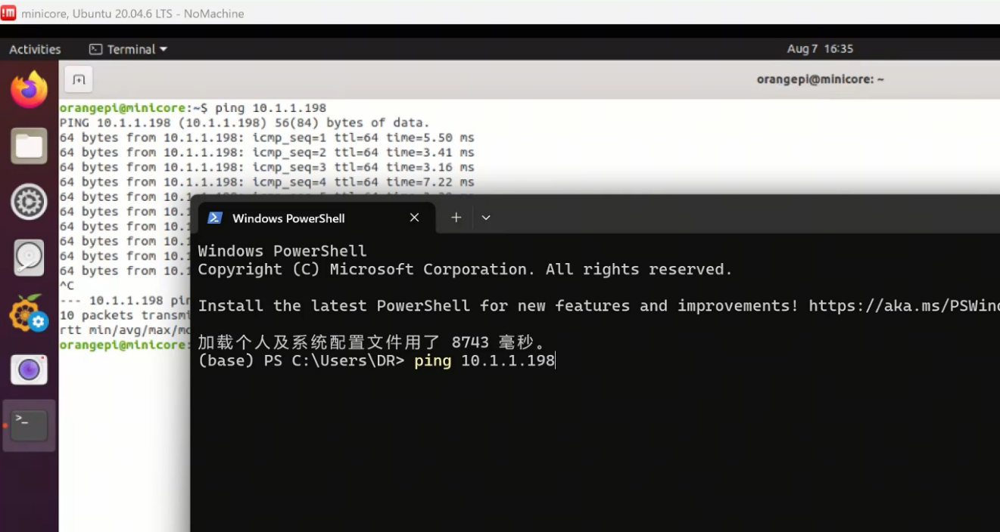
    <figcaption>图8：ping 网络测试</figcaption>
</figure>

## 2\.4 启动 vrpn\_client\_ros

输入以下命令启动 VRPN 客户端：

```bash
roslaunch vrpn_client_ros sample.launch server:=10.1.1.198
```
<div style="background-color:#F0FBEB; border:2px solid #86DD86; padding:10px 15px; margin:15px 0; border-radius:12px;">
  <strong>✅ 连接成功标志：终端打印出以下三行信息</strong>
  <ul style="margin:8px 0;padding-left:20px;">
    <li><code>Connection established</code></li>
    <li><code>Found new sender...</code></li>
    <li><code>Creating new tracker ...</code></li>
  </ul>
</div>


<figure style="flex:1; text-align:center;">
    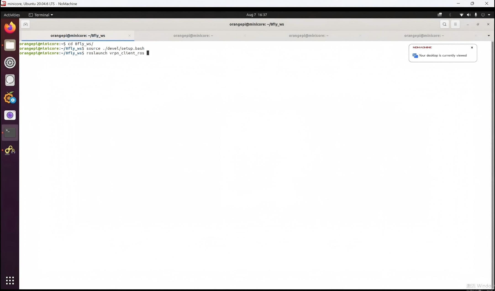
    <figcaption>图9：vrpn 启动输出（一）</figcaption>
</figure>

<figure style="flex:1; text-align:center;">
    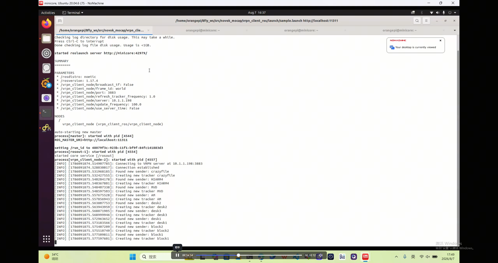
    <figcaption>图10：vrpn 启动输出（二）</figcaption>
</figure>

## 2\.5 数据采集

### \(1\) 查看话题列表

使用 `Ctrl+Alt+T` 重新开一个终端，查看 topic 话题：

```bash
rostopic list
```

### \(2\) 查看数据内容

节点启动后，会自动根据动捕软件中的"刚体名称"生成对应话题。在终端执行：

```bash
rostopic echo /MVD/odom
```

<figure style="flex:1; text-align:center;">
    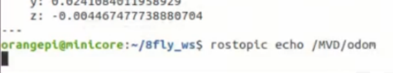
    <figcaption>图11：执行rostopic echo /MVD/odom</figcaption>
</figure>

<div style="background-color:#F0FBEB; border:2px solid #86DD86; padding:10px 15px; margin:15px 0; border-radius:12px;">
  <strong>✅ 成功标志：终端高频滚动输出包含<code>pose</code> 和<code>twist</code>的消息。</strong>
</div>

<figure style="flex:1; text-align:center;">
    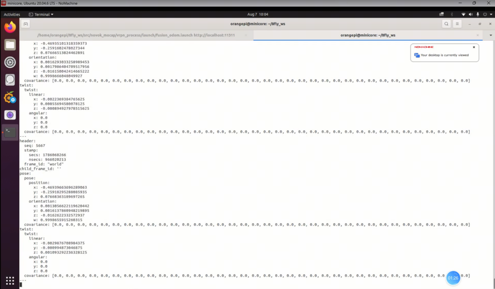
    <figcaption>图12：rostopic echo 数据输出</figcaption>
</figure>

---

<div style="background-color:#f5f6f7; border:1px solid #d8dbe2; padding:12px 18px; margin:16px 0; border-radius:14px;">
  <strong>📝 常见问题排查：</strong>
  <ul style="margin:10px 0; padding-left:22px;">
    <li><strong>连接失败</strong> → 检查网络是否连通、IP 地址是否在同一网段</li>
    <li><strong>看不到话题</strong> → 确认 XINGYING 端 VRPN 已开启、刚体名称正确</li>
    <li><strong>数据不更新</strong> → 检查软件是否处于播放状态、刚体是否被识别</li>
  </ul>
</div>


# 总结

## 1\.课程要点回顾

本周实践围绕 XINGYING 光学动作捕捉系统展开，分为两大实践内容，实现动捕刚体建立与 ROS 数据通信采集：

1. 实践一：创建刚体 明确创建刚体所需前置条件，按照规范流程完成操作：冻结 3D 视图、选取机身反光标记点、生成刚体模型、自定义刚体名称，最后开启动捕数据广播，完成无人机目标刚体的定义，使系统能够稳定识别目标载体。

2. 实践二：ROS 与 XINGYING 软件通信 学习 VRPN 通信协议，掌握两种`vrpn_client_ros`安装方案：软件源安装与源码编译安装；完成局域网网络参数配置，测试主机与动捕工作站网络连通性；启动 vrpn\_client\_ros 通信节点，通过 ROS 指令查看话题列表、订阅并读取刚体位姿数据，完成动捕定位数据采集，实现光学动捕系统与 ROS 平台的数据互通，为无人机高精度定位、状态解算提供外部定位数据源。


