# 第12周：px4ctrl实机飞行练习

# 实践课程大纲

<div style="background-color:#fff2f2; border:1px solid #f8aaaa; padding:24px 28px; margin:16px 0; border-radius:14px; color:#222; line-height:2.2;">
  💡 <strong>安全第一！实机操作前务必确认：</strong>
  <ul style="margin:12px 0 0 0; padding-left:24px;">
    <li>无人机电池电量充足（建议 80% 以上）</li>
    <li>飞行区域无人员走动、无障碍物</li>
    <li>动捕系统已校准并正常运行</li>
    <li>遥控器电量充足且已对频</li>
  </ul>
</div>


1\.1 硬件检查清单

|序号|检查项|确认标准|
|---|---|---|
|1|无人机机身|无破损，桨叶安装牢固|
|2|电池|电压正常，卡扣锁紧|
|3|机载电脑|已上电，系统启动完成|
|4|遥控器|已开机，模式开关在 Position 档|
|5|动捕标记点|全部在位，无遮挡|

---

1\.2 学习目标

1. 掌握 px4ctrl 实机飞行系统的基本组成与启动流程，理解飞控、机载计算机、px4ctrl 控制器与动捕定位系统之间的数据关系。

2. 掌握无人机机载端工作空间进入、综合启动脚本执行及核心节点运行状态检查方法，能够判断 px4ctrl 与动捕数据链路是否正常建立。

3. 掌握 /MVD/odom 里程计话题的检查方法，能够读取无人机的 位置、姿态及数据刷新状态，并在起飞前完成定位数据有效性确认。

4. 熟悉 px4ctrl 实机自主起飞、定点悬停及安全操作流程，理解 定位数据正常、控制节点稳定运行是自主飞行的前提条件。

---

1\.3 代码下载

|下载链接|代码说明|
|---|---|
|<a href="../file/8fly_ws.zip">📥 8fly_ws</a>|8fly_ws代码包|

# 实践一：环境准备与节点启动

<div style="background-color:#fff2f2; border:1px solid #f8aaaa; padding:24px 28px; margin:16px 0; border-radius:14px; color:#222; line-height:2.2;">
  ⚠️ <strong>注意：</strong>
  <ul style="margin:12px 0 0 0; padding-left:24px;">
    <li>无人机机头方向需要与动捕场地中X轴方向保持一致，否则无法飞行</li>
  </ul>
</div>

## \(1\) 遥控器状态

<p >
  <video width="950" controls>
    <source src="https://diffrobots.oss-cn-hangzhou.aliyuncs.com/nju-wiki/12/639773958697227009.mp4" type="video/mp4">
  </video>
</p>

开始任务之前遥控器应该设置的状态如视频所示。

## \(2\) 打开终端并进入工作空间

**操作步骤：**

1. 在机载电脑桌面上，点击左侧任务栏的终端图标，或按快捷键 `Ctrl + Alt + T` 打开一个新的命令行终端

<figure style="flex:1; text-align:center;">
  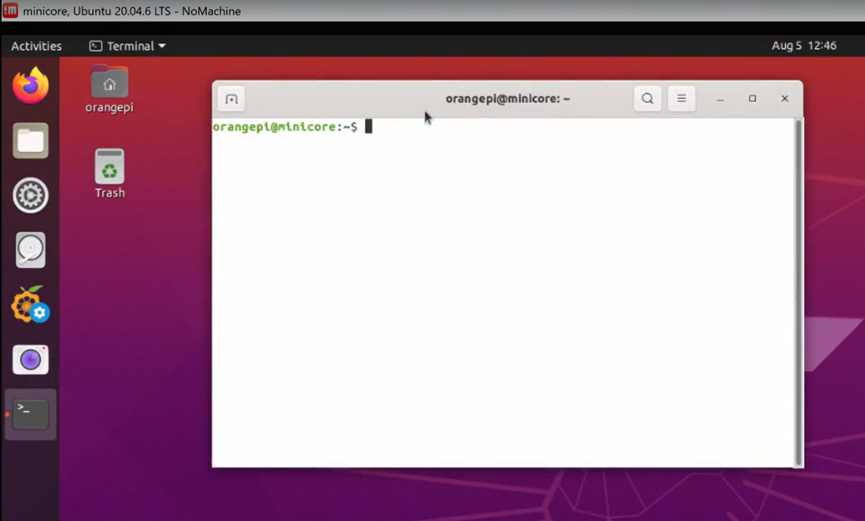
  <figcaption></figcaption>
</figure>

2. 输入以下命令进入无人机工作空间：

```bash
cd 8fly_ws/
```

<figure style="flex:1; text-align:center;">
  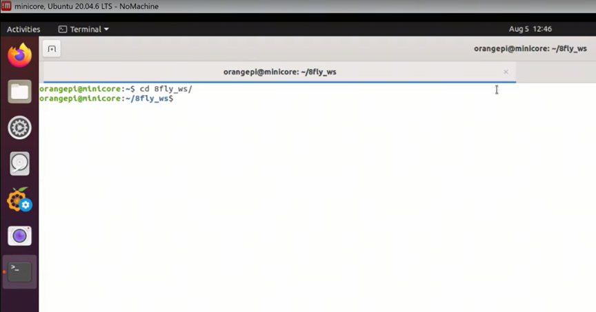
  <figcaption></figcaption>
</figure>

<div style="background-color:#edfbeb; border:1px solid #98dd94; padding:24px 28px; margin:16px 0; border-radius:14px; color:#222; line-height:2.2;">
  ✅ <strong>验证检查点：</strong>
  <div style="margin-top:12px;font-size:1.1em;">
    终端提示符应显示为 <span style="background:#f0f0f4; padding:4px 8px; border-radius:6px; font-family:monospace;">orangepi@minicore:~/8fly_ws$</span>，确认路径已切换到工作空间根目录。
  </div>
</div>

## \(3\) 启动核心脚本

在工作空间根目录下，执行综合启动脚本：

```启动核心节点
bash sh_file/run_takeoff_mocap.sh
```

<figure style="flex:1; text-align:center;">
  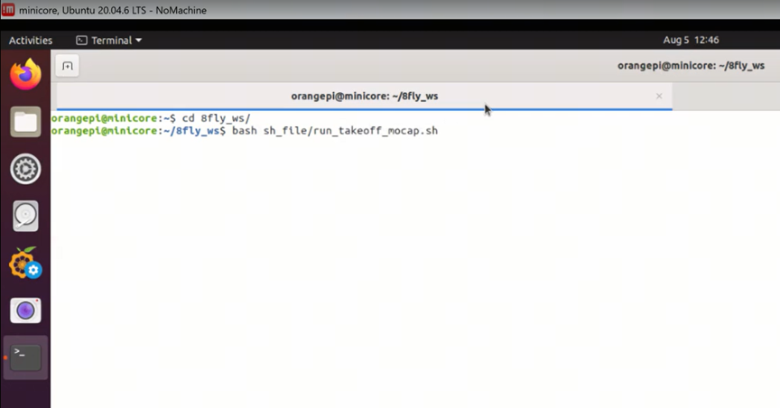
  <figcaption></figcaption>
</figure>

脚本执行过程中会提示输入系统密码（密码为小写英文字母l）：

```text
[sudo] password for orangepi:
```

<figure style="flex:1; text-align:center;">
  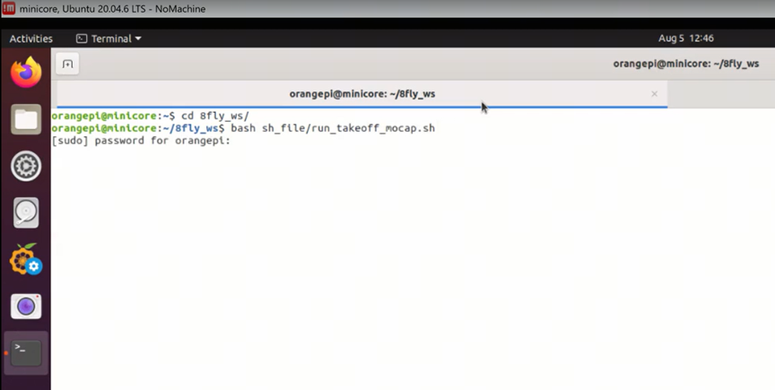
  <figcaption></figcaption>
</figure>

输入密码后按回车。

<div style="background-color:#edf2ff; border:1px solid #88aaff; padding:24px 28px; margin:16px 0; border-radius:14px; color:#222; line-height:2.2;">
  💡 <strong>脚本功能说明：</strong>
  <div style="margin-top:12px;">该脚本会自动启动以下核心节点：</div>
  <ul style="margin:12px 0 0 0; padding-left:24px;">
    <li>底层通讯节点（MAVROS / PX4 桥接）</li>
    <li>px4ctrl 控制器节点</li>
    <li>动捕数据接收节点（vrpn_client_node）</li>
  </ul>
</div>

## \(4\) 等待动捕节点就绪

输入密码后，终端将输出大量节点启动日志。请仔细观察输出，特别关注 `vrpn_client_node` 的连接信息。

<figure style="flex:1; text-align:center;">
  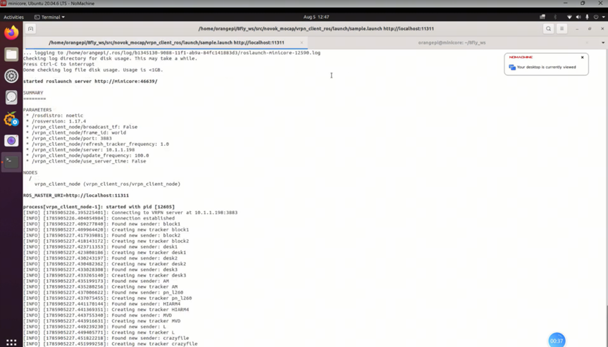
  <figcaption></figcaption>
</figure>

<div style="background-color:#fffde6; border:2px solid #ffdd44; padding:24px 28px; margin:16px 0; border-radius:14px; color:#222; line-height:2.2;">
  ⚠️ <strong>重要提示：</strong>
  <ul style="margin:12px 0 0 0; padding-left:24px;">
    <li>观察输出直到数据流开始稳定刷新</li>
    <li><strong>切勿关闭此终端窗口！</strong>它承载着无人机运行的基础进程，一旦关闭将导致飞行器失控</li>
    <li>此终端需要保持运行状态，后续操作请新建终端</li>
  </ul>
</div>

<div style="background-color:#edfbeb; border:1px solid #98dd94; padding:24px 28px; margin:16px 0; border-radius:14px; color:#222; line-height:2.2;">
  ✅ <strong>就绪标志：</strong>
  <div style="margin-top:12px;font-size:1.1em;">
    当看到终端持续输出位置数据且不再有报错信息时，说明节点已正常启动。
  </div>
</div>

---

# 实践二：数据检查与确认

## \(1\) 监听定位数据话题

**操作步骤：**

1. 新建一个终端窗口（不要关闭之前的终端！）

2. 再次进入工作空间：

```bash
cd 8fly_ws/
```

1. 监听动捕系统的里程计数据：

```bash
rostopic echo /MVD/odom
```

<figure style="flex:1; text-align:center;">
  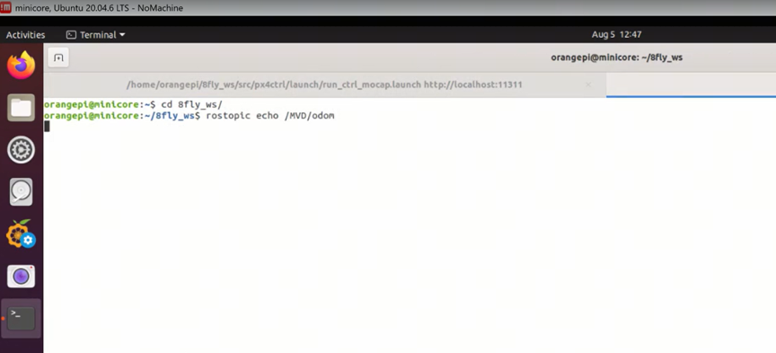
  <figcaption></figcaption>
</figure>

## \(2\) 数据确认与清屏

终端将滚动显示包含 `position`（位置 x,y,z）和 `orientation`（姿态四元数）的数据流。

<figure style="flex:1; text-align:center;">
  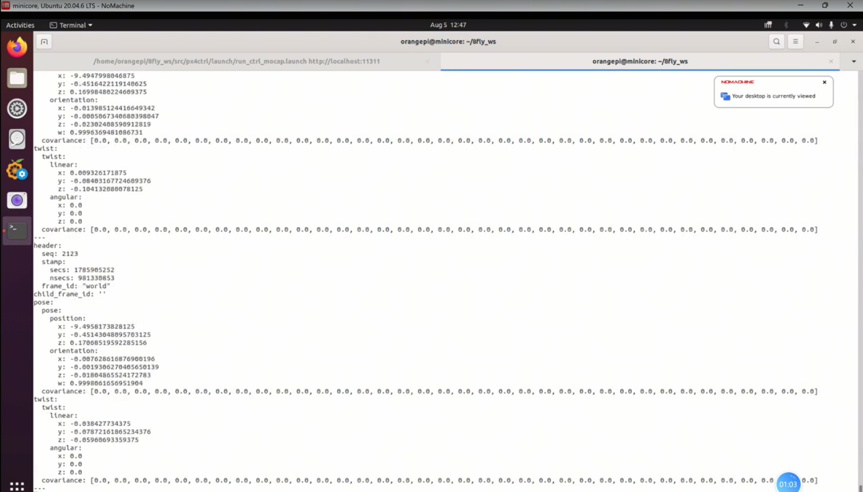
  <figcaption></figcaption>
</figure>

**数据示例：**

```yaml
pose:
  position:
    x: -9.49497949591875
    y: -7.49469724709531
    z: 0.1720247192382812
  orientation:
    x: 0.005233025643974543
    y: -0.00647707993401885
    z: 0.0242977672870077
    w: 0.9997590788258175
```

<div style="background-color:#edfbeb; border:1px solid #98dd94; padding:24px 28px; margin:16px 0; border-radius:14px; color:#222; line-height:2.2;">
  ✅ <strong>数据有效性检查：</strong>
  <ul style="margin:12px 0 0 0; padding-left:24px;">
    <li>坐标值在合理范围内跳动（不是 0 或 NaN）</li>
    <li>数据更新频率稳定（持续滚动输出）</li>
    <li>z 轴高度与实际地面高度接近（约 0.1~0.2m）</li>
  </ul>
</div>


确认数据无误后，按 `Ctrl + C` 停止打印，然后输入 `clear` 清理终端屏幕，为后续飞行指令做准备。

```bash
clear
```

<figure style="flex:1; text-align:center;">
  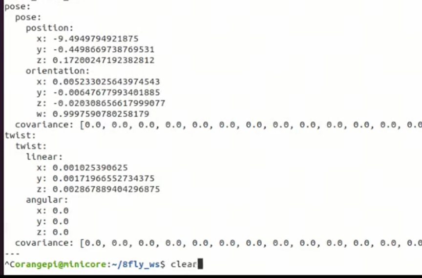
  <figcaption></figcaption>
</figure>

---

# 实践三：实机飞行操作

<div style="background-color:#fff0ee; border:1px solid #f8b8b2; padding:24px 28px; margin:16px 0; border-radius:14px; color:#222; line-height:2.2;">
  💡 <strong>飞行前最后确认：</strong>
  <ul style="margin:12px 0 0 0; padding-left:24px;">
    <li>周围人员已撤离至安全区域</li>
    <li>无人机上方无障碍物</li>
    <li>遥控器在手中，拇指放在摇杆上</li>
    <li>随时准备切换到手动模式紧急制动</li>
  </ul>
</div>

## \(1\) 执行自主起飞 \(Takeoff\)

在刚才清屏的终端中，运行起飞脚本：

```bash
bash sh_file/takeoff.sh
```

<figure style="flex:1; text-align:center;">
  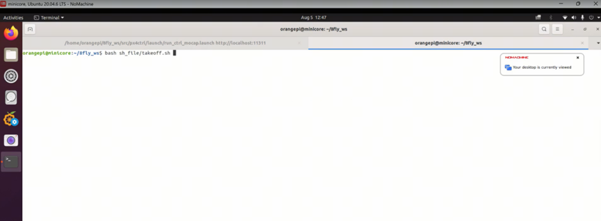
  <figcaption></figcaption>
</figure>

<figure style="flex:1; text-align:center;">
  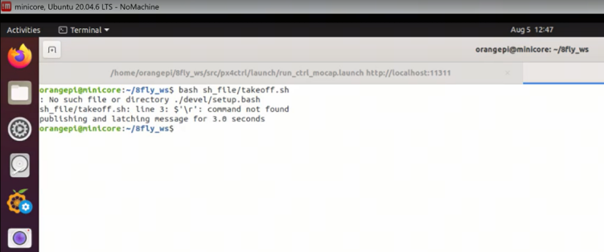
  <figcaption></figcaption>
</figure>

**飞行过程观察：**

1. 脚本执行后，飞控将解锁电机，桨叶开始旋转

2. 无人机会自动起飞至预设高度（通常为 1 米左右）

3. 到达目标高度后，基于 px4ctrl 和动捕数据，无人机将进入稳定的定点悬停状态

<div style="background-color:#edfbeb; border:1px solid #98dd94; padding:24px 28px; margin:16px 0; border-radius:14px; color:#222; line-height:2.2;">
  ✅ <strong>悬停稳定标志：</strong>
  <div style="margin:12px 0 0 0;">无人机在 1 米高度左右基本静止，漂移范围不超过 ±10cm，说明悬控状态良好。</div>
</div>

<div style="background-color:#fffde8; border:2px solid #f9e666; padding:24px 28px; margin:16px 0; border-radius:14px; color:#222; line-height:2.2;">
  ⚠️ <strong>异常处理：</strong>
  <div style="margin:8px 0 12px 0;">如果起飞后无人机出现剧烈晃动或快速漂移：</div>
  <ul style="margin:0; padding-left:24px;">
    <li>立即切换遥控器到手动模式</li>
    <li>操控无人机缓慢降落</li>
    <li>检查动捕数据是否丢失或跳变</li>
  </ul>
</div>

## \(2\) 遥控器位置控制实操

模式切换：拨动遥控器指定的模式开关，确保飞控处于允许指令控制的**位置模式 \(Position Mode\)**。

右摇杆控制平移：轻推遥控器右摇杆，控制无人机水平移动：

|摇杆方向|无人机动作|
|---|---|
|向上推|向前飞行|
|向下推|向后飞行|
|向左推|向左平移|
|向右推|向右平移|

<div style="background-color:#f0f2ff; border:2px solid #a2b8f8; padding:24px 28px; margin:16px 0; border-radius:14px; color:#222; line-height:2.2;">
  💡 <strong>操作技巧：</strong>
  <ul style="margin:12px 0 0 0; padding-left:24px;">
    <li>轻推轻放，摇杆幅度不要超过 1/3</li>
    <li>每次移动后松开摇杆，无人机会自动悬停</li>
    <li>先练习前后移动，熟练后再练左右平移</li>
    <li>保持无人机在视线范围内，不要飞太远</li>
  </ul>
</div>

回中悬停：实操练习结束后，操作摇杆将无人机小心地引导回起飞时的原点正上方，松开摇杆使其自动悬停。

## \(3\) 执行安全降落 \(Land\)

确认无人机悬停稳定后，在终端中输入降落指令：

```bash
bash sh_file/land.sh
```

<figure style="flex:1; text-align:center;">
  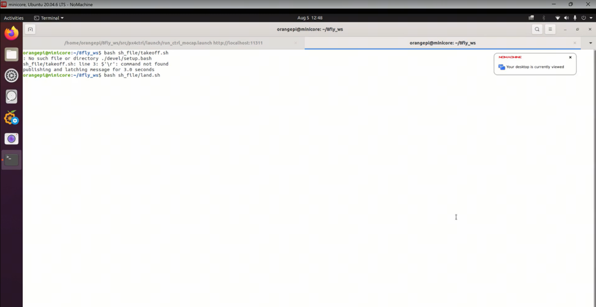
  <figcaption></figcaption>
</figure>

**降落过程：**

1. 无人机接收指令后，将匀速垂直下降

2. 直至接触地面

3. 触地后，飞控会自动判断降落完成并执行电机上锁 \(Disarm\) 动作

<div style="background-color:#edfbeb; border:1px solid #98dd94; padding:24px 28px; margin:16px 0; border-radius:14px; color:#222; line-height:2.2;">
  ✅ <strong>降落完成标志：</strong>
  <div style="margin:12px 0 0 0;">桨叶完全停止转动，终端输出降落成功信息，此时实操流程安全结束。</div>
</div>

---

# 总结：

## 1\.常见问题与排错

|问题现象|可能原因|解决方法|
|---|---|---|
|启动脚本报错，节点无法启动|工作空间路径错误 / 依赖缺失|确认在 8fly\_ws/ 目录下执行；检查 ROS 环境是否正常|
|odom 数据全为 0 或无输出|动捕系统未连接 / 话题名错误|检查动捕软件是否运行；用 `rostopic list` 确认话题名|
|起飞后无人机漂移严重|动捕数据跳变 / 控制器参数不佳|立即手动降落；检查动捕标记点是否遮挡|
|遥控器无法控制|模式开关不在 Position 档|切换遥控器模式开关到正确档位|
|降落脚本执行后无反应|节点通信异常|检查核心终端是否正常运行；确认无人机仍在悬停|

---

## 2\.课程要点回顾

1. 关闭所有终端窗口（先关闭操作终端，最后关闭核心终端）

2. 关闭机载电脑

3. 取下无人机电池，妥善存放

4. 整理遥控器和线材

5. 检查无人机桨叶和机身是否有损伤

<div style="background-color:#f0f2ff; border:2px solid #a2b8f8; padding:24px 28px; margin:16px 0; border-radius:14px; color:#222; line-height:2.2;">
  📝 <strong>实验记录建议：</strong>
  <div style="margin:8px 0 12px 0;">每次实机飞行后，记录以下信息便于复盘：</div>
  <ul style="margin:0; padding-left:24px;">
    <li>飞行时间和时长</li>
    <li>悬停精度观察</li>
    <li>遇到的问题和解决方法</li>
    <li>控制器参数调整记录</li>
  </ul>
</div>

