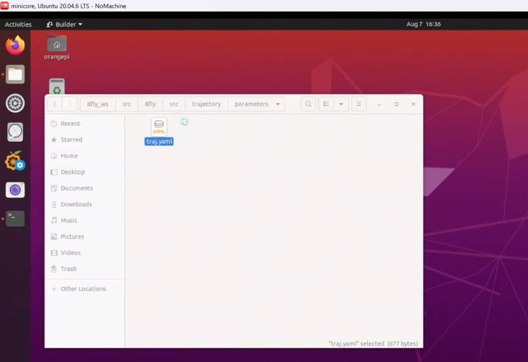
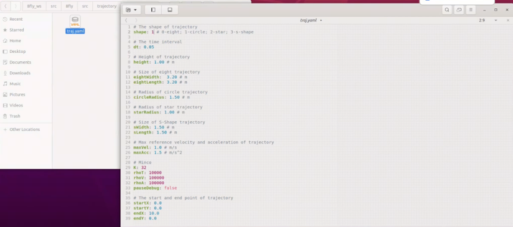
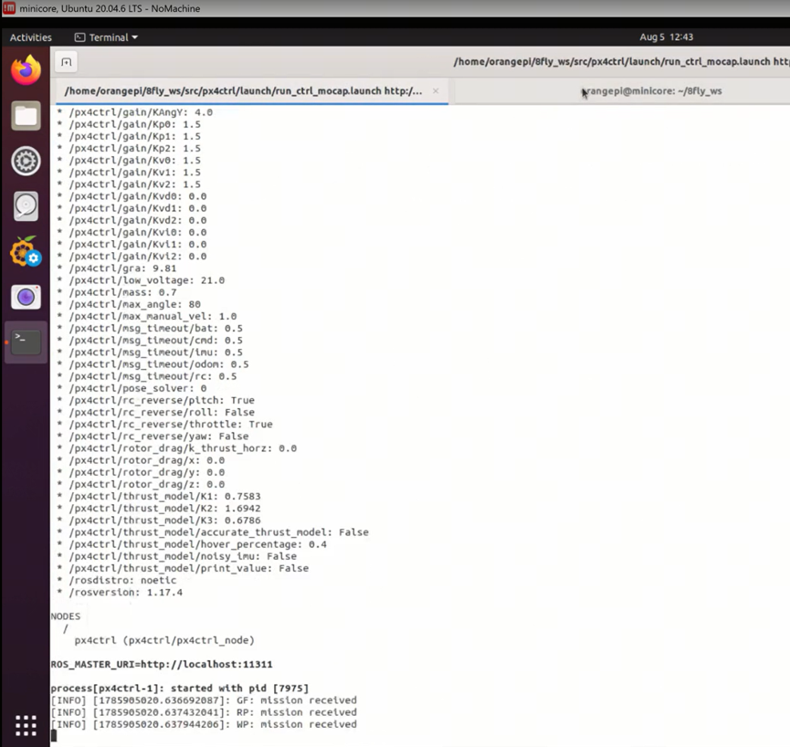
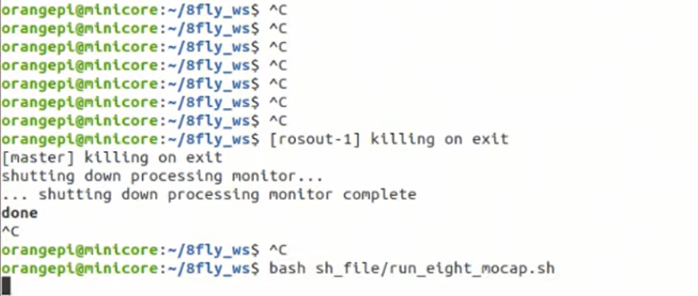
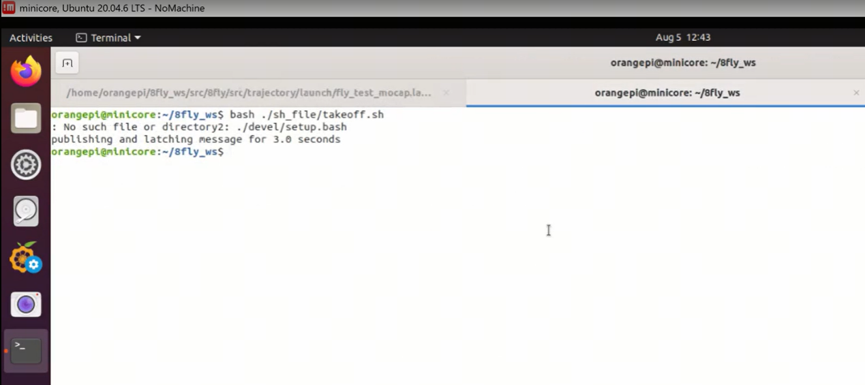
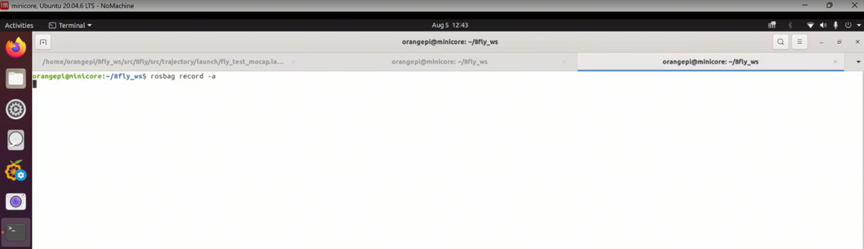
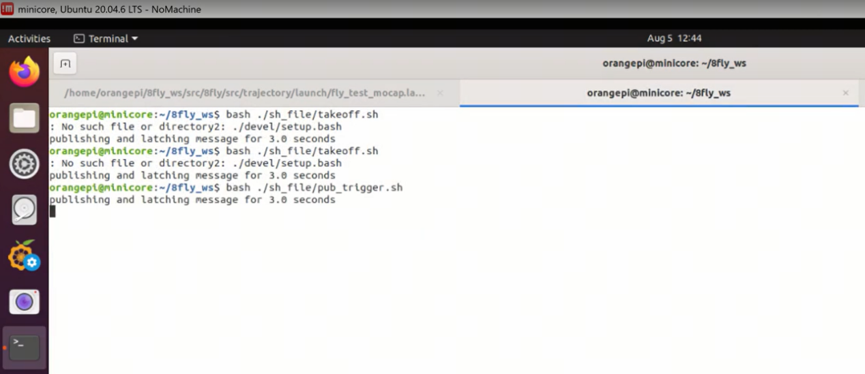
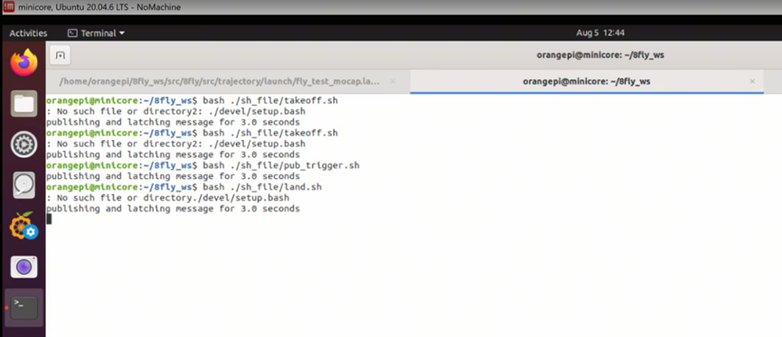
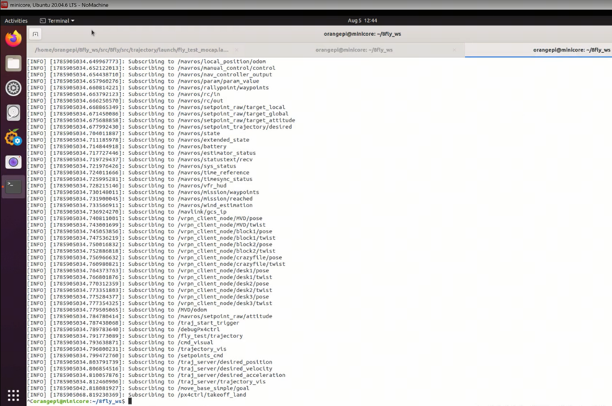
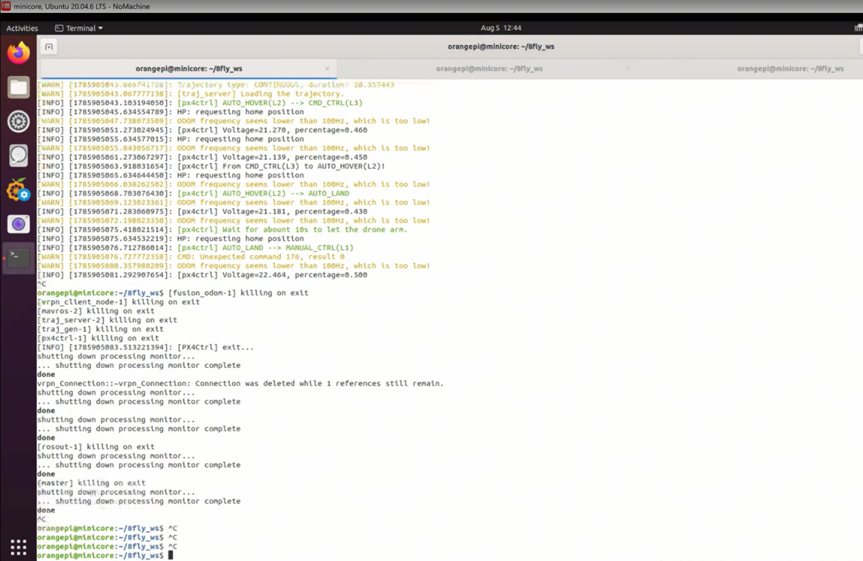

# 第13周：不同形状飞行轨迹生成与执行 

<div style="background-color:#edf2ff; border:1px solid #88aaff; padding:20px 26px; margin:16px 0; border-radius:14px; color:#222; line-height:2.4;">
  📌 <strong>本文档定位：</strong>基于 MINCO 轨迹规划算法的无人机多形状飞行实操手册。面向已完成基础飞行训练的同学，重点讲解参数配置、操作流程和常见问题排查，理论部分仅作必要铺垫。
</div>


# 实践课程大纲

本周实验的核心目标是：通过修改 `traj.yaml` 参数，让无人机完成 **8字、圆形、五角星、S形** 四种不同形状的轨迹飞行，并使用 ROSBag 记录飞行数据用于后续分析。

|形状|shape 参数值|典型应用场景|
|---|---|---|
|8 字 \(eight\)|0|测试航向连续变化、横向机动能力|
|圆形 \(circle\)|1|测试恒定向心加速度下的跟踪精度|
|五角星 \(star\)|2|测试急转与速度突变的动态响应|
|S 形 \(s\-shape\)|3|测试平滑过渡与蛇形机动能力|

1. 理解路径（Path）与轨迹（Trajectory） 的区别，明确轨迹是在空间路径基础上进一步加入时间信息，并能够描述无人机位置 p\(t\) 随时间变化的过程。

2. 理解 MINCO 的基本思想，掌握中间航点 Q、分段时间 T、多项式系数 C 之间的关系，理解为什么 MINCO 不需要将全部多项式系数作为外层优化变量。

3. 理解 minimum\-jerk 五次多项式轨迹及 带状线性系统求解机制，掌握 MINCO 根据 Q,T 快速构造连续平滑轨迹的基本流程。课件中对应的实现通过固定带宽的带状矩阵求解，复杂度近似为 O\(N\)。

4. 掌握八字形与圆形轨迹的代码构造方法，能够通过修改 轨迹长度、宽度、半径、航点和时间参数生成不同形状的轨迹，并理解轨迹从生成、可视化到发布给 px4ctrl 的完整过程。

# 实践一：前置准备

## 1\.1 硬件检查清单

* [ ] 无人机电池电量 \> 80%

* [ ] 遥控器电量充足，模式开关正常

* [ ] 动捕系统（VRPN）正常运行，刚体标记点无遮挡

* [ ] 香橙派与飞控连接正常，SSH 可登录

* [ ] 飞行场地空旷，周围无人员和障碍物

## 1\.2 代码包下载

|下载链接|代码说明|
|---|---|
|<a href="../file/8fly_ws.zip">📥 8fly_ws</a>|8fly_ws代码包|

## 1\.3 软件环境确认

登录香橙派后，确认以下路径存在：

```bash
# 工作空间路径
cd ~/8fly_ws/src/8fly/src/trajectory/

# 参数文件路径
ls parameters/traj.yaml
```

# 实践二：轨迹参数配置（核心）

## 2\.1 定位并打开参数文件

参数文件位于：

```bash
~/8fly_ws/src/8fly/src/trajectory/parameters/traj.yaml
```

使用任意编辑器打开：

```bash
nano ~/8fly_ws/src/8fly/src/trajectory/parameters/traj.yaml
```

## 2\.2 关键参数详解

<div style="background-color:#ffffe6; border:2px solid #ffed4e; padding:20px 26px; margin:16px 0; border-radius:14px; color:#222; line-height:2.4;">
  💡 <strong>快速上手：</strong>第一次实验只需要改 <span style="background:#f3f4f6; padding:4px 10px; border-radius:6px; border:1px solid #ddd; font-family:monospace;">shape</span> 和尺寸参数即可，速度/惩罚参数保持默认。
</div>


### \(1\) 轨迹形状与尺寸

|参数名|默认值|说明|
|---|---|---|
|shape|0|轨迹形状：0=8字, 1=圆形, 2=五角星, 3=S形|
|height|1\.0|飞行高度（米）|
|circleRadius|1\.0|圆形轨迹半径（米），shape=1 时生效|
|eightWidth|2\.0|8字轨迹宽度（米），shape=0 时生效|
|eightLength|3\.0|8字轨迹长度（米），shape=0 时生效|
|starRadius|1\.0|五角星外接圆半径（米），shape=2 时生效|
|sWidth|1\.5|S形横向幅度（米），shape=3 时生效|
|sLength|3\.0|S形纵向长度（米），shape=3 时生效|

### \(2\) 速度、加速度与优化参数

|参数名|默认值|说明|
|---|---|---|
|maxVel|2\.0|最大速度参考约束（m/s）|
|maxAcc|2\.0|最大加速度参考约束（m/s²）|
|K|20|每段采样点数，影响惩罚积分精度|
|rhoT|10\.0|时间代价权重，越大飞行越慢|
|rhoV|100\.0|速度越界惩罚权重|
|rhoA|100\.0|加速度越界惩罚权重|
|dt|0\.01|轨迹发布/采样间隔（秒）|

## 2\.3 参数调优速查表

|想要的效果|调整方法|
|---|---|
|飞得更慢更稳|降低 maxVel/maxAcc，或提高 rhoV/rhoA|
|飞得更快|降低 rhoT，或提高 maxVel/maxAcc（需确认推力足够）|
|轨迹更圆滑|增大 K 值（16\~32 通常够用）|
|缩小轨迹尺寸|减小对应的 radius/width/length 参数|
|换一种轨迹形状|修改 shape 值（0\~3），保存后重新生成轨迹|

<div style="background-color:#fee; border:2px solid #f8a3a3; padding:20px 26px; margin:16px 0; border-radius:14px; color:#222; line-height:2.4;">
  💡 <strong>安全提醒：</strong>提高速度前务必确认场地空间足够，且 PX4 控制器增益和实机推力能跟上。建议从低速开始逐步上调。
</div>
 

## 2\.4 代码结构快速导航

如需深入理解或修改代码，以下是 trajectory 包的核心文件：

|文件路径|作用|
|---|---|
|include/minco/minco\.hpp|**理论核心**：BandedSystem 带状矩阵求解、MinJerkOpt 轨迹生成与梯度传播|
|include/minco/traj\_opt\.h \+ src/minco/traj\_opt\.cpp|**优化器**：L\-BFGS 优化入口，加入时间/速度/加速度惩罚|
|include/minco/traj\_gen\.hpp|**轨迹生成**：根据 shape 参数生成对应形状的中间点 Q 和时间 T|
|src/traj\_gen\.cpp|**ROS 节点入口**：订阅 odom 和 RViz 触发，发布 PolynomialTrajectory|

### \(1\) 核心类与接口

**BandedSystem**（带状矩阵求解器）：

- `create(n, p, q)`：分配带状矩阵

- `factorizeLU()`：原地带状 LU 分解

- `solve()`：求解 Ax = b

- `solveAdj()`：求解 Aᵀx = b（梯度回传用）

**MinJerkOpt**（最小 Jerk 轨迹优化器）：

- `reset(headState, pieceNum)`：初始化边界状态和段数

- `generate(inPs, tailPVA, ts)`：由中间点 Q 和时间 T 生成完整轨迹

- `getTrajJerkCost()`：计算轨迹 Jerk 能量代价

- `calGrads_CT() / calGrads_PT()`：计算系数梯度和参数梯度

- `getTraj()`：获取生成的轨迹对象

# 实践三：完整实操流程

<div style="background-color:#edf9ed; border:2px solid #89dd89; padding:20px 26px; margin:16px 0; border-radius:14px; color:#222; line-height:2.4;">
  💡 <strong>操作总览：</strong>改参数 → 启动控制器 → 生成轨迹 → 起飞 → 录数据 → 触发飞行 → 降落 → 停录
</div>


## 1\.1 修改轨迹参数

1. 打开 `traj.yaml` 文件

<figure style="flex:1; text-align:center;">
  
  <figcaption></figcaption>
</figure>

2. 修改 `shape` 参数选择轨迹形状（0=8字, 1=圆, 2=五角星, 3=S形）

<figure style="flex:1; text-align:center;">
  
  <figcaption></figcaption>
</figure>

3. 根据需要调整尺寸参数（如 `circleRadius`、`height` 等）

4. 保存文件

## 1\.2 启动控制器与动捕

1. 执行综合启动 launch 文件，加载 px4ctrl 节点

2. 确认终端回显中控制器增益参数（Kp, Kv, KAngY 等）已正确加载

<figure style="flex:1; text-align:center;">
  
  <figcaption></figcaption>
</figure>

3. 检查 `/MVD/odom` 话题数据是否正常刷新

4. 确认机体坐标系与动捕坐标系对齐无误

<div style="background-color:#fee; border:2px solid #f28484; padding:20px 26px; margin:16px 0; border-radius:14px; color:#222; line-height:2.4;">
  ❗ <strong>关键检查：</strong>odom 数据异常或坐标系未对齐时，绝对不要起飞，否则极易发散炸机。
</div>

## 1\.3 生成期望轨迹

1. 新开一个终端窗口

2. 清理多余进程（如有）

3. 运行轨迹生成脚本，将期望轨迹载入内存

<figure style="flex:1; text-align:center;">
  
  <figcaption></figcaption>
</figure>

4. 确认 `/traj_server/trajectory` 话题有数据发布

此时无人机仍在地面待命，轨迹仅加载到内存中。

## 1\.4 起飞（Takeoff）

1. 确认周围环境安全，人员远离飞行区域

2. 遥控器切换到 Offboard 模式（或对应自定义模式）

3. 执行起飞脚本

<figure style="flex:1; text-align:center;">
  
  <figcaption></figcaption>
</figure>

4. 观察无人机自动拉高至预设高度（默认 1\.0m）并稳定悬停

<div style="background-color:#fffde6; border:2px solid #ffdd44; padding:20px 26px; margin:16px 0; border-radius:14px; color:#222; line-height:2.4;">
💡 <strong>悬停稳定是前提：</strong>必须等无人机悬停完全稳定后再进行下一步，否则轨迹跟踪初始误差会很大。
</div>

## 1\.5 开启 ROSBag 数据记录

1. 新开终端，执行 rosbag 记录命令：

```bash
rosbag record -a
```

<figure style="flex:1; text-align:center;">
  
  <figcaption></figcaption>
</figure>

2. 确认终端显示正在订阅的话题列表

3. 核实以下关键话题在列表中：    

    - `/mavros/local_position/odom`（融合里程计）

    - `/vrpn_client_node/...`（动捕真值）

    - `/traj_server/...`（期望轨迹）

<div style="background-color:#edf2ff; border:2px solid #94b3f0; padding:20px 26px; margin:16px 0; border-radius:14px; color:#222; line-height:2.4;">
📑 <strong>为什么用 -a?</strong> 全量记录是评估控制算法性能的唯一凭证。只有记录完整，后续才能用 PlotJuggler 绘制精确的误差响应曲线。
</div>

## 1\.6 触发轨迹飞行

1. 确认数据记录已开启，且无人机悬停稳定

2. 运行轨迹触发脚本

<figure style="flex:1; text-align:center;">
  
  <figcaption></figcaption>
</figure>

3. 观察无人机状态：从悬停切换到轨迹跟踪模式，开始沿轨迹飞行

4. 全程监控飞行状态，随时准备手动接管

## 1\.7 安全降落（Land）

1. 飞行测试完成后，运行降落脚本

<figure style="flex:1; text-align:center;">
  
  <figcaption></figcaption>
</figure>

2. 控制器规划平滑降落轨迹，无人机缓慢下降

3. 触地后飞控自动切断电机动力（Disarm）

<div style="background-color:#fff0f0; border:2px solid #f48888; padding:20px 26px; margin:16px 0; border-radius:14px; color:#222; line-height:2.4;">
💡 <strong>紧急情况：</strong>飞行中如出现异常，立即将遥控器切回手动模式或直接执行降落脚本。严重失控时直接关闭遥控器油门。
</div>

## 1\.8 停止记录与清理进程

1. 无人机上锁后，在 rosbag 终端按 `Ctrl + C`

2. 等待文件缓冲写入完毕（确认 \.bag 文件不再是 \.active 后缀）

<figure style="flex:1; text-align:center;">
  
  <figcaption></figcaption>
</figure>

3. 在主程序终端按 `Ctrl + C`，等待 killing on exit 信息

<figure style="flex:1; text-align:center;">
  
  <figcaption></figcaption>
</figure>

4. 确认所有进程已退出，端口释放

# 总结

## 1\.常见问题与排错

起飞前问题

|现象|可能原因与解决|
|---|---|
|odom 话题没有数据|检查动捕系统是否运行、VRPN 客户端是否启动、刚体名称是否匹配|
|起飞后立刻漂移或发散|坐标系未对齐 → 重新校准动捕坐标系与机体坐标系的偏航角|
|无法切到 Offboard 模式|检查 px4ctrl 是否正常运行、MAVROS 连接状态、遥控器模式开关|

轨迹飞行问题

|现象|可能原因与解决|
|---|---|
|触发后无人机不动|检查 traj\_gen 节点是否运行、轨迹话题是否有数据、触发标志位是否正确发送|
|轨迹跟踪误差很大|① 悬停未稳定就触发 → 等悬停稳定再触发 ② 速度/加速度设置过大 → 降低 maxVel/maxAcc ③ 控制器增益不合适 → 调整 Kp/Kv|
|飞行中剧烈抖动|加速度约束过紧或 rhoA 太小 → 增大 rhoA 或降低 maxAcc|
|圆形轨迹变成椭圆|① 动捕定位有偏差 ② 控制器横向和纵向增益不一致 ③ 检查是否有风干扰|

数据记录问题

|现象|可能原因与解决|
|---|---|
|bag 文件是 \.active 后缀|未正常关闭 → 用 `rosbag reindex` 和 `rosbag fix` 修复|
|bag 文件里没有轨迹数据|记录时 traj\_gen 还没启动 → 先启动所有节点再开始记录|

## 2\.MINCO理论要点速查

<div style="background-color:#f5f6f7; border:1px solid #d8d9db; padding:20px 26px; margin:16px 0; border-radius:14px; color:#222; line-height:2.4;">
💡 本节仅列出实操中需要理解的核心概念，详细推导请参考课程 PPT。
</div>

（1）路径 vs 轨迹

- 路径 (Path)：只有空间几何信息，不含时间 → "从 A 到 B 走哪条路"

- 轨迹 (Trajectory)：路径 + 时间信息 → "什么时刻到达什么位置、速度多少"

- 无人机飞控需要的是轨迹，因为电机输出依赖速度和加速度指令

（2）MINCO 核心思想

**一句话**：不直接优化几百个多项式系数，而是只优化有物理意义的 **中间点位置 Q** 和 **每段时间 T**，通过数学映射自动得到连续平滑的最优轨迹。

- **变量降维**：从 6N 个系数 → N 个中间点 \+ N 个时间

- **天然连续**：位置、速度、加速度自动连续，无需额外约束

- **线性时间求解**：带状矩阵 O\(N\) 复杂度，支持实时重规划

- **时空联合优化**：同时优化空间形状和时间分配

（3）轨迹生成四步

1. **设定输入**：边界状态 \+ 中间点 Q \+ 时间 T

2. **构造系统**：根据 BIVP 最优性条件构建带状线性方程组

3. **矩阵求解**：带状 PLU/LU 分解，O\(N\) 复杂度

4. **输出轨迹**：得到每段多项式系数，生成完整轨迹

## 3\.实验后数据分析

（1）使用 PlotJuggler 查看数据

1. 打开 PlotJuggler，加载录制的 \.bag 文件

2. 加载以下关键话题：    

    - 期望位置：`/traj_server/trajectory/pos`

    - 实际位置：`/mavros/local_position/odom/pose/pose/position`

    - 期望速度 vs 实际速度

    - 位置误差曲线

3. 重点观察：    

    - 轨迹跟踪误差大小和分布

    - 速度/加速度是否在约束范围内

    - 转弯处的跟踪表现

（2）不同轨迹的特点对比

|轨迹|跟踪难点|考察重点|
|---|---|---|
|8 字|交叉点处航向连续变化|横向跟踪精度、航向控制|
|圆形|恒定向心加速度|稳态跟踪误差、圆度|
|五角星|尖角处速度方向突变|动态响应、加减速能力|
|S 形|连续平滑转弯|过渡平滑性、蛇形机动|
