# 第14周：飞行轨迹分析与 PID 调参

# 实践课程大纲

学习目标：

本节实践课我们将学习使用 PlotJuggler 软件，提取无人机的真实飞行数据（Bag包），通过鼠标交互将枯燥的数据转化为直观的曲线，从而精准量化 PID 控制器的误差并指导参数调节。

硬件准备：

* [ ] 无人机电池电量 \> 80%

* [ ] 遥控器电量充足，模式开关正常

* [ ] 动捕系统（VRPN）正常运行，刚体标记点无遮挡

* [ ] 香橙派与飞控连接正常，SSH 可登录

* [ ] 飞行场地空旷，周围无人员和障碍物

# 实践一：启动绘图工具与数据导入

## 1\.1 启动 PlotJuggler 软件

PlotJuggler 是 ROS 生态中强大的时序数据分析软件。

1. 打开 Ubuntu 终端（快捷键 `Ctrl+Alt+T`）。

2. 在终端中输入以下指令并回车：

3. Bash

```Plain Text
rosrun plotjuggler plotjuggler
```
<div style="background-color:#f0f2ff; border:2px solid #a2b8f8; padding:24px 28px; margin:16px 0; border-radius:14px; color:#222; line-height:2.2;">
  💡 <strong>注意：</strong>启动时终端会加载各种数据解析插件，如果弹出赞赏彩蛋窗口（Shut up and take my money），直接鼠标左键点击关闭即可进入主界面。
</div>

<figure style="flex:1; text-align:center;">
  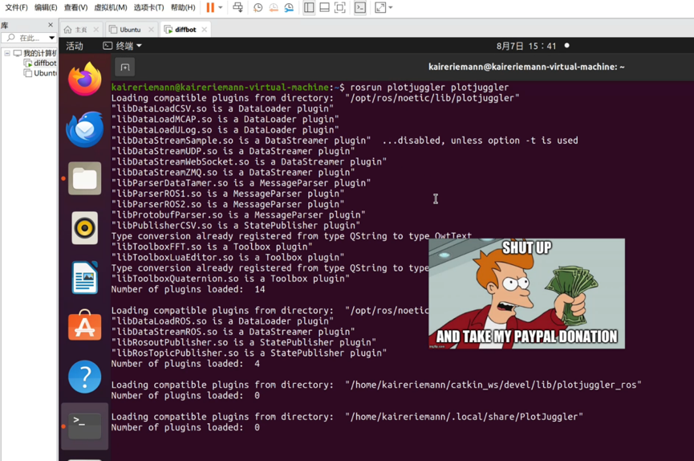
  <figcaption></figcaption>
</figure>

<figure style="flex:1; text-align:center;">
  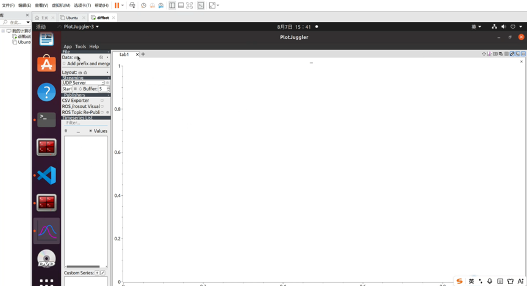
  <figcaption></figcaption>
</figure>

## 1\.2 导入与解析 Bag 文件

1. **打开加载窗口**：在 PlotJuggler 主界面，鼠标左键点击左上角的 `Data` \-\> `Load Data`（或直接使用键盘快捷键 `Ctrl+O`）。

2. **选择文件**：在弹出的文件浏览器中，找到你上节课录制生成的 `.bag` 文件（通常是以日期时间命名的，如 `2026-xxx.bag`），鼠标左键选中它，然后点击右上角的 `Open`。

<figure style="flex:1; text-align:center;">
  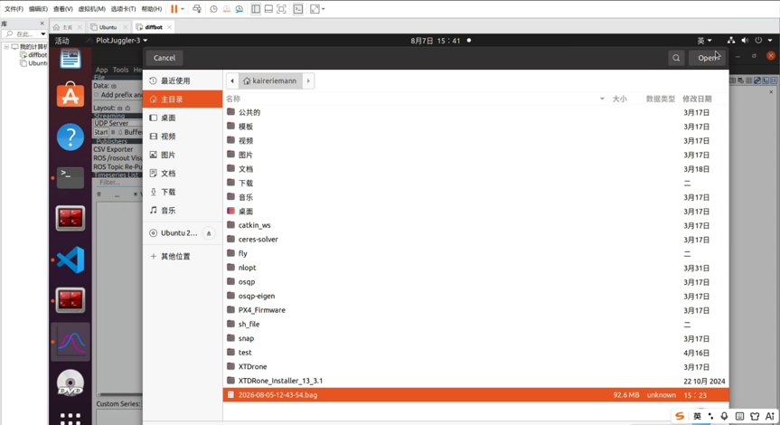
  <figcaption></figcaption>
</figure>

3. **筛选核心话题**：

- 此时会弹出一个名为 `Select ROS messages` 的小窗口，里面列出了所有的 ROS 话题。

<figure style="flex:1; text-align:center;">
  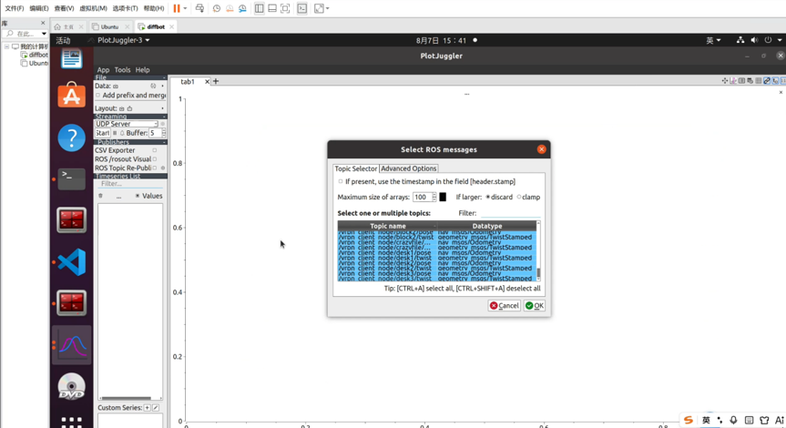
  <figcaption></figcaption>
</figure>

- 在窗口右侧的 `Filter:` 搜索框中，依次输入 `odom`（代表动捕实际位姿）与 `setpoints`（代表期望指令）来过滤数据。

- 使用快捷键 `[CTRL+A]` 全选过滤出来的所有高亮行。

- 鼠标左键点击右下角的绿色的 `✔️ OK` 按钮完成加载。

# 实践二：轨迹跟踪对比与绘图操作

## 2\.1 展开数据树与生成曲线 \(三轴位置响应\)

现在数据已经加载到左侧的侧边栏（Timeseries List）中了，接下来我们需要把它们画出来。

1. **寻找数据**：在左侧面板中，你会看到层级化的数据树。鼠标左键依次点击文件夹左侧的小三角展开：`/MVD` \-\> `odom` \-\> `pose` \-\> `pose` \-\> `position`，此时你能看到 `x`, `y`, `z` 三个变量。

<figure style="flex:1; text-align:center;">
  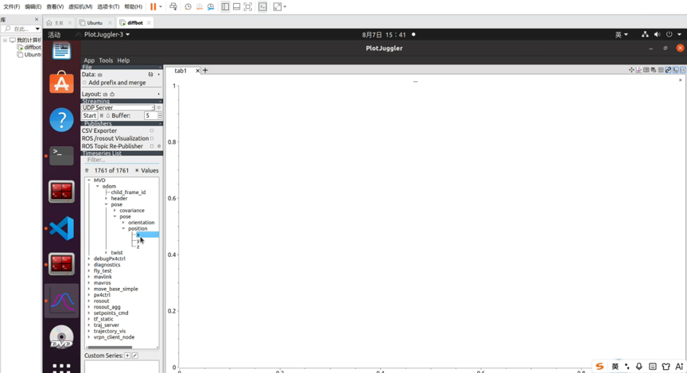
  <figcaption></figcaption>
</figure>

2. **拖拽绘图**：

- 将鼠标光标悬停在变量 `x` 上。

- **按住鼠标左键不放**，将其直接拖拽到右侧巨大的空白绘图区中。

- **松开鼠标左键**，此时屏幕上会立刻渲染出实际 X 轴位置随时间变化的曲线。

3. **叠加期望曲线**：用同样“按住并拖拽”的方法，在左侧找到 `/setpoints_cmd/position/x`，把它拖拽到**刚才同一个绘图区中**松开。

4. **观察对比**：右上角的图例会显示不同颜色的线条代表哪个变量。观察实际曲线是否紧紧“包裹”着期望曲线。

<figure style="flex:1; text-align:center;">
  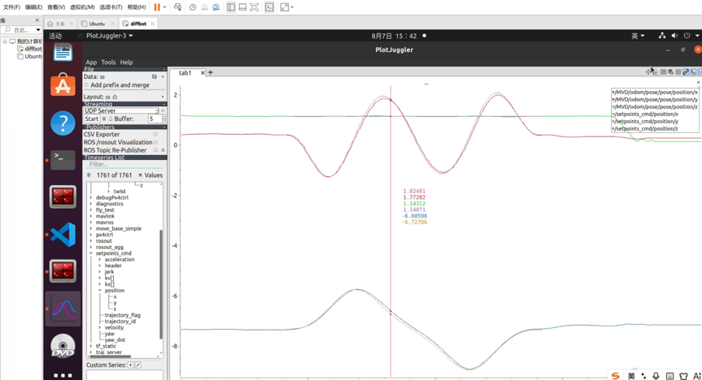
  <figcaption></figcaption>
</figure>

## 2\.2 空间“8”字形态二维验证 \(XY Plot 模式\)

除了随时间变化的折线图，我们还需要看无人机在 2D 平面上的真实飞行轨迹形状。

1. **新建工作区**：鼠标左键点击右侧绘图区顶部标签栏（如 `tab1`）旁边的 `+` 号，新建一个空白选项卡。

<figure style="flex:1; text-align:center;">
  
  <figcaption></figcaption>
</figure>

2. **切换为 XY 视图**：在新建的空白绘图区内，**点击鼠标右键**，在弹出的菜单中选择开启 `XY Plot` 模式。这会把坐标系变成直角坐标系。

3. **关联坐标轴**：

- 将左侧的实际轨迹 `x` 变量按住左键拖拽到视图中作为 X 轴数据。

- 将实际轨迹 `y` 变量拖拽进入作为 Y 轴数据。

- 同样的方法，将期望轨迹的 `x` 和 `y` 也拖入其中。

<figure style="flex:1; text-align:center;">
  
  <figcaption></figcaption>
</figure>

4. 此时，图表中应完美呈现出一个双环的“8”字曲线（Lissajous 曲线）。

<figure style="flex:1; text-align:center;">
  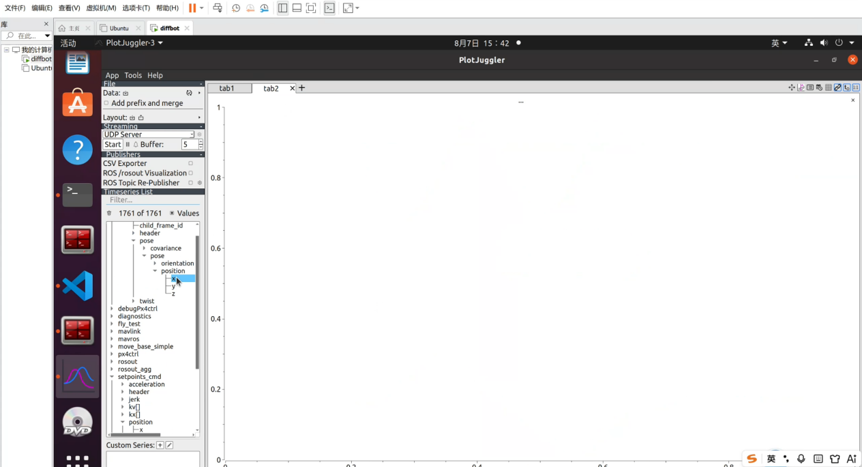
  <figcaption></figcaption>
</figure>

## 2\.3 速度响应与前馈分析

1. 再次新建一个空白选项卡（点击 `+`）。

2. 在左侧展开 `/MVD/odom/twist/linear` 找到实际速度，展开 `/setpoints_cmd/velocity` 找到期望速度。

3. 将对应的速度变量拖入同一个图表中进行同屏比对。

<figure style="flex:1; text-align:center;">
  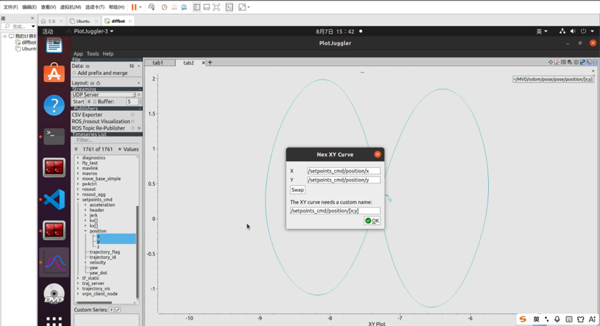
  <figcaption></figcaption>
</figure>

# 实践三：利用 Lua 脚本进行动态误差量化

肉眼看两条线靠得近不近不够严谨，我们需要计算它们相减的绝对值误差。

## 3.1 唤出自定义工具

在软件界面的左下角，找到 `Custom Series` 窗口，鼠标左键点击旁边的 `+` 图标，准备创建自定义派生序列。

<figure style="flex:1; text-align:center;">
  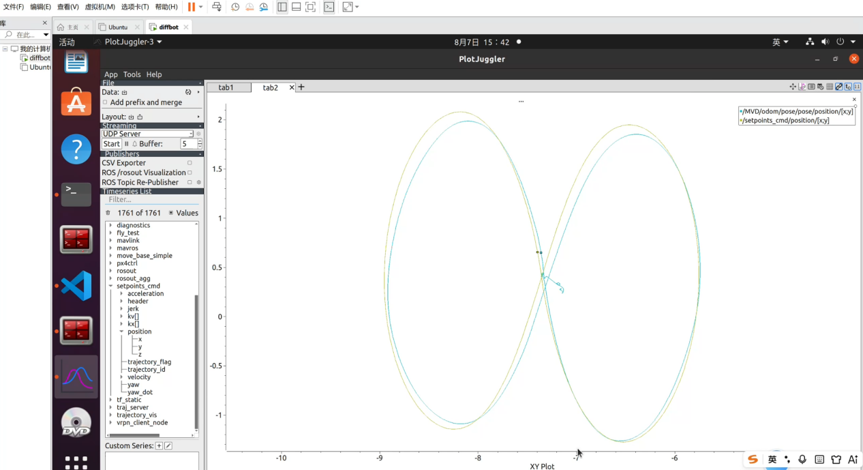
  <figcaption></figcaption>
</figure>

<figure style="flex:1; text-align:center;">
  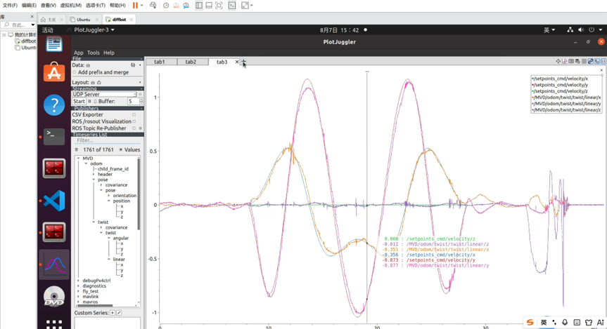
  <figcaption></figcaption>
</figure>

## 3.2 配置计算公式

- **New name \(命名\)**：在上方输入框输入 `diff_x`。

- **Input timeseries \(主变量\)**：点击输入框，选择 `/MVD/odom/pose/pose/position/x`。

- **Additional source timeseries \(辅变量\)**：将左侧列表中的期望指令 `/setpoints_cmd/position/x` 直接拖入下方名为 `v1` 的大白框中。


- **Function \(编写脚本\)**：在右下角的代码输入框中，输入以下 Lua 代码求绝对差值：


- Lua

```Plain Text
return math.abs(value - v1)
```

## 3.3 实操

1. 鼠标左键点击右上角的绿色勾选按钮（或回车）保存。

<figure style="flex:1; text-align:center;">
  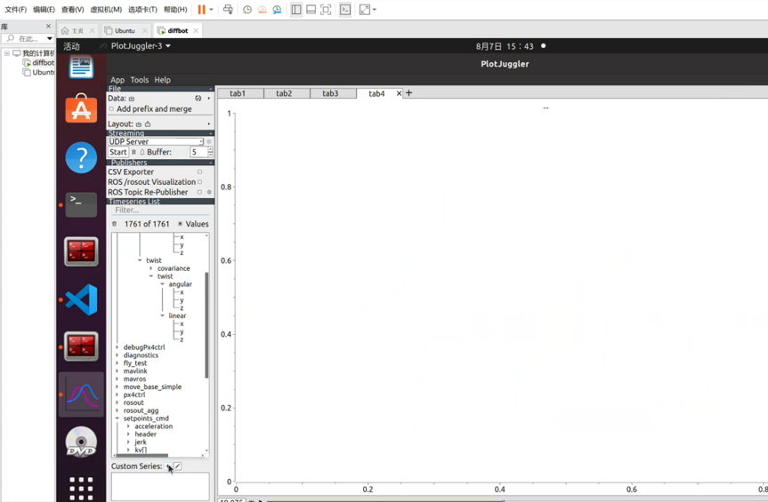
  <figcaption></figcaption>
</figure>

2. 将左侧新生成的 `diff_x` 拖入空白绘图区，即可直观看到最大的误差波峰（例如约 0\.187m），这为你接下来的调参提供了数字依据。

<figure style="flex:1; text-align:center;">
  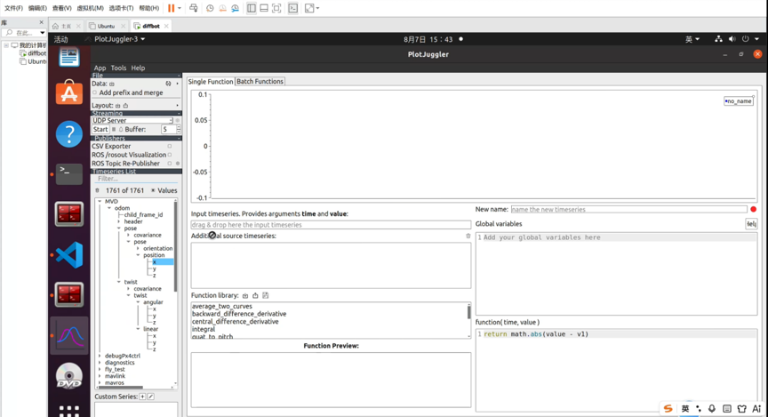
  <figcaption></figcaption>
</figure>

# 实践四：PID 调参实操法则

## 4\.1 调节位置控制 \(Kp\)

配置文件中的 `Kp0, Kp1, Kp2` 分别对应无人机在 X轴、Y轴、Z轴 的位置比例增益。


- 🔴 **如果你的图出现“超调 \(Overshoot\)”**：实际位置 \(odom\) 严重越过期望指令 \(setpoint\) 形成很高的波峰，说明当前比例增益过激 👉 **进入文件，调小对应的 Kp 值**。


- 🔵 **如果你的图出现“滞后 \(Lag\)”**：实际位置 \(odom\) 响应迟缓，曲线一直在期望指令的后面追，说明比例增益不足 👉 **进入文件，调大对应的 Kp 值**。

<figure style="flex:1; text-align:center;">
  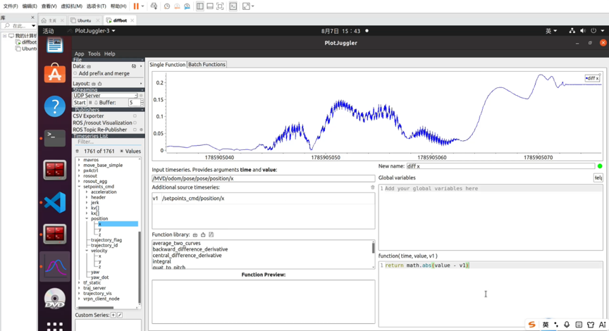
  <figcaption></figcaption>
</figure>

## 4\.2 调节速度控制 \(Kv\)

配置文件中的 `Kv0, Kv1, Kv2` 分别对应 X轴、Y轴、Z轴 的速度微分阻尼增益。


- 🔴 **如果你的速度图出现“高频震荡”**：速度波形像锯齿一样剧烈抖动或频繁超调，说明系统阻尼不匹配 👉 **进入文件，调小对应的 Kv 值**以增加稳定性。


- 🔵 **如果你的速度图出现“跟随无力”**：速度变化平缓，长时间达不到给定的期望速度波峰 👉 **进入文件，调大对应的 Kv 值**提升飞行器的敏捷度。

<figure style="flex:1; text-align:center;">
  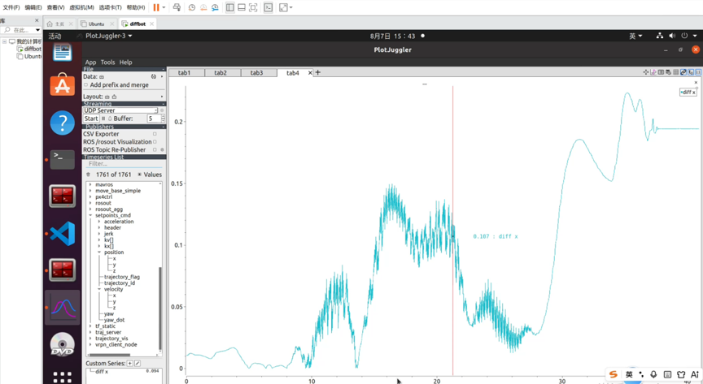
  <figcaption></figcaption>
</figure>

<figure style="flex:1; text-align:center;">
  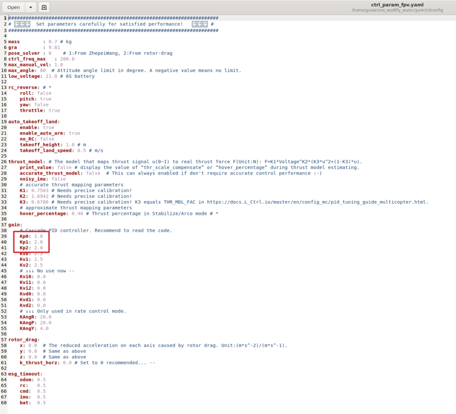
  <figcaption></figcaption>
</figure>

## 4\.3 调参最终效果

<figure style="flex:1; text-align:center;">
  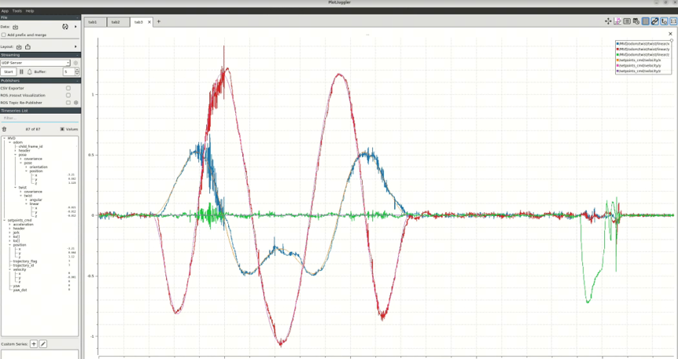
  <figcaption></figcaption>
</figure>

# 总结：

## 1\.课程要点回顾

1. 掌握飞行数据可视化方法：利用 PlotJuggler 导入 ROSBag 数据，提取实际位置、速度和期望指令，并建立轨迹分析工作区。

2. 学会比较期望轨迹与实际轨迹：通过同图叠加位置或速度曲线，观察跟踪滞后、超调、震荡以及稳态误差，判断控制器动态性能。

3. 从定性观察进一步进行误差量化：利用自定义数据序列计算实际位置与期望位置的差值，并提取最大误差、误差变化和收敛情况，为调参提供量化依据。

4. 根据数据有针对性地调节PID参数：位置跟踪超调或滞后可结合Kp判断，速度响应和震荡则结合Kv分析，并通过调参前后的数据重新验证效果。

