# 第4周：PX4与地面站配置实操指南

本文档是PX4飞控与QGroundControl地面站配置的完整实操教程，涵盖从固件烧录、参数管理、传感器校准到接收机对频的全流程。每一步都配有实际操作截图，建议按照章节顺序依次操作，确保无人机组装完成后能够安全、准确地完成地面站配置。

💡 <strong>安全提示：</strong>固件烧录和参数写入过程中，切勿断开USB连接或切断电源，否则可能导致飞控变砖。校准传感器时，务必将无人机放置在水平、静止的平台上。

# 实践课程大纲

本次实践目标是让每位同学亲手完成PX4飞控从固件烧录到遥控器对频的全部地面站配置流程。

|序号|实践环节|主要内容|
|---|---|---|
|1|QGC固件烧录|连接飞控、进入Bootloader、选择PX4 Pro固件栈、烧录自定义固件文件并验证|
|2|参数管理|导出原始参数备份、导入预设参数文件、逐项核验8项关键参数|
|3|传感器校准|陀螺仪校准、加速度计六方位校准、地平线校准|
|4|传感器数据查看|通过MAVLink Inspector查看光流高度和IMU原始数据，判断校准质量|
|5|接收机与遥控器对频|接收机WiFi配置、遥控器Web配置、通道映射与取反、对频词设置、协议确认|
|6|遥控器校准|QGC中校准遥控器摇杆行程，确认模式2（美国手）|

硬件准备

|物品|说明|
|---|---|
|无人机|已完成机械组装，飞控为MicoAir743v2，搭载光流模块|
|USB 数据线|用于连接飞控与电脑，建议使用数据线而非仅充电线|
|RadioMaster T8L遥控器|已充满电，配备USB\-C接口用于连接电脑配置|
|电脑（Windows）|已安装QGroundControl，建议使用Windows 10/11系统|

软件准备

请提前在电脑上安装好QGroundControl地面站软件。安装完成后打开一次，确认软件能正常启动。同时确保电脑上有可用的浏览器（Chrome或Edge），用于访问RadioMaster在线配置页面和ExpressLRS WiFi配置页面。

文件准备

上课前请将以下文件下载到电脑桌面或容易找到的位置，并将qgc进行安装:

|文件名|用途|
|---|---|
|<a href="https://diffrobots.oss-cn-hangzhou.aliyuncs.com/nju-wiki/file/MicoAir743v2_PX4-1.14.3.px4" target="_blank">📥 固件文件</a>`MicoAir743v2_PX4-1.14.3.px4`|PX4 1\.14\.3自定义固件，用于烧录飞控|
|<a href="https://diffrobots.oss-cn-hangzhou.aliyuncs.com/nju-wiki/file/MVD35_OpticalFlow_PX4_1.14.3.params">📥 参数文件</a>`MVD35_OpticalFlow_PX4_1.14.3.params`|预设参数文件，包含光流使能、串口配置等关键参数|
|<a href="https://diffrobots.oss-cn-hangzhou.aliyuncs.com/nju-wiki/file/QGroundControl-installer.exe"> 📥 qgc安装包</a>qgc v5.0.8软件安装包|QGroundControl 软件安装包|

# 实践一：QGC固件烧录

固件烧录是将PX4飞行控制软件写入飞控硬件的过程。我们使用的飞控为MicoAir743v2，烧录PX4固件。整个过程通过QGroundControl地面站完成，不需要额外的烧录工具。

## 1.1 硬件连接与进入固件界面

- 首先将飞控通过USB数据线直接连接到电脑，给设备供电，等待操作系统识别到串口设备。

- 连接成功后，打开QGroundControl，点击左上角的Q图标进入"Vehicle Configuration"（飞行器配置）菜单，然后在左侧选择"Firmware"（固件）选项。

<figure style="margin:16px 0;">
  <!-- 左右图片横向容器 -->
  

    
    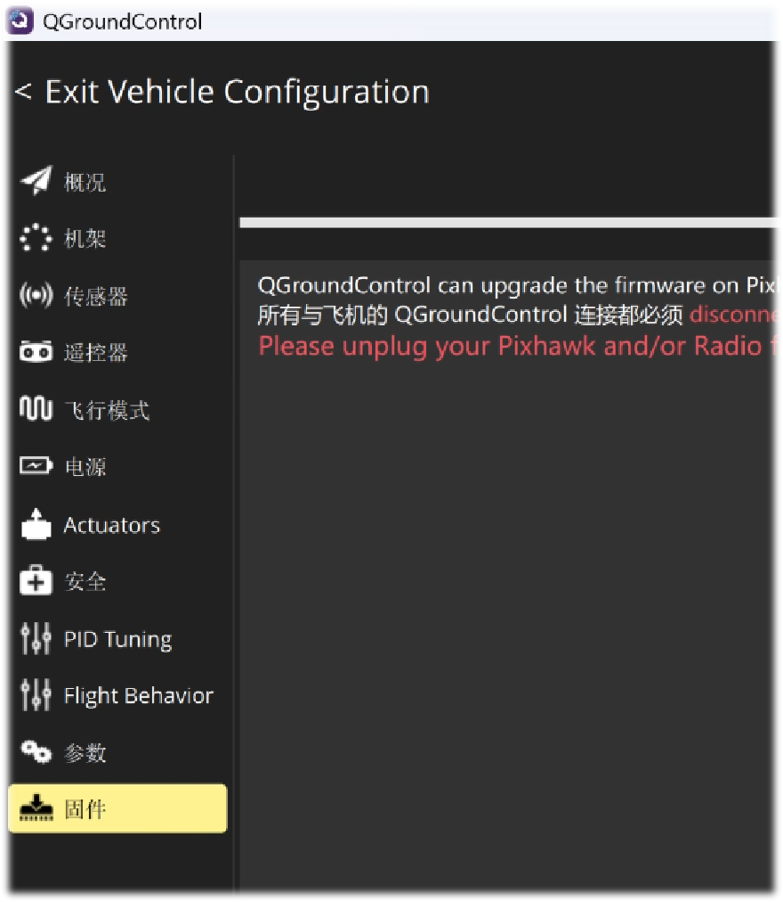
  

  <!-- 共用底部说明文字 -->
  <figcaption style="text-align:center; margin-top:12px; font-size:1.1em;">
点击左上角Q图标，进入Vehicle Configuration
  </figcaption>
</figure>

## 1.2 选择固件栈与版本

- 重新连接电池。QGC会自动检测到飞控并弹出固件设置面板。在面板中选择**PX4 Pro**作为飞行控制固件栈。

<figure style="flex:1; text-align:center;">
    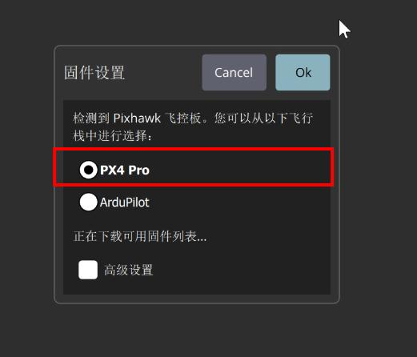
    <figcaption>选择PX4 Pro固件栈</figcaption>
</figure>

- 接下来需要指定自定义固件文件。勾选"高级设置"复选框，在下方的版本下拉菜单中选择"自定义固件文件\.\.\."选项，然后点击"OK"。

<figure style="flex:1; text-align:center;">
    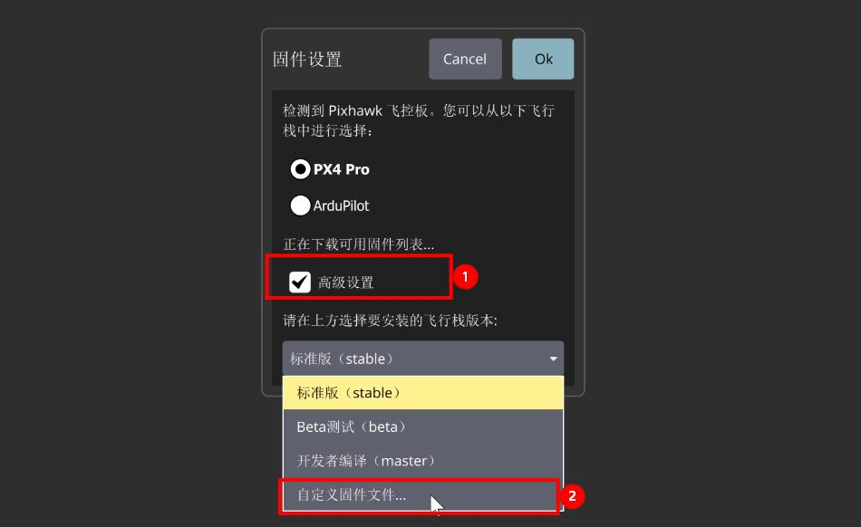
    <figcaption>勾选高级设置，选择自定义固件文件</figcaption>
</figure>

## 1.3 执行烧录

- 在弹出的文件选择对话框中，导航到固件文件所在目录，选择预先准备好的固件文件MicoAir743v2\_PX4\-1\.14\.3\.px4，点击"打开"开始烧录。

<figure style="flex:1; text-align:center;">
    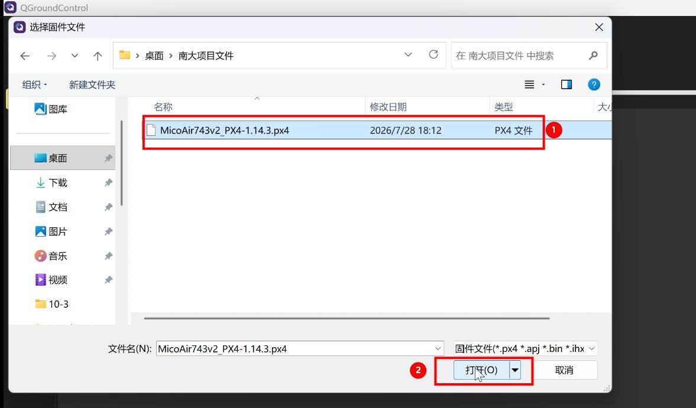
    <figcaption>选择.px4固件文件</figcaption>
</figure>

- 烧录过程中，QGC会依次显示下载固件、解压parameter\.xml和airframe\.xml、擦除旧程序、烧写新版本、验证程序等步骤。

**整个过程大约需要30秒到1分钟，期间切勿断开连接或断电。**当看到"Program complete""验证完成""Rebooting board"以及最后的"升级完成"提示时，说明固件烧录成功，飞控将自动重启。

<figure style="flex:1; text-align:center;">
    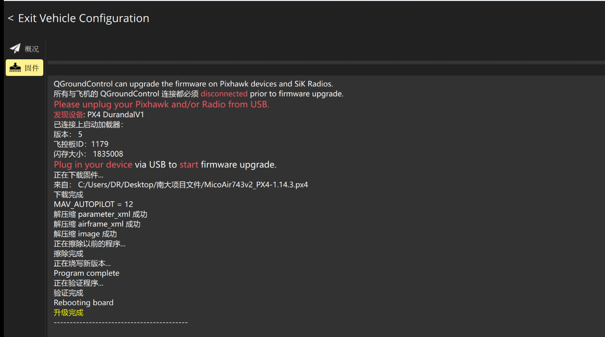
    <figcaption>固件烧录进度日志，显示升级完成</figcaption>
</figure>

## 1.4 操作视频

  <video width="950" controls>
    <source src="https://diffrobots.oss-cn-hangzhou.aliyuncs.com/nju-wiki/4/%E5%9B%BA%E4%BB%B6%E5%88%B7%E5%86%99%E6%95%99%E7%A8%8B.mp4" type="video/mp4">
  </video>

# 实践二：参数管理

PX4有数百个可调参数，控制着从飞行模式到传感器融合的方方面面。手动逐个配置效率低且容易出错，因此实际操作中通常使用参数文件进行批量导入导出。本节介绍如何导出当前参数、导入预设参数文件，以及导入后的核验方法。

## 2.1 参数导出

- 参数导出用于备份当前飞控的配置状态。在QGC主界面点击左上角Q图标，进入"Vehicle Configuration"，选择"Parameters"（参数）页面。

<figure style="margin:16px auto 16px auto; max-width:100%;">
  <!-- 左右图片横向容器 -->
  

    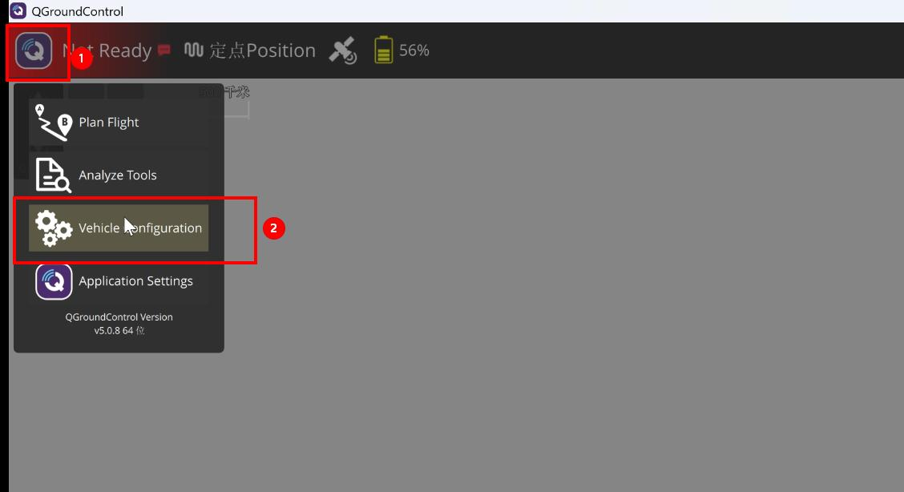
    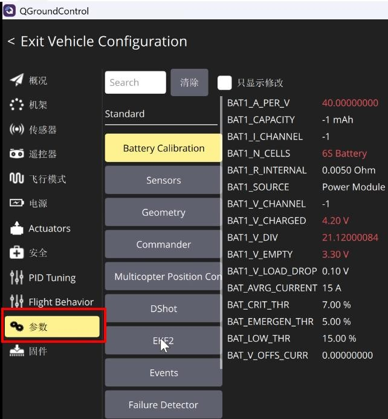
  

  <!-- 共用底部说明文字 -->
  <figcaption style="text-align:center; margin-top:12px; font-size:1.1em;">
QGC参数配置页面
  </figcaption>
</figure>

- 点击参数页面右上角的"Tools"（工具）按钮，在下拉菜单中选择"Save to file"，在弹出的保存对话框中选择保存路径并为文件命名（例如"无人机参数"），点击"保存"即可将当前所有参数导出为`.params`文件。

  

    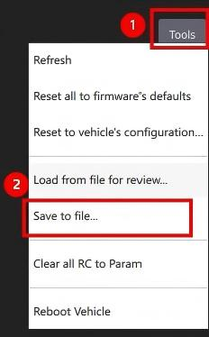
    
Tools菜单中选择Save to file

  

  

    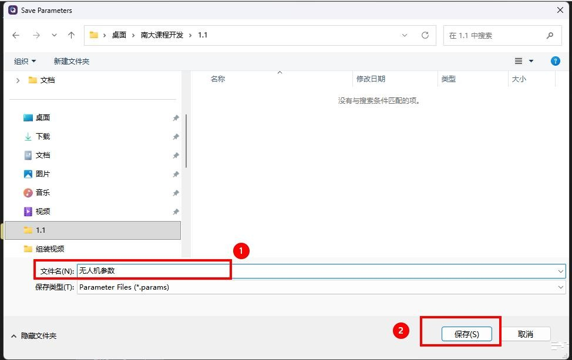
    
选择保存路径，保存参数

  

## 2.2 参数导入

- 参数导入是将预设的参数文件批量写入飞控，适用于快速配置一架新飞机或恢复到已知良好状态。进入参数页面后，点击右上角"Tools"按钮，选择"Load from file for review"，在文件选择对话框中找到目标参数文件（例如`MVD30_OpticalFlow_PX4_1.14.3.params`），选中后点击打开。

  

    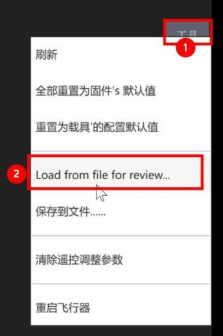
    
Tools菜单中选择Load from file for review

  

  

    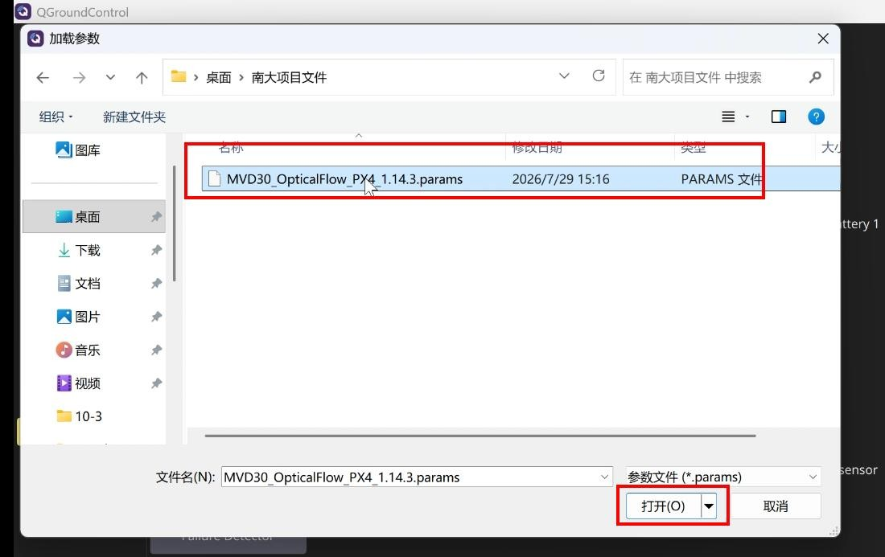
    
选择参数文件

  

- 加载后QGC会显示参数对比列表，左侧是文件中的参数值（File），右侧是飞控当前值（Vehicle），方便你确认哪些参数会被修改。确认无误后点击右上角的"OK"按钮执行写入。

<figure style="flex:1; text-align:center;">
    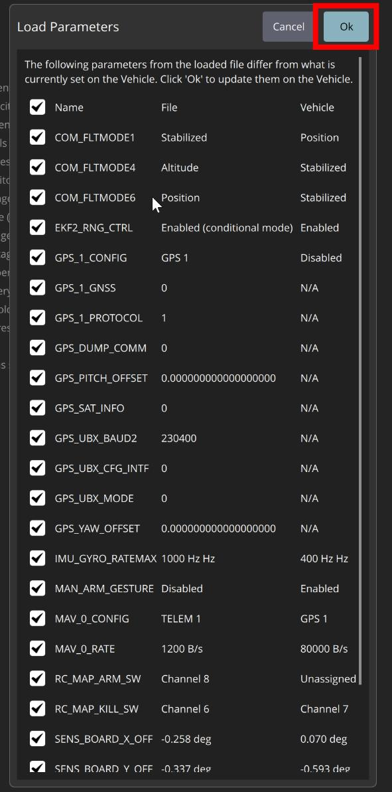
    <figcaption>参数对比列表，确认后点击OK写入</figcaption>
</figure>

- 写入完成后，必须重启飞控才能使新参数生效。再次点击"Tools"按钮，选择"Reboot Vehicle"（重启飞行器），等待飞控重启完成。

<figure style="flex:1; text-align:center;">
    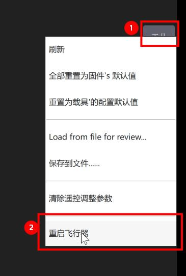
    <figcaption>Tools菜单中选择重启飞行器</figcaption>
</figure>

## 2.3 参数导入核验

⚠️ <strong>重要：</strong>
    <ul style="margin:8px 0;padding-left:20px;">
      <li>参数导入显示成功≠参数正确生效。导入后必须逐项核验关键参数，避免"导入成功但实际运行参数异常"导致悬停漂移、控制失效甚至炸机。</li>
      <li>在进行<code>MAN_ARM_GESTURE</code>参数检查时，先将飞行模式中，<code>Arm switch channel</code>设置为Unassigned</li>
  </ul>

导入并重启后，回到参数页面，逐一搜索并确认以下关键参数的值是否与预期一致：

|参数名|期望值|
|---|---|
|`EKF2_RNG_CTRL`|ENABLED|
|`IMU_GYRO_RATEMAX`|400 Hz|
|`GPS1_CONFIG`|DISABLED|
|`MAV_0_CONFIG`|GPS1|
|`MAV_0_RATE`|80000 B/s|
|`MAN_ARM_GESTURE`|ENABLED|
|`SER_GPS1_BAUD`|921600 8N1|
|`SENS_FLOW_ROT`|YAW180|
|`SDLOGGING`|Default set\(general log analysis\) Estimator replay \(EKF2\) System identification High rate Sensor comparison|

这些参数涉及光流使能、陀螺仪采样率、GPS禁用、MAVLink串口配置、手势解锁、串口波特率和光流安装方向，任何一项不正确都可能导致飞行异常。如果发现某个参数值与预期不符，手动修改后再次重启。

## 2.4 操作视频

  <video width="950" controls>
    <source src="https://diffrobots.oss-cn-hangzhou.aliyuncs.com/nju-wiki/4/%E5%8F%82%E6%95%B0%E5%AF%BC%E5%87%BA%E5%AF%BC%E5%85%A5%E5%8F%8A%E6%95%B0%E6%8D%AE%E6%A3%80%E6%9F%A5.mp4" type="video/mp4">
  </video>

# 实践三：传感器校准

传感器校准是确保飞控能够准确感知自身姿态和运动状态的关键步骤。PX4依赖陀螺仪、加速度计等IMU传感器进行姿态估计，如果校准不准，无人机会出现漂移、抖动甚至无法起飞。本节依次介绍陀螺仪校准、加速度计校准和地平线校准。

## 3.1 校准前准备

校准前需要准备好QGroundControl软件、USB Type\-C转接线和待校准的无人机。**务必将无人机放置在水平、静止的平台上**，校准过程中不得移动机体。用USB线将飞控连接到电脑，等待QGC连接成功，顶部状态栏显示绿色就绪状态。

<figure style="flex:1; text-align:center;">
    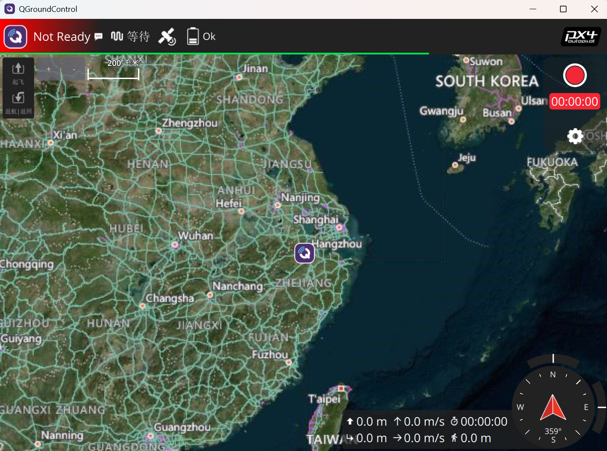
    <figcaption>QGC连接界面，等待飞控就绪</figcaption>
</figure>

## 3.2 陀螺仪校准

陀螺仪（Gyroscope）用于测量无人机的角速度，是姿态估计的核心传感器。

- 点击QGC右上角的Q图标进入"Vehicle Configuration"，在左侧选择"Sensors"（传感器），然后点击"Gyroscope"选项。在弹出的提示框中点击"OK"，确认无人机已水平放置并保持静止。

  

    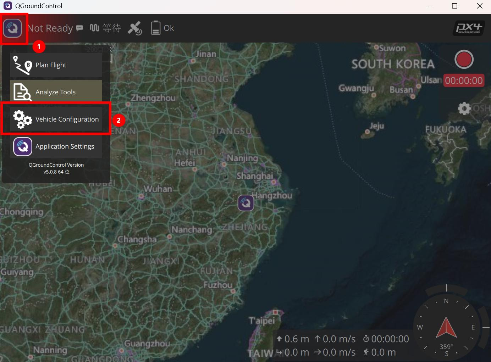
    
进入载具设置

  

  

    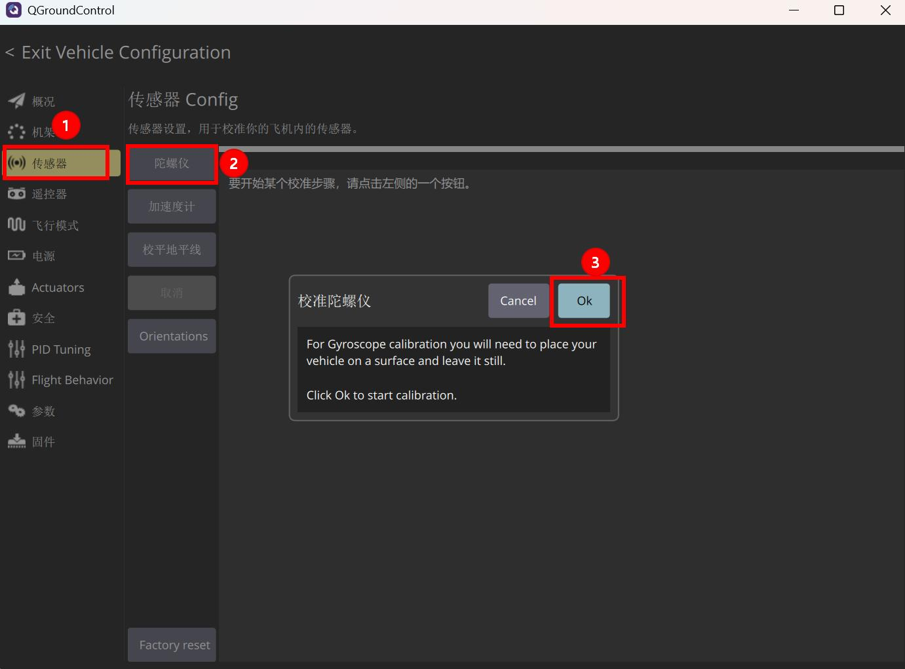
    
传感器页面选择陀螺仪校准

  

- 校准过程大约持续30秒，期间无人机会保持静止，QGC界面上的3D模型会显示校准进度。当进度条走完、3D模型变为绿色并提示"已完成"时，陀螺仪校准成功。

<figure style="flex:1; text-align:center;">
    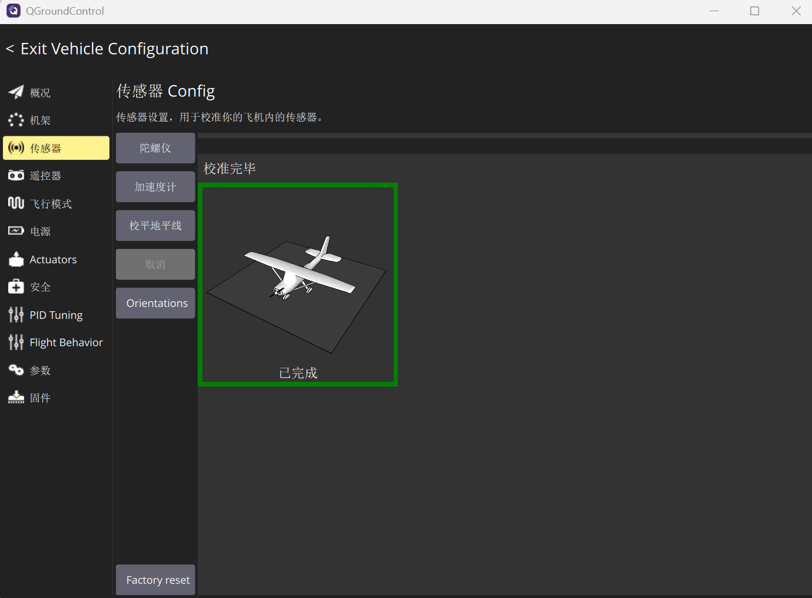
    <figcaption>陀螺仪校准完成</figcaption>
</figure>

## 3.3 加速度计校准

加速度计（Accelerometer）用于测量重力方向和线性加速度，决定了无人机能否准确判断"哪边是下"。

- 点击QGC右上角的Q图标进入"Vehicle Configuration"，在左侧选择"Sensors"（传感器），然后点击"Accelerometer"，选项选择"No rotation"选项，在提示框中点击"OK"，确认无人机已水平放置并保持静止。

  

    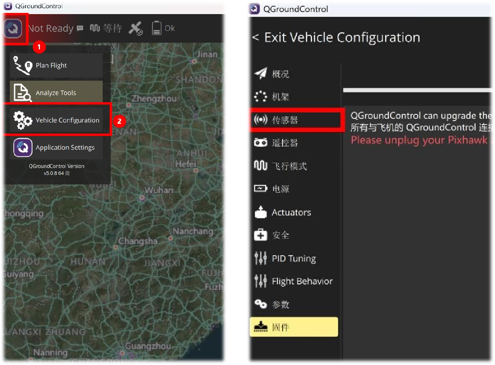
    

  

  

    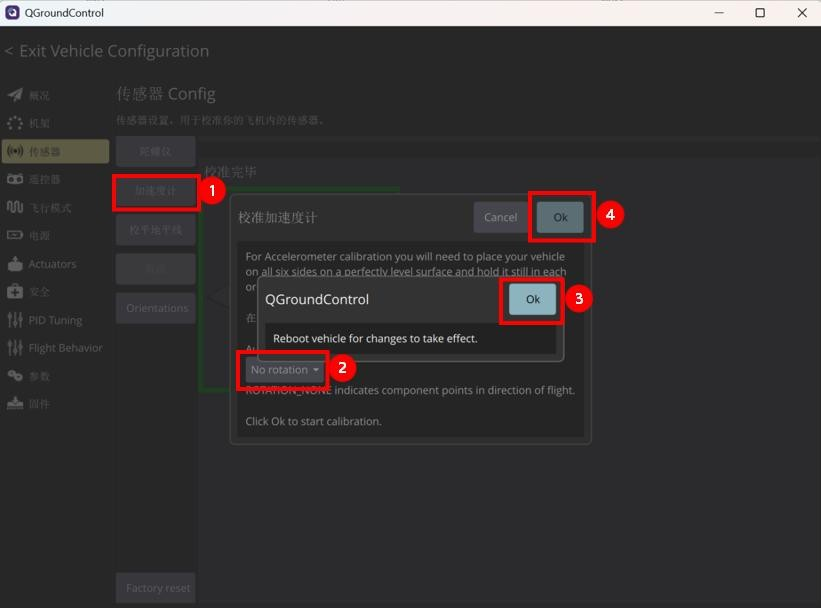
    

  

- 与陀螺仪不同，加速度计校准需要将无人机依次摆放到六个不同的姿态：正面朝上、背面朝上、左侧、右侧、顶部、底部。每个姿态保持约10秒。

<figure style="flex:1; text-align:center;">
    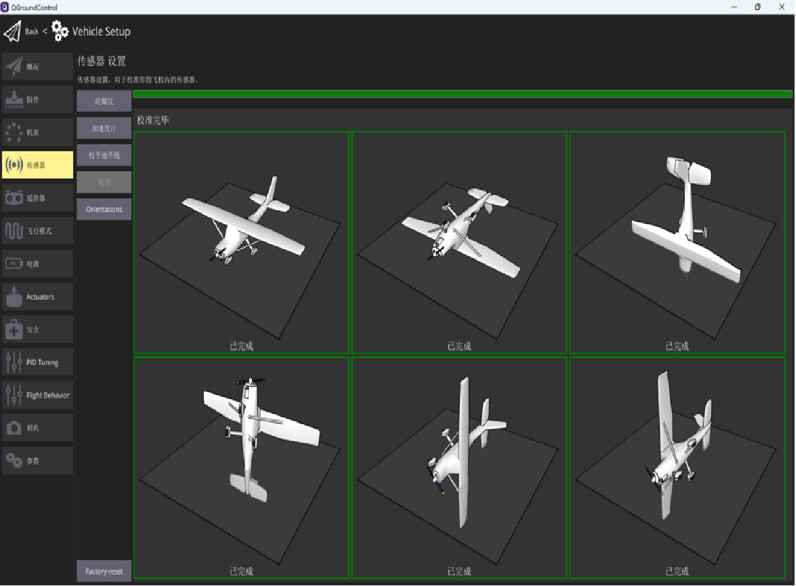
    <figcaption>加速度计校准完成</figcaption>
</figure>

## 3.4 地平线校准

地平线校准（Level Horizon）用于设定无人机的水平基准面，确保悬停时姿态仪显示水平。

- 点击QGC右上角的Q图标进入"Vehicle Configuration"，在左侧选择"Sensors"（传感器），然后点击"地平线"，在提示框中点击"OK"，确认无人机已水平放置并保持静止。

  

    
    

  

  

    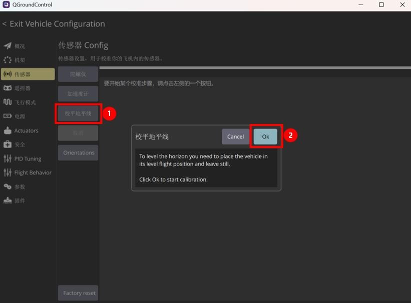
    

  

- 将无人机水平放置在桌面上，保持静止约30秒，QGC会自动完成校平。当日志中显示"calibration done: level"时，表示地平线校准成功。

<figure style="flex:1; text-align:center;">
    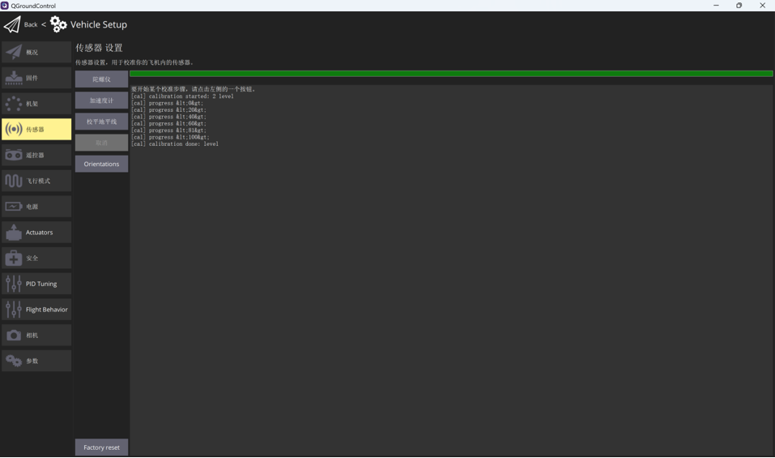
    <figcaption>地平线校准进度日志</figcaption>
</figure>

## 3.5 操作视频

  <video width="950" controls>
    <source src="https://diffrobots.oss-cn-hangzhou.aliyuncs.com/nju-wiki/4/%E4%BC%A0%E6%84%9F%E5%99%A8%E6%A0%A1%E5%87%86%E5%8F%8A%E9%A3%9E%E8%A1%8C%E6%A8%A1%E5%BC%8F%E8%AE%BE%E7%BD%AE.mp4" type="video/mp4">
  </video>

# 实践四：传感器数据查看与分析

校准完成后，不能只看QGC显示"校准成功"就放心了——必须通过MAVLink Inspector直接查看传感器原始数据，确认数据合理、无异常。本节介绍如何查看光流和IMU数据，以及如何解读这些数据。

## 4.1 查看光流高度数据

- 光流是无GPS环境下PX4位置环的核心感知源，光流异常会直接导致悬停漂移、飞丢甚至炸机。在QGC中点击右上角图标，选择"Analyze Tools"（分析工具）。

<figure style="flex:1; text-align:center;">
    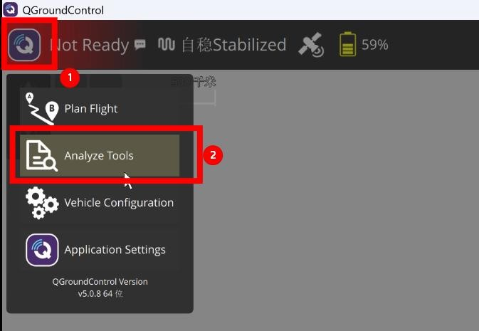
    <figcaption>Analyze Tools菜单入口</figcaption>
</figure>

- 然后在左侧选择"MAVLink Inspector"（MAVLink检测）。在消息列表中找到`DISTANCE_SENSOR`消息，展开后查看`current_distance`字段，这是光流/激光测距测得的对地高度。

可以上下移动无人机，观察数值是否随距离变化而合理变化——例如将飞机抬高时数值应增大，放低时数值应减小。如果数值不动或跳变异常，说明光流传感器连接或安装有问题。

<figure style="flex:1; text-align:center;">
    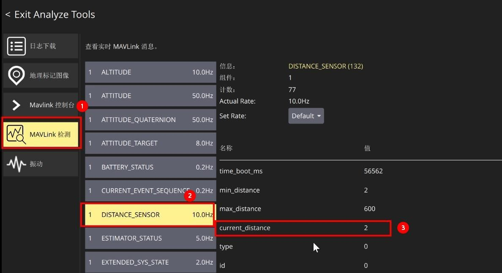
    <figcaption>MAVLink Inspector中查看DISTANCE_SENSOR数据</figcaption>
</figure>

## 4.2 查看IMU数据

IMU（惯性测量单元）是无人机状态估计的基础传感器，光流仅作为外部观测做修正。在MAVLink Inspector中找到`HIGHRES_IMU`消息，展开后可以看到三轴加速度、三轴角速度、气压、温度等原始数据。

<figure style="flex:1; text-align:center;">
    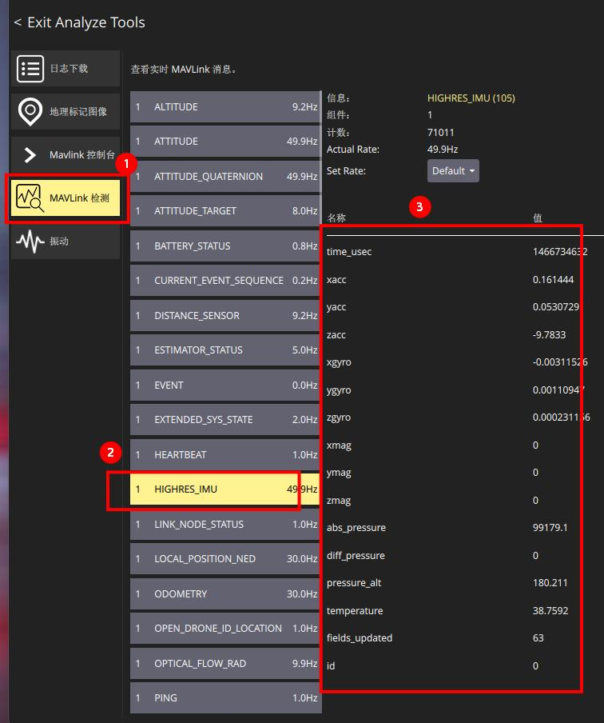
    <figcaption>HIGHRES_IMU原始数据</figcaption>
</figure>

IMU数据的判断方法如下：飞机静止放在桌面上时，三轴陀螺仪`xgyro/ygyro/zgyro`的数值应该接近0；Z轴加速度`zacc`理论上应接近\-9\.81 m/s²（重力加速度），而X、Y轴加速度接近0。

如果这些数值偏差较大，说明IMU校准不准确或硬件有问题。此外，`temperature`字段显示IMU芯片温度，正常工作温度一般在30\-60°C之间。

|字段|含义|静止状态正常范围|
|---|---|---|
|xacc/yacc/zacc|三轴加速度（m/s²）|x≈0, y≈0, z≈\-9\.81|
|xgyro/ygyro/zgyro|三轴角速度（rad/s）|全部接近0|
|xmag/ymag/zmag|三轴磁力计|此报文可能不带磁力计数据|
|abs\_pressure|绝对气压（Pa）|约101325 Pa（海平面）|
|pressure\_alt|气压高度（m）|随海拔变化|
|temperature|IMU温度（°C）|30\-60°C|

## 4.3 校准结果检验

所有传感器校准完成后，退出校准页面回到QGC主飞行界面。观察右上角的姿态仪（人工地平仪）和罗盘航向仪：将无人机拿在手中缓慢前后左右倾斜，姿态仪中的地平线应同步移动且方向正确；旋转无人机时，航向仪的指针应跟随转动。如果姿态仪反应迟钝、方向相反或不动，说明校准有问题，需要重新校准。

<figure style="flex:1; text-align:center;">
    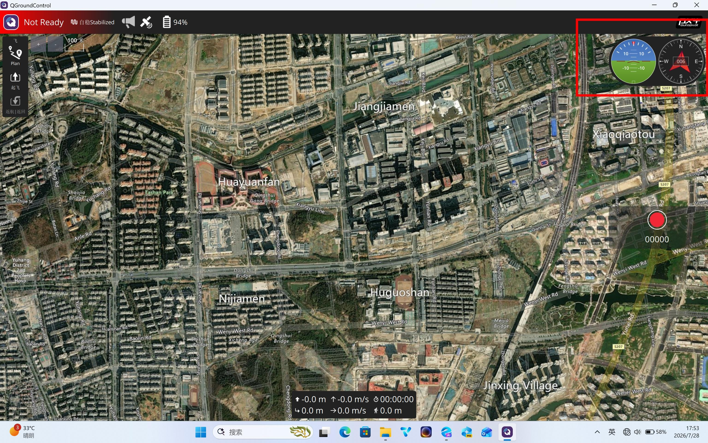
    <figcaption>主飞行界面的姿态仪和航向仪</figcaption>
</figure>

## 4.4 操作视频

  <video width="950" controls>
    <source src="https://diffrobots.oss-cn-hangzhou.aliyuncs.com/nju-wiki/4/%E4%BC%A0%E6%84%9F%E5%99%A8%E6%95%B0%E6%8D%AE%E6%9F%A5%E7%9C%8B%E4%B8%8E%E5%88%86%E6%9E%90.mp4" type="video/mp4">
  </video>

# 实践五：接收机与遥控器对频配置

本节以RadioMaster T8L遥控器和RP3 V2为例，完整介绍从接收机WiFi配置、遥控器Web配置到对频成功的全流程。

## 5.1 接收机WiFi配置

首先给接收机通电（注意不要开遥控器），等待约1分钟。观察接收机上的LED灯，如果快速连续闪烁，说明接收机已开启WiFi热点。用电脑或手机搜索WiFi网络，找到名为`ExpressLRS RX`的热点并连接（默认密码为`expresslrs`）。

<figure style="flex:1; text-align:center;">
    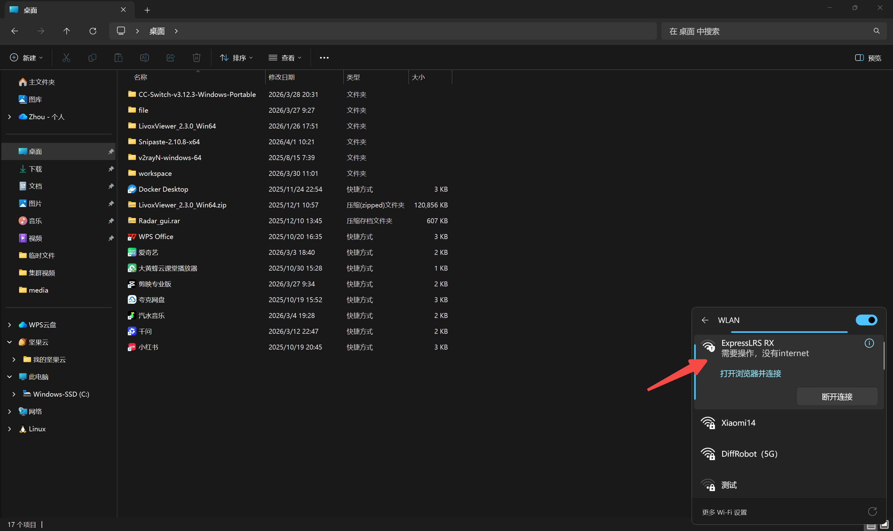
    <figcaption>连接ExpressLRS RX WiFi热点</figcaption>
</figure>

连接成功后，打开浏览器访问`10.0.0.1`进入RP3 V2接收机配置页面。找到"Binding Phrase"（对频短语）选项，输入一组自定义的对频字符串，例如`myuav123`。

<figure style="flex:1; text-align:center;">
    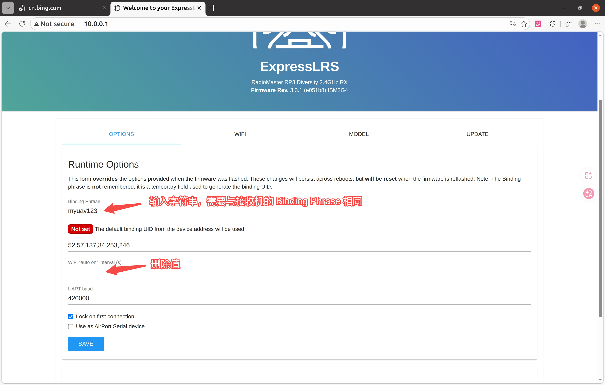
    <figcaption>在10.0.0.1页面设置Binding Phrase</figcaption>
</figure>

⚠️ 每组遥控器和接收机可以设置自己的对频词，切勿多架飞机使用相同的对频词，否则容易出现串频——开机后多架飞机同时响应你的遥控器操作，非常危险。

另外，找到"WiFi Auto On Interval"选项，将默认的60秒删除为空（即禁用自动开启WiFi），避免飞行中意外进入WiFi模式。完成后点击"Save"保存，然后点击"Reboot"重启接收机。

<figure style="flex:1; text-align:center;">
    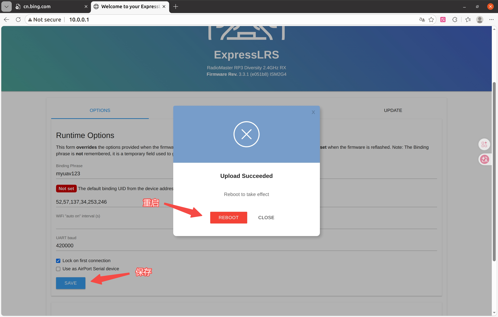
    <figcaption>保存并重启接收机</figcaption>
</figure>

## 5.2 连接遥控器

接下来配置遥控器端。准备一根USB数据线，通过遥控器顶部的USB\-C接口将T8L遥控器连接到电脑。遥控器顶部接口位置和各拨杆分布如下图所示。

<figure style="flex:1; text-align:center;">
    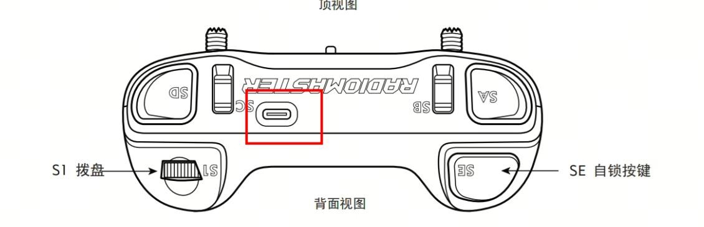
    <figcaption>遥控器顶部USB-C接口与拨杆位置</figcaption>
</figure>

连接后，打开浏览器访问RadioMaster在线配置页面：[https://radiomaster\-rc\.github\.io/RM\-Web\-Page/Connection\.html](https://radiomaster-rc.github.io/RM-Web-Page/Connection.html)。
在遥控器关机状态下，同时按住遥控器上“M”键与“开关”键5秒钟左右，然后点击`Connect`，页面会弹出串口选择对话框，在列表中选择"RadioMaster T8L"对应的COM端口，点击"连接"。

<figure style="flex:1; text-align:center;">
    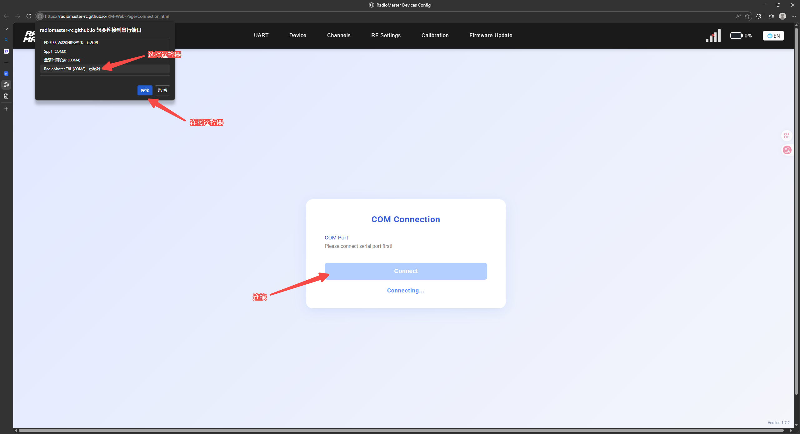
    <figcaption>RadioMaster Web配置页面连接T8L</figcaption>
</figure>

## 5.3 切换中文界面

连接成功后，配置页面默认显示英文。点击页面右上角的语言切换按钮，将界面切换为中文，方便后续操作。在"设备配置"页面中，你可以看到通道监视器，实时显示CH1到CH10各通道的PWM值（1000\-2000之间）。

<figure style="flex:1; text-align:center;">
    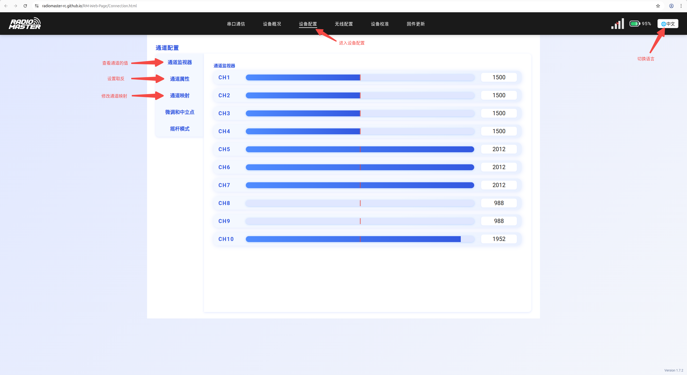
    <figcaption>中文界面下的通道监视器</figcaption>
</figure>

## 5.4 通道映射与取反

在"设备配置"页面中，进入"通道映射"（Channel Mapping Relation）进行遥控器通道映射。按照下表将物理开关映射到对应通道：

|通道|映射到|
|---|---|
|Channel 5|SB|
|Channel 6|SE|
|Channel 7|SC|
|Channel 8|SD|
|Channel 9|SA|
|Channel 10|S1|

<figure style="flex:1; text-align:center;">
    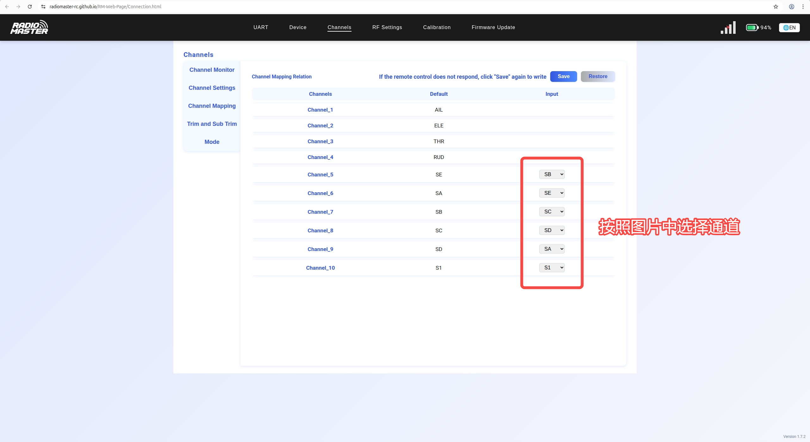
    <figcaption>通道映射设置</figcaption>
</figure>

映射完成后，进入"通道属性"（Channel Settings），将CH6和CH7两个通道设置为"REV"（取反）。这是因为SE和SC两个开关的默认方向与PX4期望的方向相反，需要取反才能正确响应。修改后记得点击"Save"保存。

<figure style="flex:1; text-align:center;">
    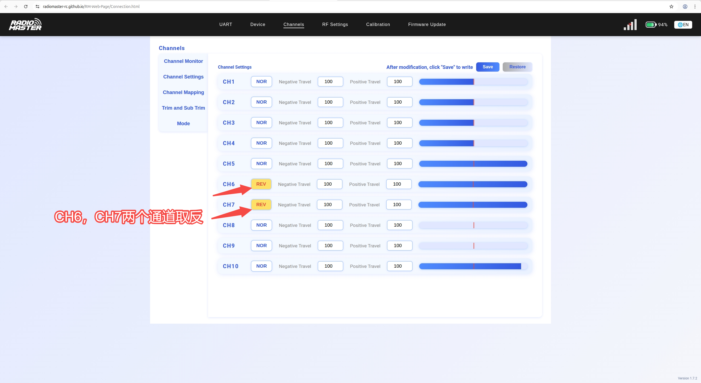
    <figcaption>CH6和CH7通道取反设置</figcaption>
</figure>

## 5.5 无线配置与开启WiFi

通道映射完成后，进入"无线配置"页面。先点击"刷新TX"按钮读取当前配置，然后将通信频率（Packet Rate）设置为`333Hz Full`，遥控器通道数（Switch Mode）设置为`16ch Rate/2`。这些参数需要与接收机端保持一致。

<figure style="flex:1; text-align:center;">
    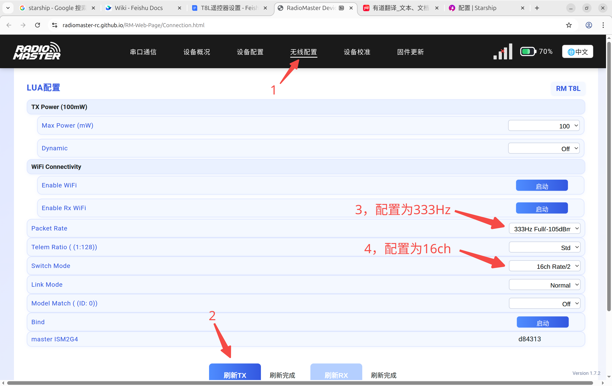
    <figcaption>无线配置：333Hz Full / 16ch</figcaption>
</figure>

配置完成后，点击"Enable WiFi"旁边的"Start"按钮开启遥控器的WiFi热点。等待弹出"Operating\.\.\."提示，表示遥控器WiFi已开启。

<figure style="flex:1; text-align:center;">
    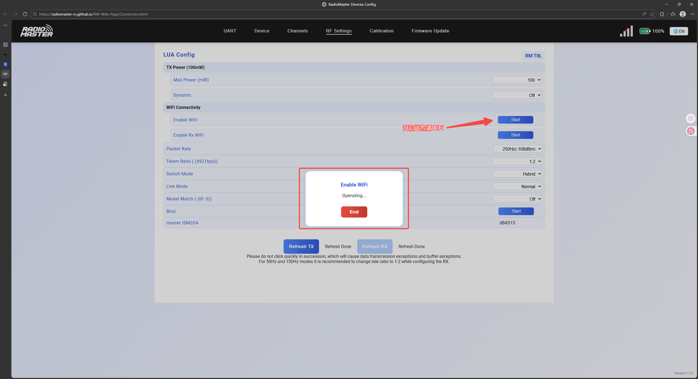
    <figcaption>开启遥控器WiFi热点</figcaption>
</figure>

## 5.6 遥控器对频词设置

遥控器开启WiFi后，在电脑的WiFi列表中找到名为`ExpressLRS TX`的热点并连接。连接成功后打开浏览器访问`10.0.0.1`，进入遥控器端的ExpressLRS配置页面。

<figure style="flex:1; text-align:center;">
    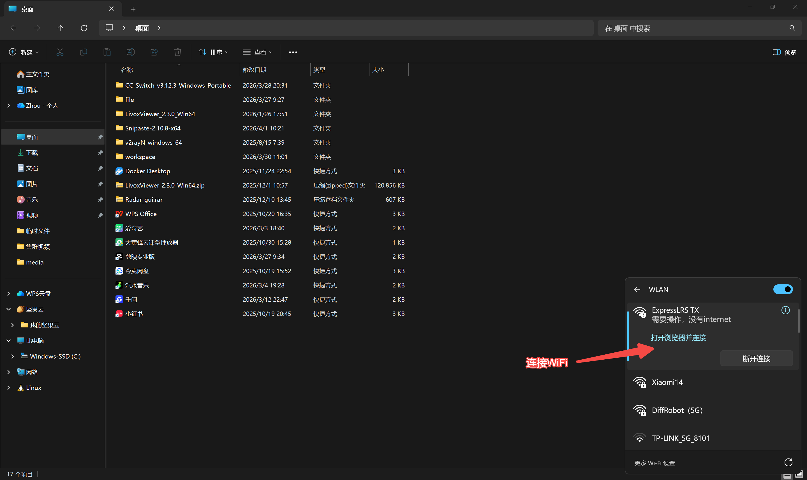
    <figcaption>连接ExpressLRS TX WiFi热点</figcaption>
</figure>

在"Binding Phrase"中输入与接收机**完全相同**的对频词（即`myuav123`），然后点击"SAVE"保存。保存成功后会弹出"Upload Succeeded"提示，点击"REBOOT"重启遥控器。

## 5.7 协议确认与对频验证

重启完成后，回到RadioMaster Web配置页面的"无线配置"（RF Settings）中，先点击"刷新RX"（Refresh RX）按钮，接着检查协议是否设置为SBUS，如不是设置为SBUS之后，再次点击"刷新RX"（Refresh RX）按钮。如果能成功读取到接收机信息，说明遥控器与接收机之间的信号链路已建立，对频成功。

此时观察接收机上的LED灯，应该变为常亮（不再闪烁），表示对频成功且信号稳定。

<figure style="flex:1; text-align:center;">
    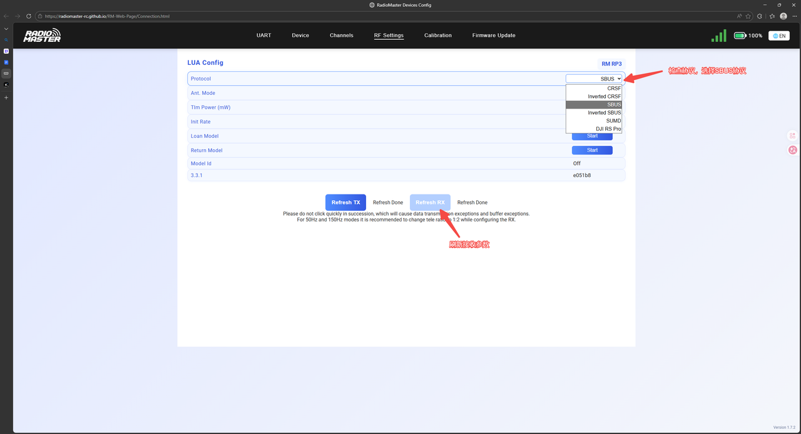
    <figcaption>确认SBUS协议并刷新RX</figcaption>
</figure>

# 实践六：遥控器校准

对频成功后，还需要在QGC中校准遥控器，让飞控正确识别各通道的含义。在QGC中点击左上角Q图标进入"Vehicle Configuration"，选择"Radio"（遥控器）页面。

首先确认遥控器操纵模式为**模式2（美国手）**——即左手控制油门和偏航，右手控制横滚和俯仰，这是最常用的操作模式。确认后点击"校准"按钮，按照QGC的提示依次操作各个摇杆和开关：将两个摇杆分别打到四个角的最大位置，拨动所有开关到两端。QGC会自动识别各通道的行程范围。

校准过程中，右侧的Channel Monitor会实时显示各通道的数值变化，确认所有通道都能正确响应后，校准即完成。至此，PX4飞控与地面站的基础配置全部完成。

<figure style="flex:1; text-align:center;">
    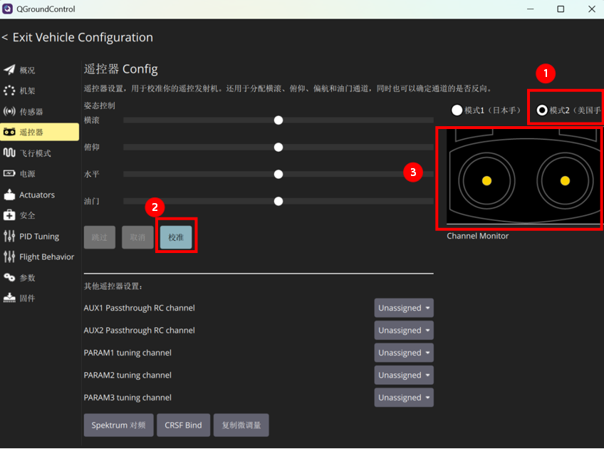
    <figcaption>QGC遥控器校准页面</figcaption>
</figure>

## 6\.1操作视频

参考 第三节 传感器校准操作视频 1分23秒

## 6\.2 飞行模式设置

- 在QGC主界面点击左上角Q图标，进入"Vehicle Configuration"，选择"飞行模式"页面。

- 按照下图中所示进行飞行模式设置。

  

    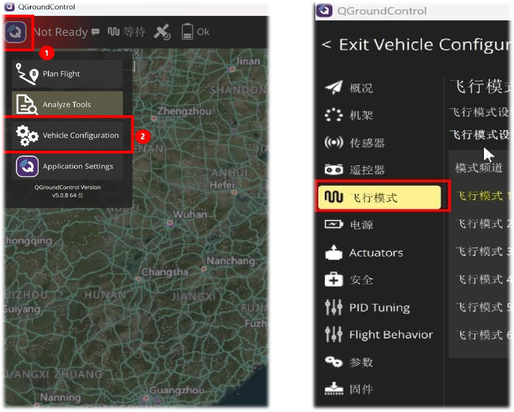
    

  

  

    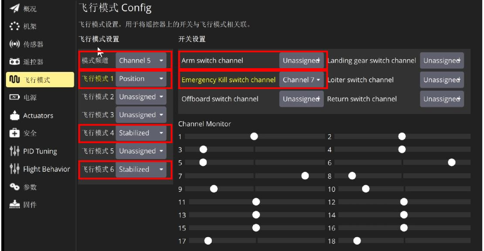
    

  

# 总结

## 1\.课程要点回顾

本次实践完成了PX4飞控与QGroundControl地面站的完整配置流程，涵盖从固件烧录到遥控器对频的六大环节。以下是各环节的核心要点：

|实践环节|核心内容|关键命令/操作|
|---|---|---|
|固件烧录|PX4 1\.14\.3固件烧录至MicoAir743v2飞控|QGC Firmware页面、PX4 Pro、高级设置、自定义固件文件`.px4`|
|参数管理|参数导出备份、预设参数文件导入与8项关键参数核验|Save to file、Load from file for review、Reboot Vehicle|
|传感器校准|陀螺仪、加速度计六方位、地平线校准|Sensors→Gyroscope、Accelerometer六方位、No rotation|
|数据查看|通过MAVLink Inspector验证光流与IMU原始数据|`DISTANCE_SENSOR`、`HIGHRES_IMU`、zacc≈\-9\.81 m/s²|
|接收机对频|ExpressLRS接收机与T8L遥控器WiFi对频配置|Binding Phrase、10\.0\.0\.1、333Hz Full、16ch、SBUS|
|遥控器校准|QGC中校准摇杆行程，确认通道映射与取反|Radio校准、模式2美国手、CH6/CH7设为REV|

## 2\.常见问题排查

**问题1：QGC无法识别飞控或固件烧录失败**

排查：检查USB线是否为数据线（非仅充电线）、驱动是否安装成功；按提示先断开USB再重新连接进入Bootloader；尝试更换USB端口

**问题2：参数导入后飞机悬停漂移**

排查：核验`EKF2_RNG_CTRL=ENABLED`（光流使能）、`SENS_FLOW_ROT=YAW180`（光流方向）；检查光流模块安装方向是否正确

**问题3：陀螺仪或加速度计校准失败**

排查：确保飞机放置在水平桌面上，校准期间不要触碰；加速度计六方位每个面需完全接触桌面并保持静止10秒以上；地平线校准选择No rotation后静置30秒

**问题4：光流current\_distance数值不动或跳变**

排查：检查光流模块接线是否牢固；在MAVLink Inspector中确认DISTANCE\_SENSOR消息有数据

**问题5：接收机LED持续快闪，对频不成功**

排查：确认接收机和遥控器的Binding Phrase完全一致；检查两端Packet Rate均为333Hz Full、通道数均为16ch Rate/2；确认协议设置为SBUS后点击刷新RX

**问题6：搜不到ExpressLRS RX或TX的WiFi热点**

排查：接收机需通电后等待约1分钟，LED快闪表示WiFi已开启；遥控器需在无线配置页面点击Enable WiFi的Start按钮；确认WiFi Auto On Interval未被禁用

**问题7：遥控器Web页面连不上T8L**

排查：更换USB数据线；使用Chrome或Edge浏览器（支持WebSerial）；在弹出的串口选择框中确认选择了RadioMaster T8L对应的COM端口

**问题8：QGC中遥控器通道无反应**

排查：确认接收机LED常亮（对频成功）；在QGC的Radio页面检查通道监视器；确认无线配置中协议为SBUS；点击刷新RX确认能读取接收机信息

**问题9：开关通道方向反了**

排查：在RadioMaster Web配置的通道属性（Channel Settings）中，将CH6和CH7设置为REV（取反）；确认通道映射顺序为CH5→SB、CH6→SE、CH7→SC、CH8→SD、CH9→SA、CH10→S1

