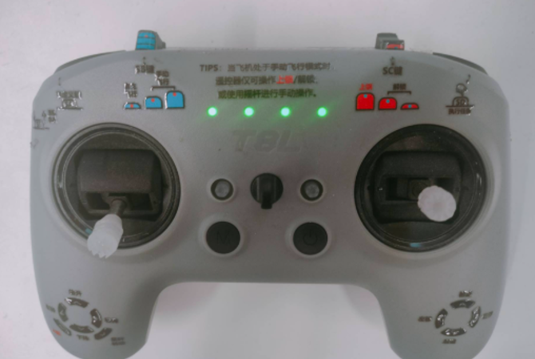
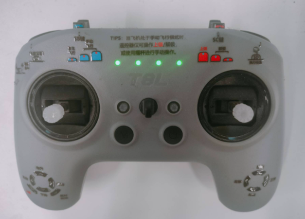
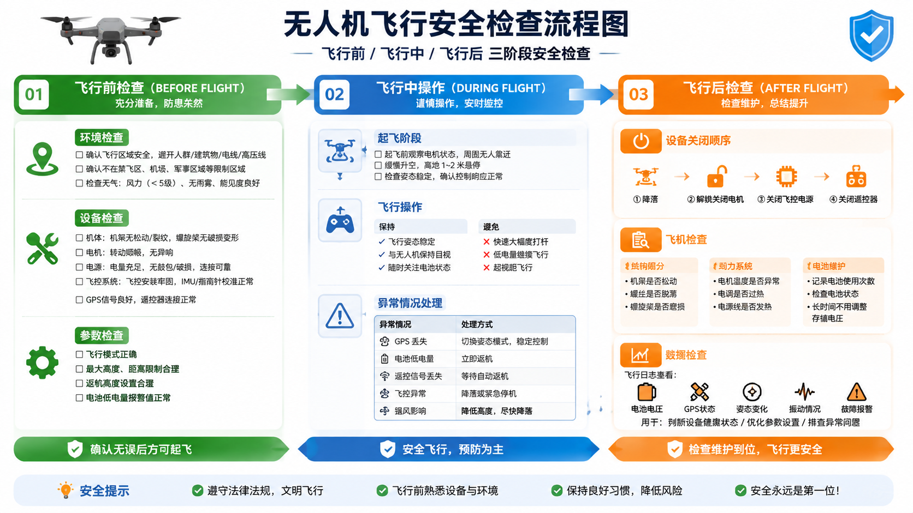
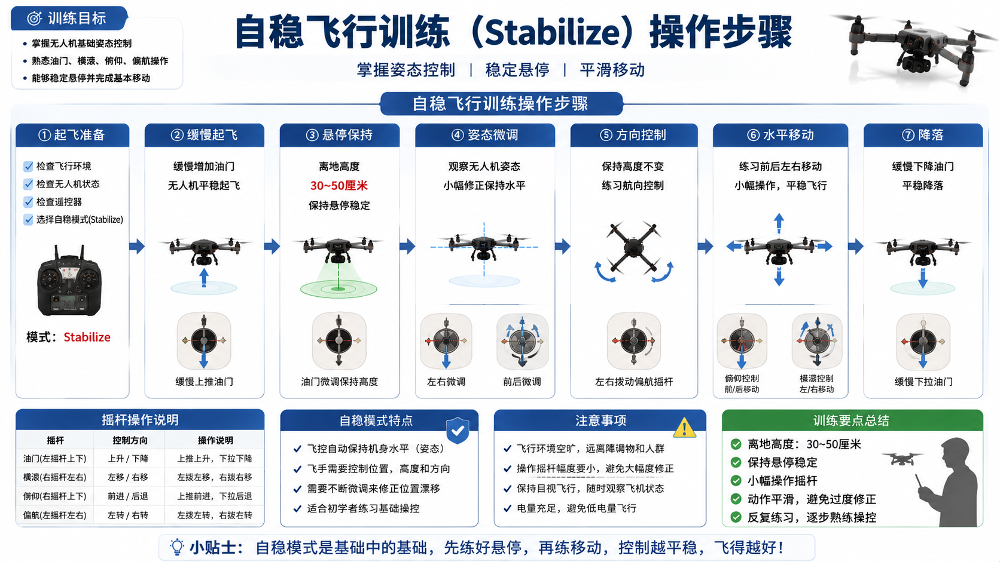
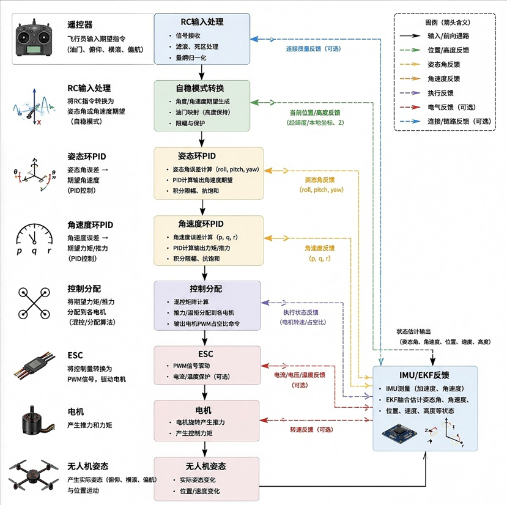
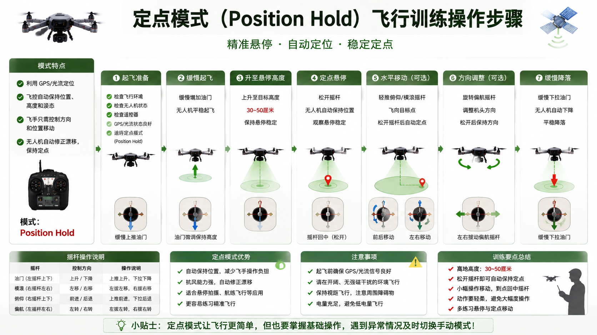
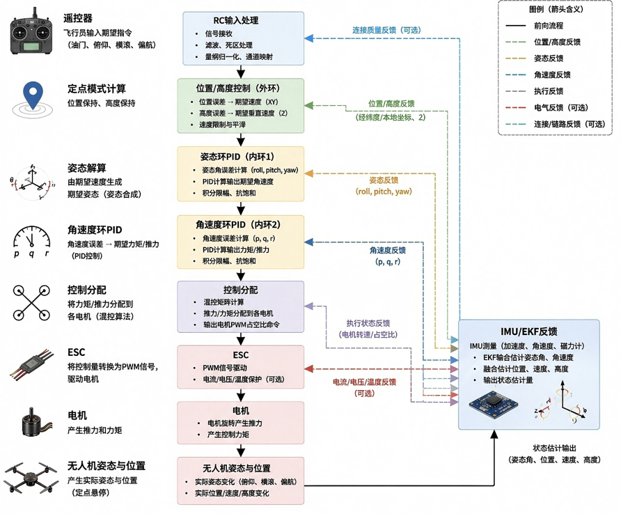

# 第5周：飞行模式介绍与实机练习 

# 实践课程大纲

本周实践课程包含两个核心练习环节，通过实机操作帮助学员掌握自稳模式和定点模式的飞行技能。

|实践环节|实践内容|学习目标|
|---------|----|----|
|**实践一：自稳飞行练习**|通过遥控器控制无人机进入自稳模式（Stabilized Mode），完成无人机起飞、悬停、前后左右移动及姿态调整等基础飞行动作|掌握自稳模式的基本操作，建立飞行手感，理解姿态控制原理|
|**实践二：定点飞行练习**|通过遥控器切换无人机进入定点模式（Position Hold Mode），完成自动悬停、位置保持及小范围移动控制实验|掌握定点模式的操作方法，理解位置控制原理，能够安全切换飞行模式|

  📌 <strong>实践准备：</strong>实践前确认无人机电池充满电，遥控器电量充足，飞行场地开阔无障碍物。

# 课前准备

## 1\.遥控器检查

1. 拨杆按钮介绍：在开始飞行之前，首先需要熟悉遥控器的基本操作。长按遥控器电源键即可开机，由于遥控器与飞机已经提前完成配对，开机后遥控器会自动连接飞机。手柄连续鸣叫两声表示手柄成功开机，连续鸣叫三声则表示已经成功与无人机建立连接。

2. 起飞前的拨杆状态：不同的起飞方式对应不同的遥控器拨杆初始状态，起飞前务必确认拨杆位置正确，避免意外发生。

1)手动起飞时的初始拨杆状态：SC键切换成解锁模式，左侧和右侧摇杆保持中位，SB键可以切换到任意档位（光流模式）。

<figure style="flex:1; text-align:center;">
    
    <figcaption></figcaption>
</figure>

2)自动起飞时的初始拨杆状态：SC键切换成解锁模式，左侧和右侧摇杆保持中位，SB键必须切换到一档（自主飞行模式），SE键保持弹出状态。

<figure style="flex:1; text-align:center;">
    
    <figcaption></figcaption>
</figure>

## 2\.飞行注意事项及飞行要点

1. 飞行安全检查：无人机飞行前、飞行中、飞行后的检查，是保证飞行安全、设备可靠、任务成功的重要措施。通过系统的检查可以提前发现风险，避免因设备故障、参数错误或操作失误造成事故。简单来说，飞行前检查是"防患于未然"，飞行中检查是"控制风险"，飞行后检查是"消除隐患"，三者缺一不可。

<figure style="flex:1; text-align:center;">
    
    <figcaption></figcaption>
</figure>

2. 自稳飞行（Stabilized）操作要点：自稳模式是无人机飞行的基础模式，飞控会自动保持机身水平，但位置、高度和方向都需要飞手手动控制。掌握好自稳模式的操作，是进一步学习其他飞行模式的前提。

    **起飞阶段：**缓慢推油门，离地瞬间立刻稳住油门，因为离地后高度极易窜动，需要细腻控制。

    **姿态控制：**横滚和俯仰摇杆回中时，飞机只是保持水平姿态，一定会有飘移，必须持续微调杆量来保持位置。

    **高度控制：**完全靠油门摇杆来控制高度，在气流扰动下高度会上下浮动，注意小幅度修正，不要猛打油门。

    **偏航控制：**小杆量打方向，避免大角度自旋导致失控。

    **降落阶段：**提前降低高度，低空时油门控制要更加细腻，不要直接切油门断电，以免飞机硬着陆造成损坏。

💡 <strong>自稳模式常见问题：</strong>
    <ul style="margin:12px 0 0 24px; padding:0;">
        <li>机身抖动：可能是姿态P参数过大，或者机械震动大（桨不平衡、电机虚位）</li>
        <li>一离地就乱跑：可能是加速度计未校准、机架变形，或者桨装反了</li>
    </ul>

3. 定点模式（Position）操作要点：定点模式利用GPS或光流定位，飞控会自动保持飞机的位置、高度和姿态，飞手只需控制方向和位置移动。这种模式比自稳模式更容易上手，也是日常飞行中最常用的模式之一。

    **起飞阶段：**建议先在自稳模式离地，再切换到Position模式；不要直接在定点模式暴力起飞。

    **悬停操作：**摇杆完全回中后，飞机应该牢牢钉在原地，自动保持位置和高度。

    **移动飞行：**摇杆控制飞行速度，杆量越大飞得越快；松开摇杆后，飞机会自动减速刹车并回到定点状态。

    **风天操作：**大风天气下，定点模式会有小范围的来回摆动，这属于正常现象，不必过于紧张。

    **模式切换逻辑：**定点模式出问题时，立刻切回Stabilized模式，手动接管控制，确保飞行安全。

💡 <strong>定点模式不良现象排查：</strong>
    <ul style="margin:12px 0 0 24px; padding:0;">
        <li>水平来回晃荡（蛇形摆）：位置环P参数过高，或GPS噪声大</li>
        <li>缓慢漂移：GPS精度不足，或存在多路径干扰（如建筑反射）</li>
        <li>高度上下跳动：气压计受气流、螺旋桨下洗气流干扰</li>
    </ul>

# 自稳、定点模式飞行练习实操流程

## 实践一：自稳飞行练习

### 1\.1 练习步骤

1. 完成飞行前检查，确认无人机状态正常，周围环境安全

2. 将遥控器拨杆切换到自稳模式（Stabilized），解锁电机

3. 缓慢推油门，让无人机平稳离地，保持在1\-2米高度悬停

4. 练习悬停控制：通过微调横滚和俯仰摇杆，保持无人机在原地附近

5. 练习前后移动：缓慢推动俯仰摇杆，控制无人机前后飞行

6. 练习左右移动：缓慢推动横滚摇杆，控制无人机左右飞行

7. 练习偏航旋转：小幅度推动偏航摇杆，控制无人机原地旋转

8. 练习降落：缓慢降低高度，在接近地面时稳住油门，平稳着陆

<figure style="flex:1; text-align:center;">
    
    <figcaption></figcaption>
</figure>

### 1\.2 自稳控制流程

下图为多旋翼无人机自稳（Angle）模式完整控制数据流框图，展现从飞行员遥控器指令输入，经由飞控逐级解算、驱动执行机构，再通过传感器状态估计形成闭环控制系统的完整流程。系统采用姿态外环 PID \+ 角速度内环 PID串级控制架构，依靠 IMU 与 EKF 滤波实现机体状态反馈，完成姿态稳定控制。

<figure style="flex:1; text-align:center;">
    
    <figcaption></figcaption>
</figure>

### 1\.3 自稳模式实操视频演示

  <video width="950" controls>
    <source src="https://diffrobots.oss-cn-hangzhou.aliyuncs.com/nju-wiki/5/%E6%89%8B%E9%A3%9E.mp4" type="video/mp4">
  </video>

## 实践二：定点飞行练习

### 2\.1 练习步骤

1. 在自稳模式下完成起飞，稳定悬停在2\-3米高度

2. 确认GPS信号良好（至少8颗以上卫星），将遥控器拨杆切换到定点模式（Position）

3. 松开所有摇杆，观察无人机是否能够自动保持位置悬停

4. 练习位置保持：观察无人机在无操作情况下的悬停精度，记录漂移情况

5. 练习移动控制：缓慢推动摇杆，控制无人机以不同速度前后左右移动

6. 练习刹车效果：移动过程中突然松开摇杆，观察无人机自动减速刹车的过程

7. 练习模式切换：在定点模式和自稳模式之间切换，熟悉切换操作和飞行状态变化

8. 降落：先切换回自稳模式，再手动控制降落，或在定点模式下缓慢降低高度后降落

<figure style="flex:1; text-align:center;">
    
    <figcaption></figcaption>
</figure>

### 2\.2 定点控制流程

下图为多旋翼无人机定点（Position）模式完整控制数据流，在姿态‑角速度串级内环基础上，增加位置 / 高度外环控制，实现位置锁定、高度保持的定点悬停功能。整个控制系统采用三层级串级架构：位置外环 → 姿态内环 1（姿态环 PID） → 角速度内环 2（角速度环 PID），依靠 IMU/EKF 状态估计实现全闭环控制。

<figure style="flex:1; text-align:center;">
    
    <figcaption></figcaption>
</figure>

### 2\.3 定点模式实操视频演示

  <video width="950" controls>
    <source src="https://diffrobots.oss-cn-hangzhou.aliyuncs.com/nju-wiki/5/%E5%AE%9A%E7%82%B9.mp4" type="video/mp4">
  </video>

# 总结

## 1\.课程要点回顾

本周课程系统介绍了PX4飞控的四种核心飞行模式，讲解了遥控器的操作方法和飞行安全注意事项，并通过自稳模式和定点模式的实机练习，帮助学员掌握基础飞行技能。以下是核心要点回顾：

|模块|核心内容|关键要点|
|---|---|---|
|飞行模式讲解|自稳、定高、定点、板外四种模式|理解各模式的飞控参与程度和适用场景|
|遥控器使用|开机连接、拨杆配置、模式切换|掌握手动起飞和自动起飞的拨杆状态|
|飞行注意事项|飞行前中后检查流程|安全第一，提前发现风险，消除隐患|
|自稳模式操作|起飞、悬停、移动、降落|操作轻柔，持续微调，高度控制细腻|
|定点模式操作|自动悬停、速度控制、模式切换|摇杆控速，松开自动刹车，异常切回自稳|

## 2\.常见问题解答

**Q：自稳模式下无人机总是漂移怎么办？**  
A：自稳模式只稳定姿态，不控制位置，漂移是正常现象。如果漂移速度过快，可能是加速度计未校准或机架存在变形，建议重新校准传感器并检查机架。

**Q：新手应该先练习哪种模式？**  
A：建议先在自稳模式下练习基础操作，建立飞行手感。熟练掌握起飞、悬停、移动和降落后，再尝试定点模式。定点模式更安全、更易用，是实际任务中最常用的模式。

