# 第6周：飞行日志分析与系统调试

# 实践课程大纲

本周实践课程包含三个循序渐进的实验，从飞行日志的获取到分析，再到基于日志分析的PID参数调校：

|实践环节|核心内容|学习目标|
|---|---|---|
|实践一：飞行日志下载|通过QGroundControl\(QGC\)连接PX4飞控，学习无人机飞行日志的获取方法，完成飞行数据下载、日志文件保存及基本查看|掌握QGC地面站连接飞控和下载飞行日志的操作流程|
|实践二：飞行日志分析|完成飞控日志导出，使用Flight Review分析无人机振动性能与控制性能|掌握Flight Review工具的使用，能够分析振动水平和PID控制跟踪效果|
|实践三：PID调参|在QGroundControl实机平台完成PX4飞控角速度环与姿态环PID调参|掌握滤波器参数配置和PID增益调校方法，提升无人机控制性能|

<strong>​​​💡 实践准备： 

确保已安装QGroundControl地面站软件，拥有一架可正常飞行的PX4飞控无人机，配备USB数据线用于连接飞控和电脑。Flight Review是PX4官方提供的在线飞行日志分析工具，网址为:[https://review.px4.io/](https://review.px4.io/)。
</strong>

# 实践一：飞行日志下载

## 1\.1 连接飞控并打开分析工具

1. 用USB数据线将飞控与地面站电脑连接，连接成功后打开QGC地面站软件

2. 双击打开QGC地面站，点击左上角的Logo，在弹出的菜单中选择"Analyze Tools"（分析工具）

<strong>​​​💡 注意： 

连接飞控时，确保USB数据线能够正常传输数据，部分充电线只能充电无法传输数据。连接成功后，QGC地面站顶部会显示飞控连接状态和电池电量等信息。
</strong>

<figure style="flex:1; text-align:center;">
    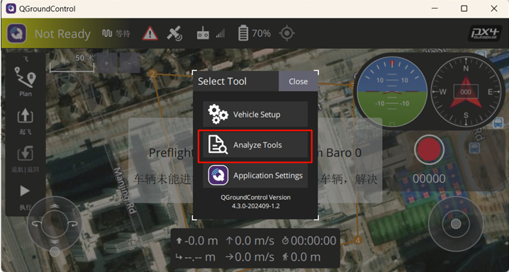
    <figcaption>QGC分析工具入口</figcaption>
</figure>

## 1\.2 打开日志下载界面并下载日志

1. 在Analyze Tools中点击左侧栏的"日志下载\(Log Download\)"，打开日志下载页面

2. 点击"刷新"按钮，QGC会从飞控中读取所有已存储的飞行日志并列出

3. 在列出的日志列表中，选择想要下载的日志，然后点击右侧的"下载"按钮

4. 选择本地保存地址，点击"选择文件夹"，即可将飞行日志保存到本地电脑

<strong>​​​💡 日志文件格式： 

PX4飞控的飞行日志文件格式为\.ulg（ULog格式），这是PX4专门设计的二进制日志格式，能够高效记录大量飞行数据。下载的日志文件可以直接上传到Flight Review在线工具进行分析。
</strong>

<strong>​​​💡 日志选择建议： 

日志列表中会显示每条日志的日期、时间和飞行时长。建议选择飞行时间较长、包含完整飞行阶段（起飞、悬停、机动、降落）的日志进行分析，这样能够更全面地评估无人机的性能。
</strong>

  

    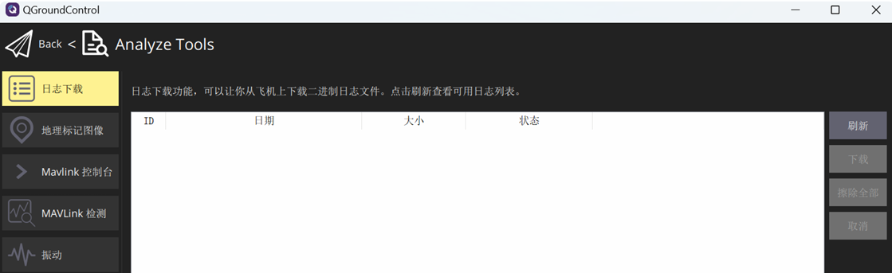
    
QGroundControl日志下载页面

  

  

    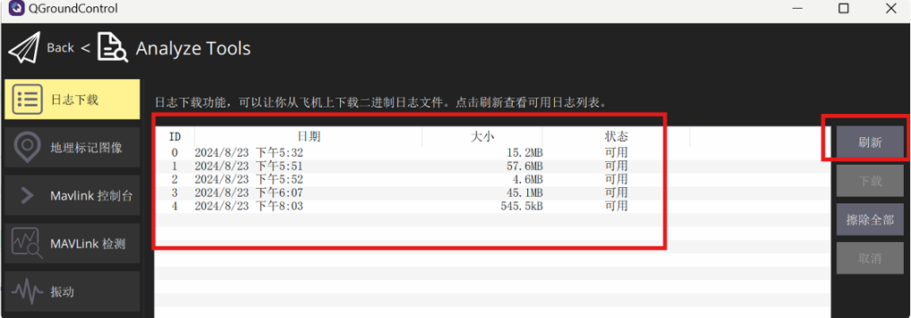
    
QGroundControl日志下载页面

  

  

    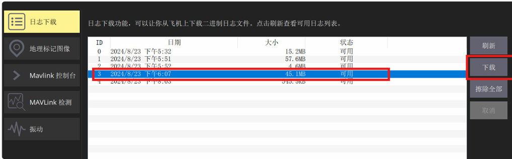
    
选择日志示意图

  

  

    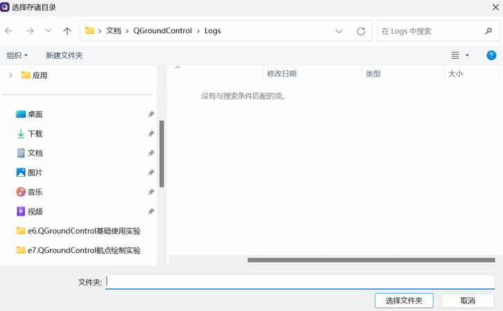
    
日志保存完成

  

# 实践二：飞行日志分析

## 2\.1 图表共同功能

Flight Review生成的飞行图表具备许多共同功能，帮助用户更直观地理解飞行数据：

- **图表背景颜色**：用于指示记录期间的飞行模式，不同颜色代表不同的飞行模式（如手动、定点、任务等）

- **飞行模式标识**：图表主体的背景颜色表示当前飞行模式，可以直观看到不同阶段的飞行状态

- **VTOL飞行模式**：对于垂直起降飞行器，还会在图表底部以背景颜色显示VTOL模式，蓝色代表多旋翼模式，黄色代表固定翼模式，红色代表过渡阶段

<strong>​​​💡 使用技巧： 
在图表上可以用鼠标框选某个时间段进行放大查看，也可以将鼠标悬停在曲线上查看具体数值。通过对比不同颜色的背景区域，可以分析不同飞行模式下的无人机表现。

</strong>

<figure style="flex:1; text-align:center;">
    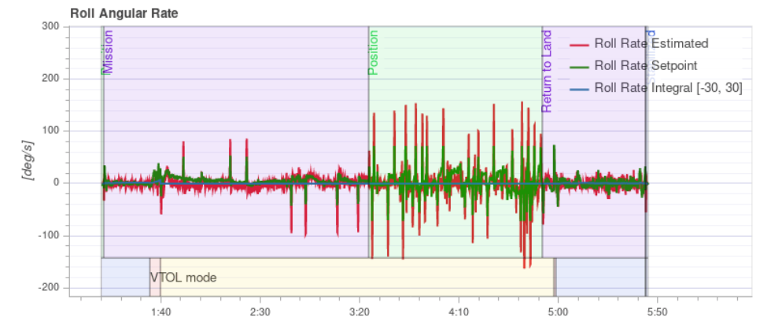
    <figcaption>飞行日志图表共同功能示例</figcaption>
</figure>

## 2.2 PID性能跟踪分析

根据飞行模式的不同，飞行器控制器可能会尝试跟踪位置、速度、高度或速率设定值。具体跟踪的设定值取决于当前飞行模式，例如在自稳模式下没有速度设定值，而在定点模式下会跟踪位置设定值。

在Flight Review的PID性能跟踪图表中：

- **绿色线条**：表示设定值（期望值），即控制器想要达到的目标值

- **红色线条**：表示估计值（实际值），即传感器测量到的实际飞行状态

理想情况下，估计值（红色线条）应与设定值（绿色线条）紧密匹配。如果两者不匹配，在大多数情况下，需要调整该控制器的PID增益。查看日志有助于评估调参效果，判断PID参数是否合适。

<strong>​​​💡 条参依据 
通过对比设定值和实际值的曲线，可以直观地判断控制性能。如果实际值总是滞后于设定值，说明P增益过小或系统响应过慢；如果实际值出现明显超调和振荡，说明P增益过大或D增益不足。

</strong>

<figure style="flex:1; text-align:center;">
    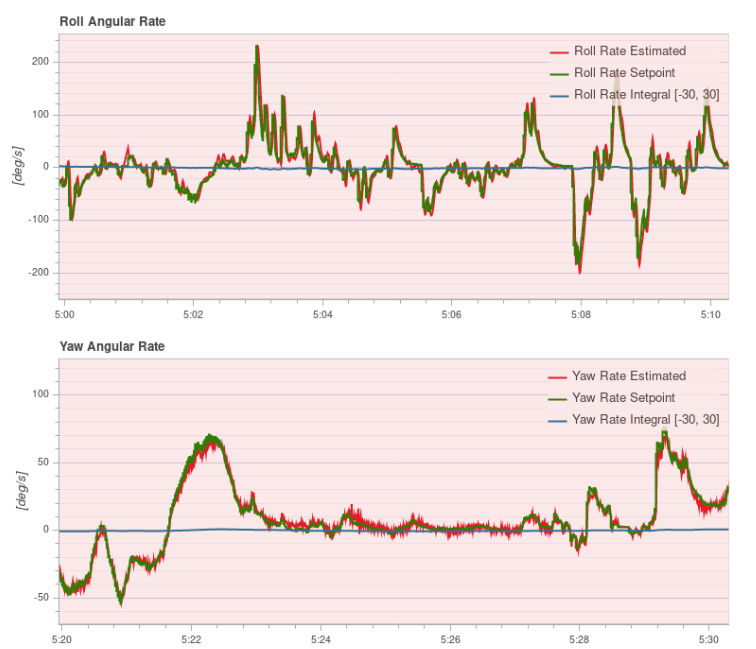
    <figcaption>横滚和偏航角速度日志示意图</figcaption>
</figure>

以下日志展示了横滚角速度调试良好的示例。图中包含了几个翻转动作，即非常极限的阶跃输入。可以看到飞行器的超调量非常小，实际角速度能够快速、准确地跟踪期望角速度，说明PID参数调校得当。

<strong>​​​💡 良好调参的特征： 
1) 实际值快速跟踪设定值，响应延迟小；2) 阶跃输入后超调量小，无明显振荡；3) 稳态误差小，能够精确保持目标值；4) 整个控制过程平稳，电机输出无异常波动。

</strong>

<figure style="flex:1; text-align:center;">
    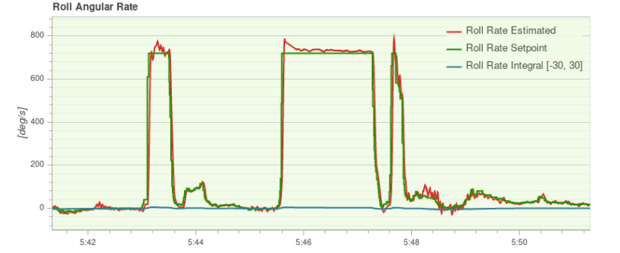
    <figcaption>横滚角速度调试良好示例</figcaption>
</figure>

## 2\.3 振动性能分析

振动是多旋翼飞行器最常见的问题之一。高振动水平可能导致：1)飞行效率降低，飞行时间缩短；2)电机温度升高；3)材料磨损加剧；4)飞行器难以精确调校，导致飞行性能下降；5)传感器故障。因此，关注振动水平并在必要时改进设置非常重要。

### \(1\) FFT频率分析

FFT（快速傅里叶变换）是基于执行器控制信号（速率控制器的PID输出），展示了横滚、俯仰和偏航轴的频率图。它有助于识别频率峰值，并配置软件滤波器。

理想情况下，在最低端（约20Hz以下）应只有一个单一峰值，其余部分应较低且平稳。如果在较高频率出现明显峰值，说明存在机械振动问题，需要检查电机、桨叶和机架结构。

<strong>​​​💡 振动的危害： 
高振动不仅会影响飞行稳定性和控制精度，还可能导致IMU传感器数据失真，进而影响姿态估计和导航精度。严重的振动甚至可能导致结构疲劳和零部件损坏。因此，在PID调参之前，必须先确保机械振动处于可接受的水平。

</strong>

  

    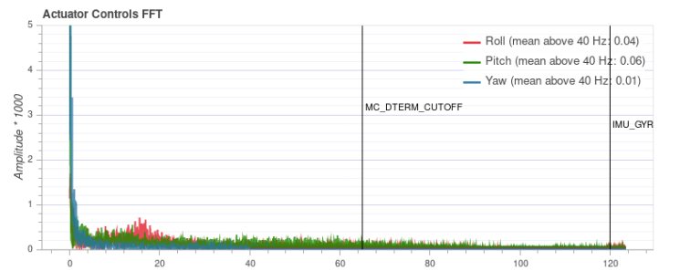
    
良好振动FFT示意图

  

  

    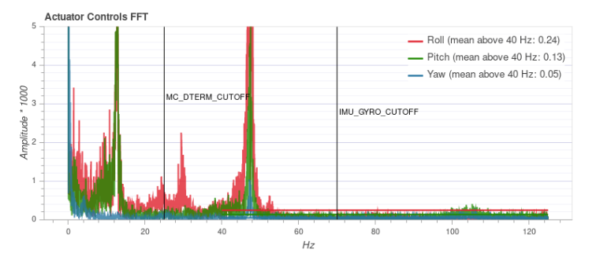
    
不良振动FFT示意图

  

### \(2\) 原始加速度分析

原始加速度图表展示了x、y和z轴的原始加速度计测量值。理想情况下，每条线都应较细，且能清晰显示飞行器的加速度变化。

一般经验法则是：如果在悬停或缓慢飞行时，z轴图表与x/y轴图表相交，则说明振动水平过高。正常情况下，z轴加速度应在1g（重力加速度）附近波动，而x/y轴加速度应在0附近波动。如果x/y轴的波动幅度接近或超过z轴的波动幅度，说明存在较大的横向振动。

<strong>​​​💡 判断标准： 
良好的振动水平下，原始加速度曲线应该是三条清晰、细窄的曲线，z轴在约9.8m/s²附近，x/y轴在0附近。如果曲线变得很粗、噪声很大，或者x/y轴的波动幅度明显增大，说明振动问题需要解决。

</strong>

  

    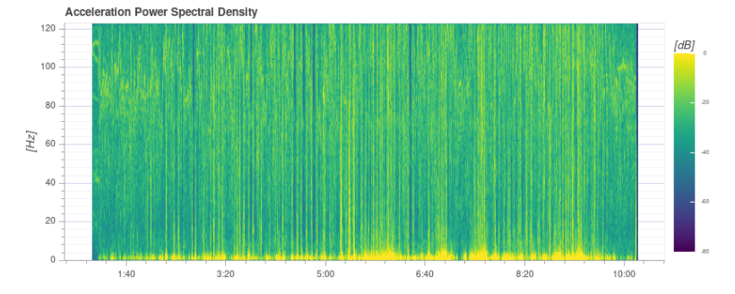
    
良好振动原始加速度示意图

  

  

    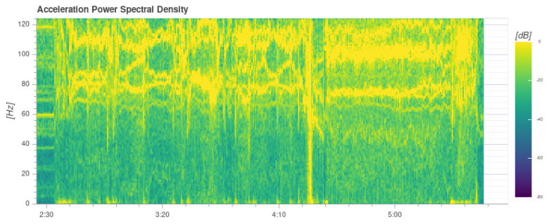
    
不良振动原始加速度示意图

  

### \(3\) 加速度功率谱密度

加速度功率谱密度是一个二维频率图，展示了原始加速度计数据随时间的频率响应（显示x、y和z轴的总和）。区域颜色越黄，表明该时刻和频率的频率响应越高。

理想情况下，只有几Hz以下的最低部分为黄色，其余部分大多为绿色或蓝色。如果在较高频率区域出现大面积黄色，说明存在明显的高频振动，需要排查机械振动来源。

<strong>​​​💡 排查方向： 
如果检测到异常频率成分，需要重点检查：1)飞控安装是否牢固，是否有减震措施；2)电机固定是否松动，电机轴承是否磨损；3)桨叶是否平衡，是否有损伤；4)机架结构是否存在共振。通过紧固和调整可以有效降低振动干扰。

</strong>

  

    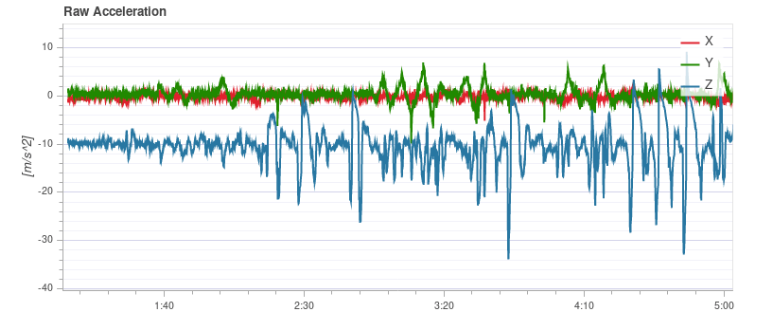
    
良好振动功率谱密度示意图

  

  

    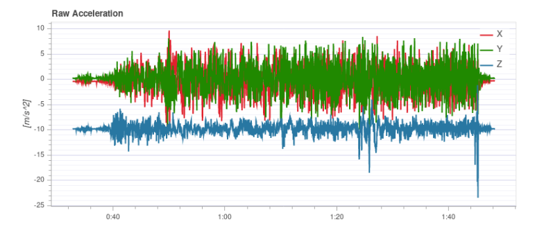
    
不良振动功率谱密度示意图

  

## 2\.4 制动器输出分析

"执行器输出"图表显示发送到各个执行器（电机/舵机）的信号。通常，该信号范围在配置的PWM最小值和最大值之间。

如果一个或多个信号长时间处于最大值，意味着控制器进入饱和状态。这不一定是问题，例如在全速飞行时，这是预期情况。但如果在正常任务飞行中出现这种情况，则表明飞行器可能超重，无法提供足够的推力，或者PID参数设置不当导致输出过大。

<strong>​​​💡 饱和状态判断： 
正常悬停时，各电机输出应在中等水平（约50%-70%），且各电机输出相对均衡。如果某个电机长期满负荷输出，说明动力分配不均或飞行器重心偏移。如果所有电机都接近满负荷，说明推重比不足，需要减轻重量或更换更大推力的动力系统。

</strong>

<figure style="flex:1; text-align:center;">
    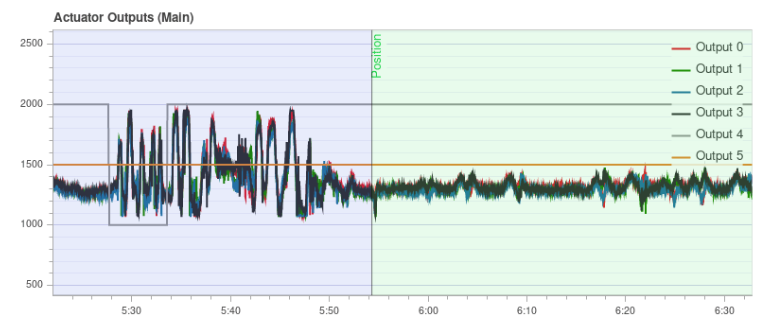
    <figcaption>制动器输出正常示例</figcaption>
</figure>

# 实践三：PID调参

## 3\.1 开启High rate高速率日志

在进行PID调参之前，首先需要开启High rate（高速率）日志功能。开启后，飞控会以控制环原生高频频率记录姿态控制相关数据。

PID属于毫秒级快速闭环控制，普通低速日志的采样率不足，无法用于分析振荡、响应滞后、超调等控制问题。只有高速率日志才能完整捕捉控制环的动态响应过程，为PID参数调校提供准确的数据依据。

<strong>​​​💡 开启方法： 
在QGC地面站的参数设置中，找到SDLOG\_PROFILE参数，勾选"High rate"选项，或者设置相关的日志速率参数。开启后重新飞行，记录的日志将包含高频姿态控制数据。

</strong>

<strong>​​​💡 注意事项： 
高速率日志会产生更大的数据量，占用更多的SD卡存储空间。建议在调参完成后关闭高速率日志，恢复正常日志记录模式，以节省存储空间。

</strong>

<figure style="flex:1; text-align:center;">
    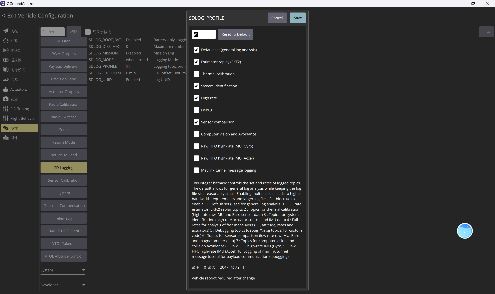
    <figcaption>High rate高速率日志设置</figcaption>
</figure>

## 3\.2 Cutoff滤波器参数概念

### \(1\) 总体概念

滤波器截止频率（Cutoff）是PID调参中的关键参数。总体原则是：cutoff低，噪声小但是延迟大；cutoff高，延迟小但是噪声大。需要在噪声抑制和控制延迟之间找到平衡点。

### \(2\) IMU\_GYRO\_CUTOFF参数

IMU\_GYRO\_CUTOFF影响主陀螺仪送往控制器的角速度，是二阶Butterworth低通滤波器的截止频率。在PX4当前控制链中，gyro数据先经过notch（陷波滤波器），再经过IMU\_GYRO\_CUTOFF，得到供P/I项使用的角速度；然后对角速度求导，再经过IMU\_DGYRO\_CUTOFF，得到D项使用的角加速度。

<strong>​​​💡 滤波器作用： 
低通滤波器允许低频信号通过，同时衰减高频信号。陀螺仪数据中包含有用的姿态变化信息（低频）和机械振动噪声（高频）。截止频率决定了哪些频率的信号能够通过，哪些被滤除。

</strong>

  

    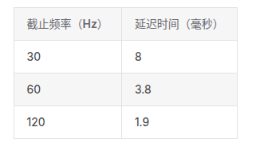
    
截止频率与信号延迟特性

  

  

    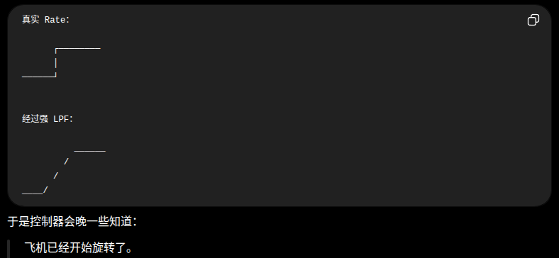
    
IMU_GYRO_CUTOFF参数说明

  

### \(3\) IMU\_DGYRO\_CUTOFF参数

D项对噪声最敏感，因此设置了独立的二阶巴特沃斯低通滤波器IMU\_DGYRO\_CUTOFF，用于抑制角速度微分产生的高频噪声。适当提高截止频率可以降低控制延迟，并为提高P增益提供条件。

以下示例展示了三种不同的IMU\_DGYRO\_CUTOFF滤波器频率值（40Hz、70Hz、90Hz）。当频率达到90Hz时，整体噪声水平开始升高（尤其是滚转噪声），因此70Hz的截止频率是一个较为安全的设置。

<strong>​​​💡 调参建议： 
IMU\_DGYRO\_CUTOFF的推荐范围通常在40Hz\-80Hz之间。具体取值需要根据飞行器的振动水平来确定：振动小的飞行器可以适当提高截止频率以获得更快的响应；振动大的飞行器则需要降低截止频率以抑制噪声。建议从60Hz开始测试，逐步调整。

</strong>

<figure style="flex:1; text-align:center;">
    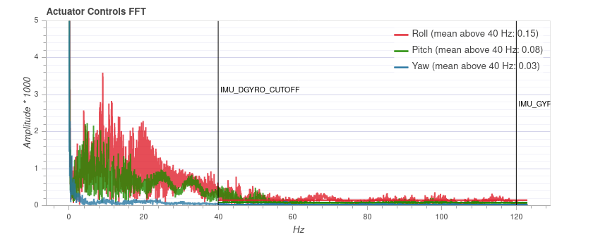
    <figcaption>IMU_DGYRO_CUTOFF=40Hz噪声水平</figcaption>
</figure>

<figure style="flex:1; text-align:center;">
    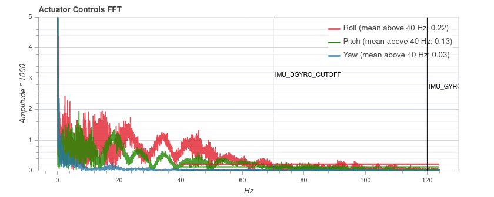
    <figcaption>IMU_DGYRO_CUTOFF=70Hz噪声水平</figcaption>
</figure>

<figure style="flex:1; text-align:center;">
    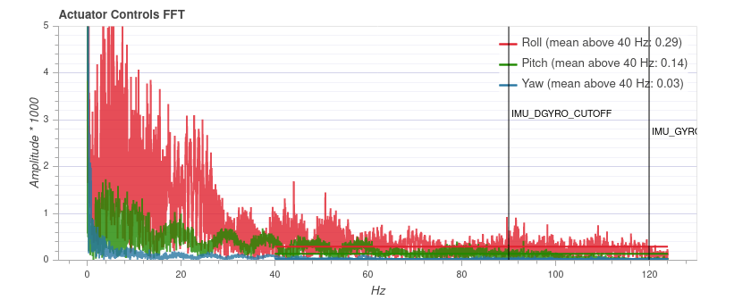
    <figcaption>IMU_DGYRO_CUTOFF=90Hz噪声水平</figcaption>
</figure>

## 3\.3 Cutoff滤波器参数调参

在PID参数保持默认的情况下，通过测试不同的IMU\_DGYRO\_CUTOFF值，观察角速度FFT频谱的变化，从而选择合适的截止频率。

### \(1\) IMU\_DGYRO\_CUTOFF = 30Hz / 40Hz

当IMU\_DGYRO\_CUTOFF设置为30Hz和40Hz时，截止频率较低，滤波效果较强，噪声被有效抑制，但同时控制延迟也较大。从FFT频谱图可以看到，高频噪声被有效滤除，但低频控制信号也可能受到一定影响。

  

    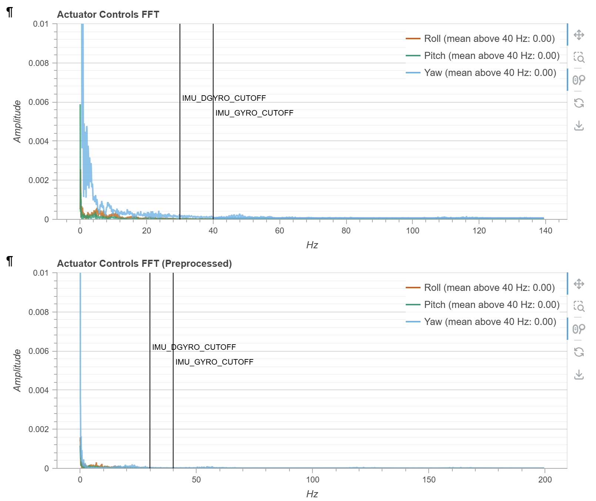
    
30Hz/40Hz执行器控制量频域分析

  

  

    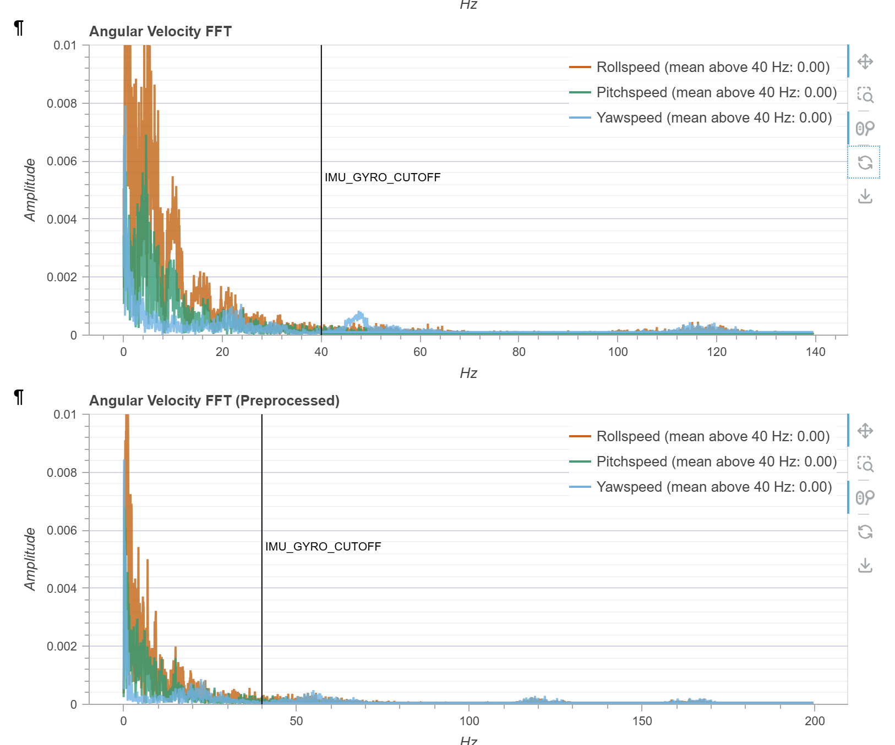
    
30Hz/40Hz三轴角速度信号FFT频谱分析

  

### \(2\) IMU\_DGYRO\_CUTOFF = 50Hz / 60Hz

当IMU\_DGYRO\_CUTOFF提高到50Hz和60Hz时，滤波强度适中，在噪声抑制和控制延迟之间取得了较好的平衡。从FFT频谱图可以看到，高频噪声仍然得到有效控制，同时控制信号的响应速度有所提升。

  

    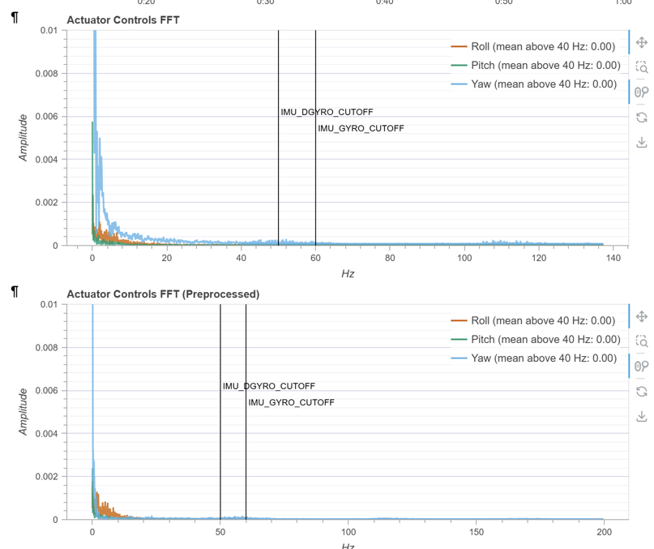
    
50Hz/60Hz执行器控制量频域分析

  

  

    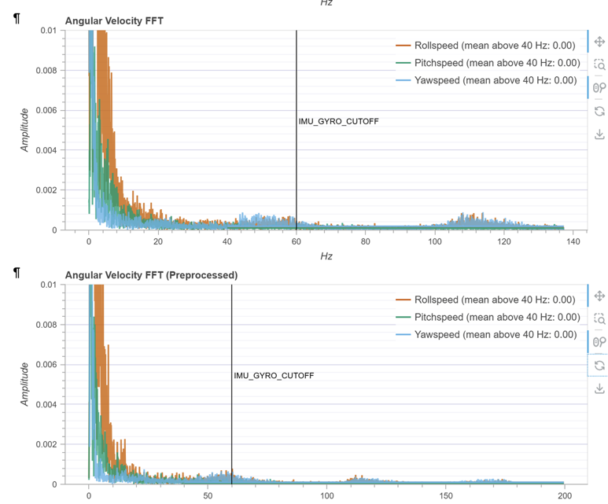
    
50Hz/60Hz三轴角速度信号FFT频谱分析

  

### \(3\) IMU\_DGYRO\_CUTOFF = 60Hz / 70Hz

当IMU\_DGYRO\_CUTOFF设置为60Hz和70Hz时，截止频率较高，控制延迟进一步降低，同时噪声水平仍然在可接受范围内。这是一个比较理想的取值范围，能够在保证控制响应速度的同时，有效抑制高频噪声。

  

    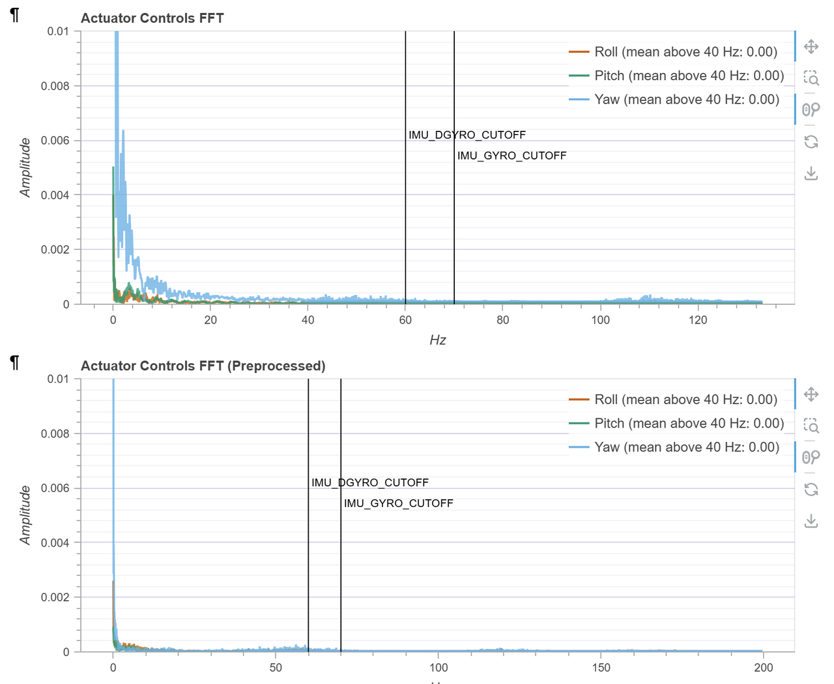
    
60Hz/70Hz执行器控制量频域分析

  

  

    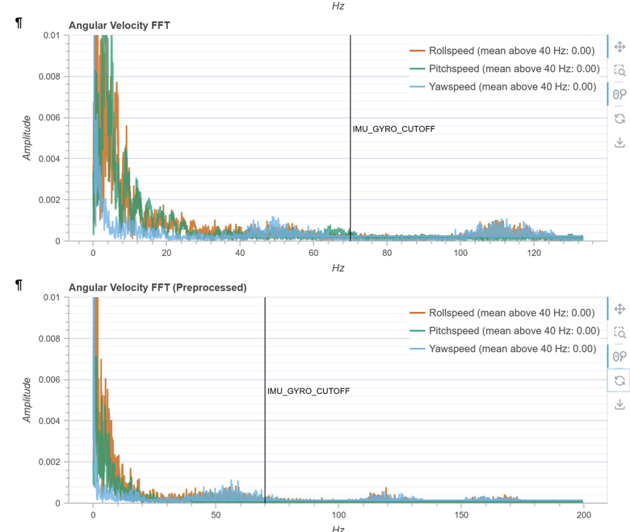
    
60Hz/70Hz三轴角速度信号FFT频谱分析

  

### \(4\) IMU\_DGYRO\_CUTOFF = 60Hz / 80Hz

当IMU\_DGYRO\_CUTOFF提高到80Hz时，可以看到电机和角速度的FFT开始变大，噪声水平明显升高，尤其是滚转轴的噪声增加较为明显。这说明截止频率过高会导致噪声无法有效抑制，影响控制稳定性。

<strong>​​​💡 调参结论： 
综合对比四组不同截止频率的测试结果，IMU\_DGYRO\_CUTOFF从80Hz开始电机和角速度的FFT明显变大，因此推荐选择60Hz或70Hz作为IMU\_DGYRO\_CUTOFF的参数值。这个范围能够在控制延迟和噪声抑制之间取得最佳平衡。

</strong>

  

    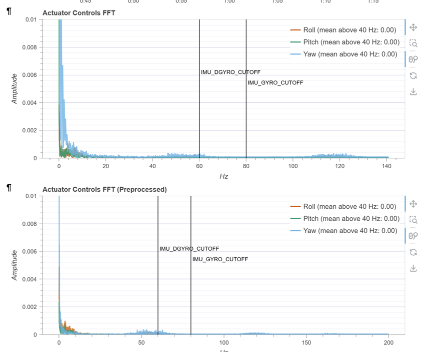
    
60Hz/80Hz执行器控制量频域分析

  

  

    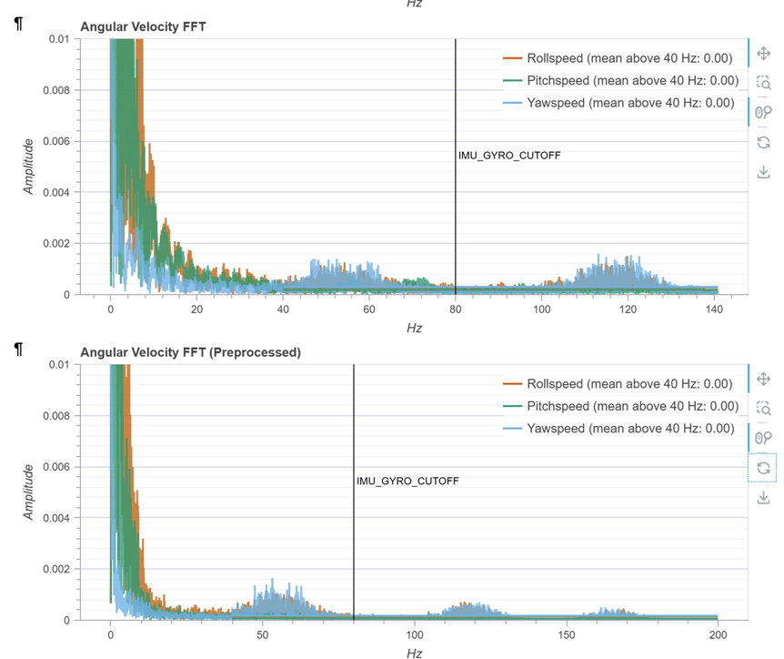
    
60Hz/80Hz三轴角速度信号FFT频谱分析

  

## 3\.4 分析系统振动性能

在进行PID调参之前，首先需要确保系统的振动性能处于良好状态。振动过大会严重影响PID控制效果，导致参数难以调校。

1. 录制Position（定点悬停）模式飞行日志

2. 利用飞行日志中的Actuator FFT参数，检查无人机振动情况

3. 正常情况下，频谱应主要表现为直流分量，不应存在明显的其他频率峰值

若检测到除直流分量外的异常频率成分，则需要进一步排查机械振动来源，重点检查飞控安装、电机固定、桨叶平衡以及机架结构是否存在松动或异常，并通过紧固和调整降低振动干扰，确保飞控系统稳定运行。

<strong>​​​💡 振动排查步骤： 
1)检查飞控是否使用减震垫安装，安装是否牢固；2)检查电机螺丝是否紧固，电机轴承是否有异响；3)检查桨叶是否有损伤，是否做过动平衡；4)检查机架螺丝是否全部紧固，是否存在结构共振。逐一排查并解决问题后，重新录制日志验证振动水平。

</strong>

<figure style="flex:1; text-align:center;">
    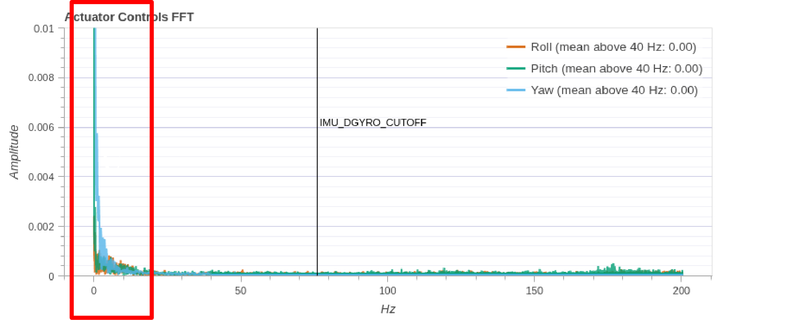
    <figcaption>Actuator FFT参数分析</figcaption>
</figure>

<figure style="flex:1; text-align:center;">
    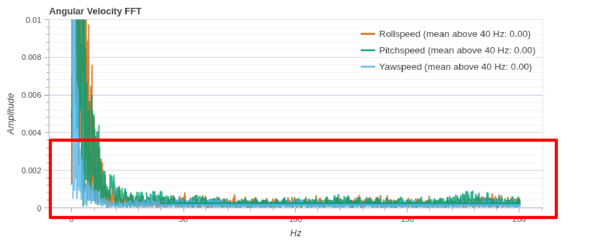
    <figcaption>正常振动频谱示例</figcaption>
</figure>

### 不正常振动性能示例

以下是不正常振动性能的示例。可以看到频谱中除了直流分量外，还存在明显的其他频率峰值，说明系统存在较大的机械振动。这种情况下，需要先解决振动问题，再进行PID参数调校，否则调参效果会受到严重影响。

<strong>​​​💡 振动过大的影响： 
1)陀螺仪数据噪声增大，导致角速度估计不准确；2)PID控制器容易受到噪声干扰，产生不必要的控制输出；3)电机输出波动加剧，增加功耗和发热；4)姿态控制精度下降，飞行稳定性变差。因此，必须在振动水平达标后再进行PID调参。

</strong>

  

    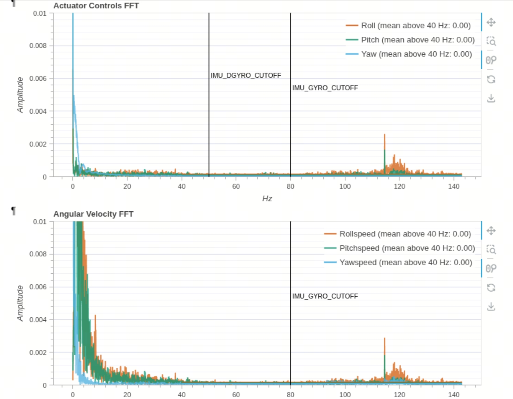
    
不正常振动性能示例1

  

  

    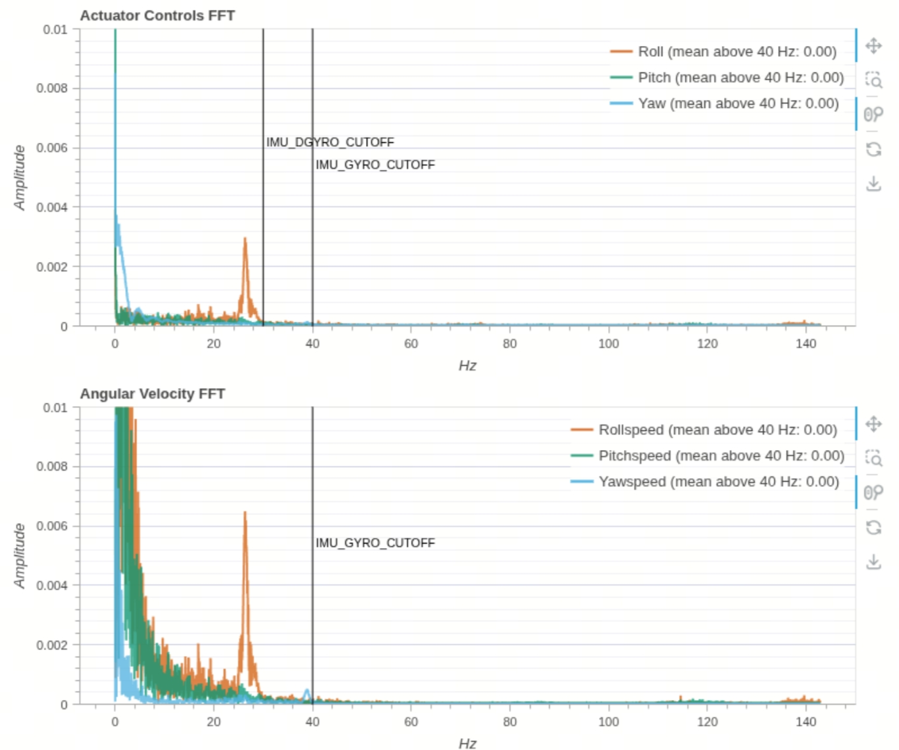
    
不正常振动性能示例2

  

## 3\.5 分析系统控制性能

在确认振动性能良好后，接下来分析系统的控制性能，评估PID参数是否合理。

1. 录制在Stabilized模式下的飞行日志，通过遥控器控制无人机进行前后、左右方向的往复运动，采集飞行过程中的姿态数据与控制响应信息

2. 通过飞行日志分析工具提取姿态角（Roll、Pitch）及角速度数据，重点分析无人机角度环（姿态环）和角速度环的控制效果，观察期望值与实际响应之间的跟踪误差、响应速度以及稳定性

### \(1\) Roll姿态角及角速度数据分析

以下是Roll（横滚）姿态角及角速度数据图。通过对比期望姿态角和实际姿态角的曲线，可以评估角度环的控制效果；通过对比期望角速度和实际角速度的曲线，可以评估角速度环的控制效果。

<figure style="flex:1; text-align:center;">
    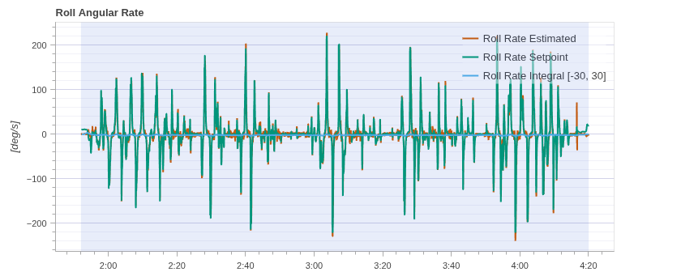
    <figcaption>Roll姿态角跟踪效果</figcaption>
</figure>

<figure style="flex:1; text-align:center;">
    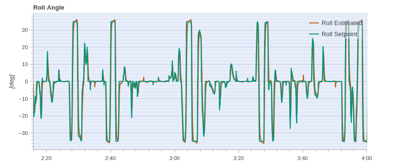
    <figcaption>Roll角速度跟踪效果</figcaption>
</figure>

### \(2\) Pitch姿态角及角速度数据分析

以下是Pitch（俯仰）姿态角及角速度数据图。根据曲线变化情况可以判断PID参数设置是否合理，并针对响应滞后、振荡或超调等问题进行参数优化，提高无人机姿态控制性能。

<strong>​​​💡 常见问题判断： 
1)如果实际值明显滞后于期望值，说明P增益过小，需要增大P；2)如果实际值出现明显超调后振荡，说明P增益过大或D增益不足，需要减小P或增大D；3)如果存在稳态误差，说明I增益过小，需要增大I；4)如果存在低频缓慢振荡，说明I增益过大，需要减小I。

</strong>

<figure style="flex:1; text-align:center;">
    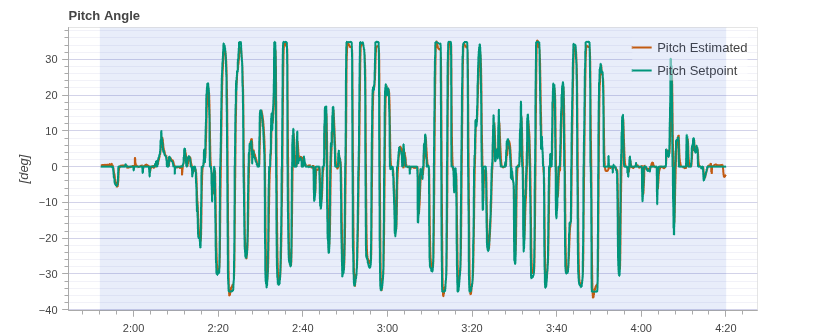
    <figcaption>Pitch姿态角跟踪效果</figcaption>
</figure>

<figure style="flex:1; text-align:center;">
    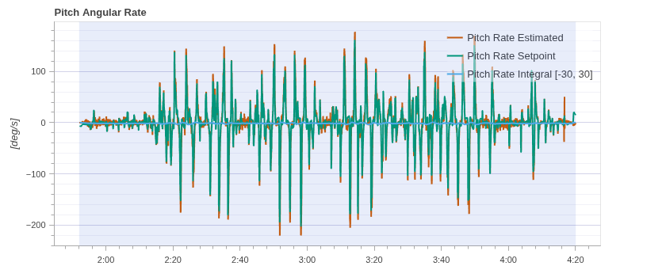
    <figcaption>Pitch角速度跟踪效果</figcaption>
</figure>

### \(3\) 响应时间评估

评估角速度环和角度环的响应延迟与跟踪性能。其中，角速度环控制响应时间通常应保持在50ms左右，角度环响应时间应控制在200ms左右。

<strong>​​​💡 性能评估标准： 
1)角速度环响应时间约50ms，响应过快可能导致振荡，过慢则跟踪滞后；2)角度环响应时间约200ms，保证姿态变化平稳流畅；3)超调量应小于10%，无明显振荡；4)稳态误差应接近于零，能够精确保持目标姿态。

</strong>

<figure style="flex:1; text-align:center;">
    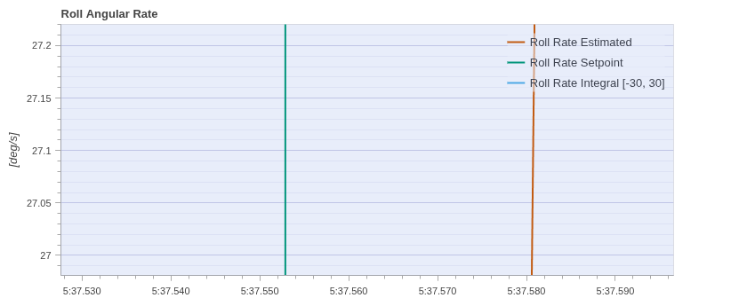
    <figcaption>角速度环响应时间分析</figcaption>
</figure>

<figure style="flex:1; text-align:center;">
    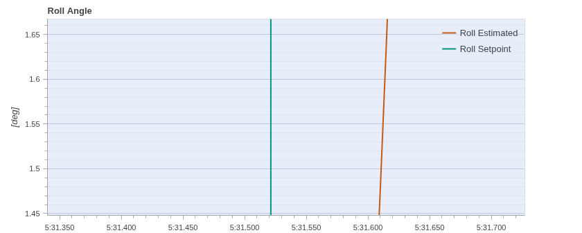
    <figcaption>角度环响应时间分析</figcaption>
</figure>

## 3\.6 手动模式PID调校过程

手动模式PID调校是提升无人机控制性能的关键步骤。调校过程需要循序渐进，逐步调整各参数，观察飞行响应的变化。

### \(1\) 调校顺序与原则

首先迭代调整横滚（Roll）和俯仰（Pitch）的P、D增益，再调整I增益。初始阶段，横滚和俯仰可以采用相同参数；获得合适的基础参数后，再分别观察两者的响应特性进行微调。对于结构和动力系统高度对称的无人机，可不进行单独调整。偏航（Yaw）的调校过程与横滚、俯仰类似，但通常可将D增益设置为0。

**比例增益（P）：**P值应尽可能提高，但需避免产生明显振荡。P过高：无人机出现高频振荡，姿态响应不稳定；P过低：无人机响应迟缓，跟随遥控输入的能力较弱。

**微分增益（D）：**D值应设置在能够有效抑制过冲的范围内，同时避免过度放大传感器噪声。D过高：角速度控制容易受到噪声影响，可能导致电机输出快速波动；D过低：无人机在阶跃输入或快速姿态变化后容易出现过冲和振荡。

**积分增益（I）：**I过高：容易产生低频、缓慢的振荡；I过低：稳态误差较大，受到外界扰动后姿态恢复能力较弱。

<strong>​​​💡 调参测试模式： 
调参过程中，可在自稳模式或手动姿态控制模式下进行测试，通过观察无人机对遥控输入的响应速度、振荡幅度、过冲以及姿态恢复能力，逐步确定合适的P、I、D参数。每次只调整一个参数，调整幅度不宜过大，调整后进行飞行测试并记录日志，通过日志分析评估调参效果。

</strong>

### \(2\) D增益对比分析

以下是不同D增益设置下的控制效果对比。通过对比可以直观地看到D增益对控制性能的影响。

**正常MC\_ROLLRATE\_D：**D增益设置合适时，角速度控制响应快速，超调量小，无明显振荡，电机输出平稳。

<figure style="flex:1; text-align:center;">
    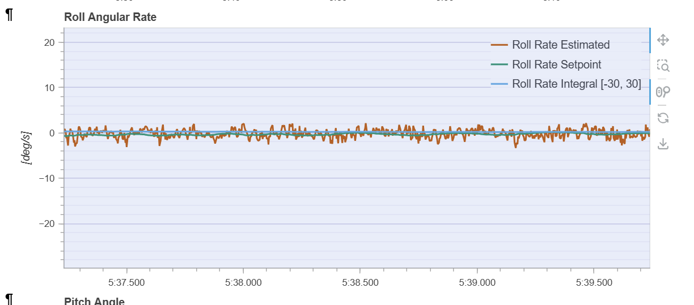
    <figcaption>正常MC_ROLLRATE_D现象</figcaption>
</figure>

**调大MC\_ROLLRATE\_D：**D增益过大时，会放大传感器噪声，导致角速度控制信号出现明显的高频波动，电机输出也随之快速波动，增加功耗和发热。

<figure style="flex:1; text-align:center;">
    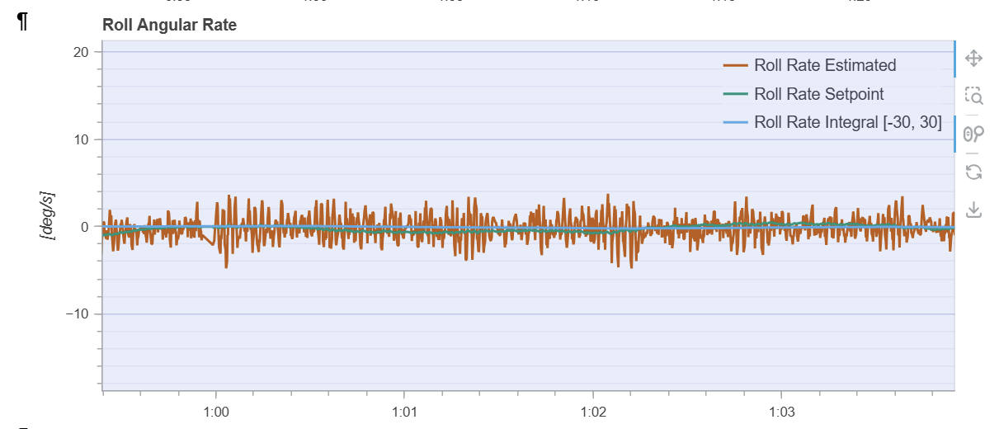
    <figcaption>调大MC_ROLLRATE_D，噪声放大</figcaption>
</figure>

**调小MC\_ROLLRATE\_D：**D增益过小时，无法有效抑制过冲，无人机在阶跃输入或快速姿态变化后容易出现明显的过冲和振荡，姿态恢复时间延长。

<figure style="flex:1; text-align:center;">
    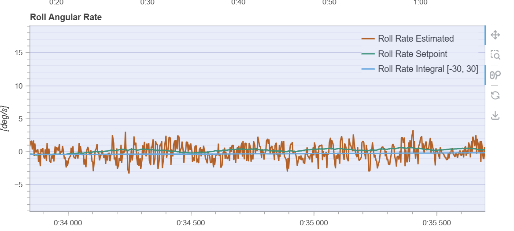
    <figcaption>调小MC_ROLLRATE_D，容易发生过冲现象</figcaption>
</figure>

<strong>​​​💡 D增益调参建议： 
D增益的调整需要在噪声抑制和过冲抑制之间找到平衡。建议从默认值开始，逐步增大D增益，观察电机输出是否出现明显的高频波动。如果出现波动，说明D增益过大，需要适当减小。如果没有波动但存在过冲，可以继续增大D增益直到过冲被有效抑制。

</strong>

### \(3\) P增益对比分析

以下是不同P增益设置下的控制效果对比。P增益是PID控制器中最基础、最重要的参数，直接决定了控制系统的响应速度和稳定性。

**正常MC\_ROLLRATE\_P：**P增益设置合适时，角速度控制响应快速，能够准确跟踪期望值，超调量小，无明显振荡。

<figure style="flex:1; text-align:center;">
    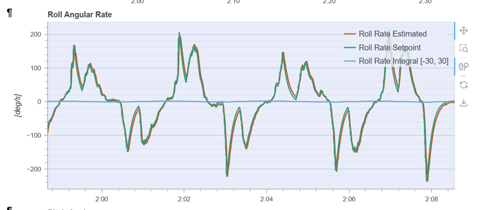
    <figcaption>正常MC_ROLLRATE_P现象</figcaption>
</figure>

**MC\_ROLLRATE\_P过小：**P增益过小时，无人机响应滞后，实际角速度明显落后于期望角速度，跟随遥控输入的能力较弱，控制效果迟钝。

<figure style="flex:1; text-align:center;">
    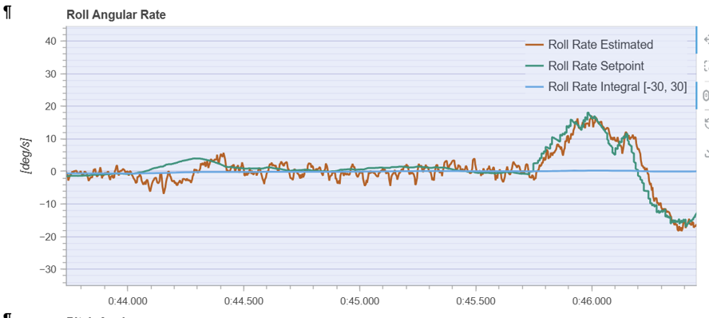
    <figcaption>MC_ROLLRATE_P过小，响应滞后</figcaption>
</figure>

**MC\_ROLLRATE\_P过大：**P增益过大时，系统响应过于激进，容易出现明显的超调，甚至产生高频振荡，姿态响应不稳定，影响飞行安全。

<figure style="flex:1; text-align:center;">
    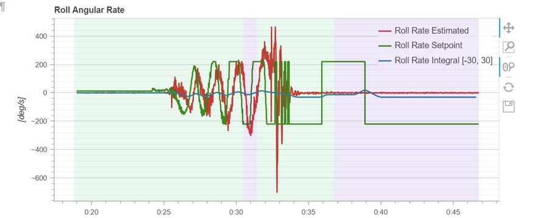
    <figcaption>MC_ROLLRATE_P过大，超调</figcaption>
</figure>

<strong>​​​
    💡 P增益调参建议： 
    P增益的调整应遵循"逐步增大，出现振荡则回退"的原则。从较小的值开始，逐步增大P增益，每次调整后进行飞行测试，观察是否出现振荡。当开始出现轻微振荡时，将P增益回退10%-20%，通常可以获得较好的控制效果。注意：在调整P增益之前，必须确保D增益和滤波器参数已经设置合理。

</strong>

# 总结

## 1\.课程要点回顾

本周课程围绕飞行日志分析与飞控PID调参展开，涵盖了从日志获取、性能分析到参数调校的完整流程。以下是核心要点回顾：

|模块|核心内容|关键操作/工具|
|---|---|---|
|飞行日志下载|通过QGC连接PX4飞控，下载飞行日志|QGC地面站、Analyze Tools、Log Download、\.ulg格式|
|飞行日志分析|使用Flight Review分析振动性能与控制性能|Flight Review、PID性能跟踪、FFT频率分析、原始加速度、功率谱密度、执行器输出|
|PID调参准备|开启高速率日志，配置滤波器参数|High rate日志、IMU\_GYRO\_CUTOFF、IMU\_DGYRO\_CUTOFF|
|振动性能分析|检查机械振动水平，排查振动来源|Actuator FFT、Position模式悬停日志|
|控制性能分析|评估角度环和角速度环的响应性能|Stabilized模式日志、Roll/Pitch姿态角及角速度分析|
|PID参数调校|调整P、D、I增益，优化控制性能|MC\_ROLLRATE\_P/D/I、MC\_PITCHRATE\_P/D/I、MC\_YAWRATE\_P/D/I|

## 2\.常见问题排查

**QGC无法连接飞控：**  
1\)检查USB数据线是否支持数据传输（部分充电线只能充电）；2\)检查飞控驱动是否正确安装；3\)确认飞控是否正常上电，指示灯是否正常；4\)尝试更换USB接口或数据线。

**日志列表为空：** 
1\)确认飞控中已有飞行记录，至少完成过一次飞行；2\)检查SD卡是否正常工作，是否有足够存储空间；3\)尝试点击"刷新"按钮重新读取日志列表；4\)如果SD卡损坏，需要更换SD卡。

**Flight Review上传失败：** 
1\)检查日志文件是否完整，文件大小是否正常；2\)确认网络连接是否正常，能够访问review\.px4\.io；3\)尝试使用其他浏览器或清除浏览器缓存；4\)如果日志文件过大，可以尝试截取部分数据进行分析。

**振动过高无法降低：** 
1\)检查飞控是否使用减震垫安装，安装是否牢固；2\)检查电机螺丝是否全部紧固，电机轴承是否有异响或磨损；3\)检查桨叶是否有损伤，是否做过动平衡测试；4\)检查机架螺丝是否紧固，是否存在结构共振；5\)如果以上都正常，可以尝试降低IMU\_GYRO\_CUTOFF和IMU\_DGYRO\_CUTOFF参数。

**PID调参后出现振荡：** 
1\)首先降低P增益，观察振荡是否消失；2\)如果振荡仍然存在，适当提高D增益，增强阻尼效果；3\)检查滤波器截止频率是否设置过高，导致噪声进入控制环；4\)确认振动水平是否在可接受范围内，振动过大也会导致振荡；5\)如果是低频缓慢振荡，可能是I增益过大，需要降低I增益。

<strong>​​​💡 安全提示： 
PID参数调校涉及实机飞行测试，务必在安全的环境中进行，远离人群和障碍物。每次调整参数后，先进行小幅度的测试飞行，确认控制性能正常后再进行大幅度的机动测试。如果出现异常振荡或失控，应立即切换到自稳模式或紧急降落，确保飞行安全。

</strong>

