# 第7周：机载电脑系统烧录与环境配置

# 实践课程大纲

本课程为无人机实践课程，主要内容包括香橙派Ubuntu系统烧录、常用调试软件安装与使用、以及Mavros与飞控的实机通讯配置。通过三个实践环节，掌握无人机机载计算平台的环境搭建与数据交互方法。

|实践环节|核心内容|学习目标|
|---|---|---|
|实践一：香橙派 Ubuntu 系统烧录下载<br>|完成香橙派机载计算平台 Ubuntu 系统烧录，搭建无人机机载伴随计算机基础开发环境|掌握无人机机载伴随计算机开发环境搭建的基础流程|
|实践二：常用调试软件安装与调试方法|部署 ROS、MAVROS 环境；安装 terminator、plotjuggler、rqt 等工具；学习各类调试软件基础操作|熟悉无人机开发常用调试工具，掌握 ROS 环境基础调试手段|
|实践三：Mavros 与飞控实机通讯|搭建 MAVROS 与 PX4 飞控通信链路，实现机载计算机与飞控双向数据交互|掌握机载计算平台与 PX4 飞控之间的数据交互方法|

<div style="background-color:#edf2ff; border:1px solid #88aaff; padding:20px 26px; margin:16px 0; border-radius:14px; color:#222; line-height:2.4;">
  💡 <strong>实践准备：</strong>准备香橙派底板，电脑预先准备 Ubuntu 系统镜像与烧录工具；香橙派完成系统烧录后需能够正常上电联网。
</div>

|下载链接|文件名|用途|
|---|---|---|
|<a href="https://diffrobots.oss-cn-hangzhou.aliyuncs.com/nju-wiki/file/RKDevTool_v3.15.zip" target="_blank">📥RKDevTool_v3.15</a>|RKDevTool_v3.15|香橙派镜像烧录软件|
|<a href="https://diffrobots.oss-cn-hangzhou.aliyuncs.com/nju-wiki/file/MiniCoreOpenDroneV2-U20-K6.1-.img.gz" target="_blank">📥MiniCoreOpenDroneV2-U20-K6.1-.img</a>|MiniCoreOpenDroneV2-U20-K6.1-.img|香橙派镜像文件|

<div style="background-color:#edf2ff; border:1px solid #88aaff; padding:20px 26px; margin:16px 0; border-radius:14px; color:#222; line-height:2.4;">
  💡 <strong>香橙派用户名密码：</strong>
  <div style="margin‑top:12px;">
    <div> 用户名：orangepi</div>
    <div> 密码：l（小写L）</div>
  </div>
</div>

# 实践一：香橙派Ubuntu系统烧录

## 1.1 系统镜像解压

首先需要下载并解压香橙派的Ubuntu系统镜像。镜像文件需要与硬件平台版本匹配，否则可能导致烧录失败或系统无法正常启动。

**操作步骤：**

1. 根据香橙派开发板型号，从官网下载对应版本的 Ubuntu 系统镜像压缩包，确保镜像版本与硬件平台匹配

2. 使用解压工具对下载的镜像压缩包进行解压，提取其中的系统镜像文件（\.img格式）

3. 确认解压后的镜像文件大小及格式是否正确，避免因文件损坏导致系统烧录失败

<figure style="flex:1; text-align:center;">
    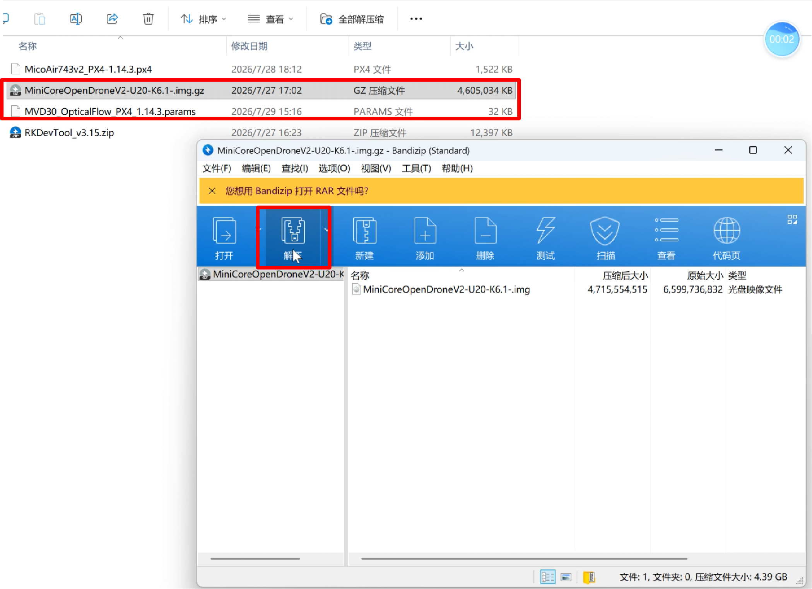
    <figcaption>镜像解压操作</figcaption>
</figure>

## 1.2 驱动安装

镜像准备好后，需要安装香橙派的烧录工具驱动。驱动程序用于让电脑能够识别并与香橙派开发板进行通信。

**操作步骤：**

1. 使用解压工具对 RKDevTool 驱动压缩包进行解压，提取其中的驱动文件

2. 选择 RKDevTool\_v3\.15/DriverAssitant\_v5\.12/DriverInstall\.exe 驱动文件

3. 以管理员身份运行安装文件，等待驱动安装完毕

<figure style="flex:1; text-align:center;">
    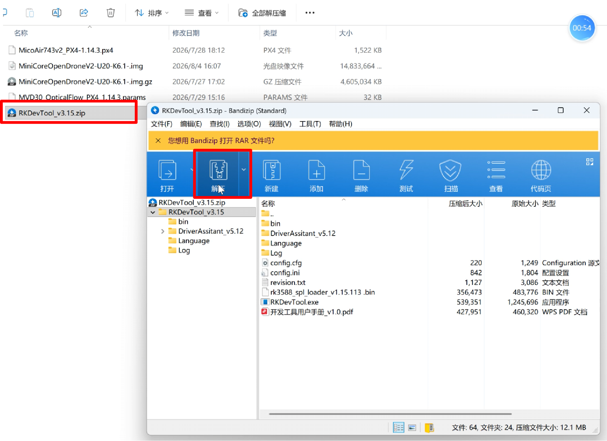
    <figcaption>驱动文件位置</figcaption>
</figure>

<div style="display:flex; gap:12px; justify-content:center; margin:16px 0; align-items:flex-start; flex-wrap:wrap;">
  <div style="flex-shrink:0; flex-basis:48%; text-align:center; max-width:48%;">
    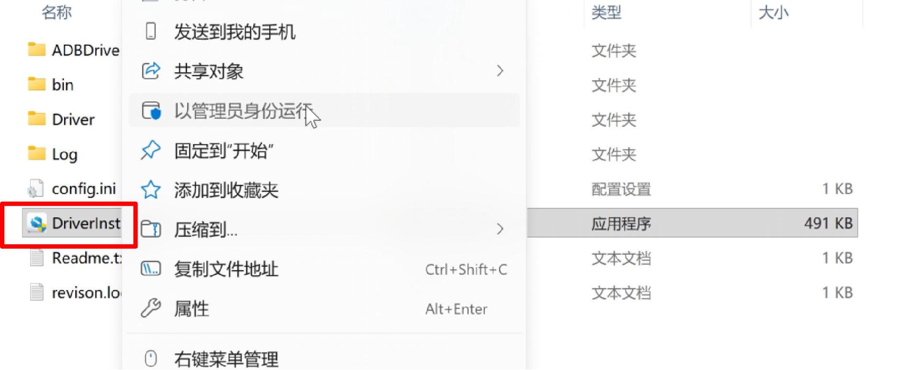
    <div style="margin-top:12px; font-size:1.1em;">驱动安装过程</div>
  </div>

  <div style="flex-shrink:0; flex-basis:49%; text-align:center; max-width:39%;">
    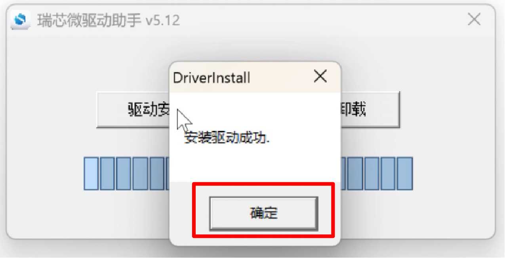
    <div style="margin-top:12px; font-size:1.1em;">驱动安装完成</div>
  </div>
</div>

## 1.3 连接香橙派与烧录工具

驱动安装完成后，需要将香橙派开发板连接到电脑，并配置烧录工具。这一步是系统烧录的关键准备工作。

**操作步骤：**

1. 设置香橙派引导程序，在烧录工具中选择 Loader 文件：`RKDevTool_v3.15/rk3588_spl_loader_v1.15.113.bin`

2. 设置系统镜像 img 文件，选择 Linux 镜像：`MiniCoreOpenDroneV2-U20-K6.1-.img`，点击"强制按地址写"

3. 移除风扇接口，按住开发板最左边按键，然后通电，等待绿灯亮起后松手，此时烧录工具会显示发现一个 MASKROM 设备

<div style="background-color:#fffde0; border:1px solid #f4d345; padding:20px 26px; margin:16px 0; border-radius:14px; color:#222; line-height:2.4;">
  💡 <strong>注意：</strong>进入MASKROM模式前必须移除风扇接口，否则可能无法正常进入烧录模式。
</div>

<div style="display:flex; gap:16px; width:100%; box-sizing:border-box;">

  <!-- 卡片1：Loader文件选择 -->
  <div style="flex:1; background:#ffffff; border-radius:16px; padding:12px; border:1px solid #eee;">
    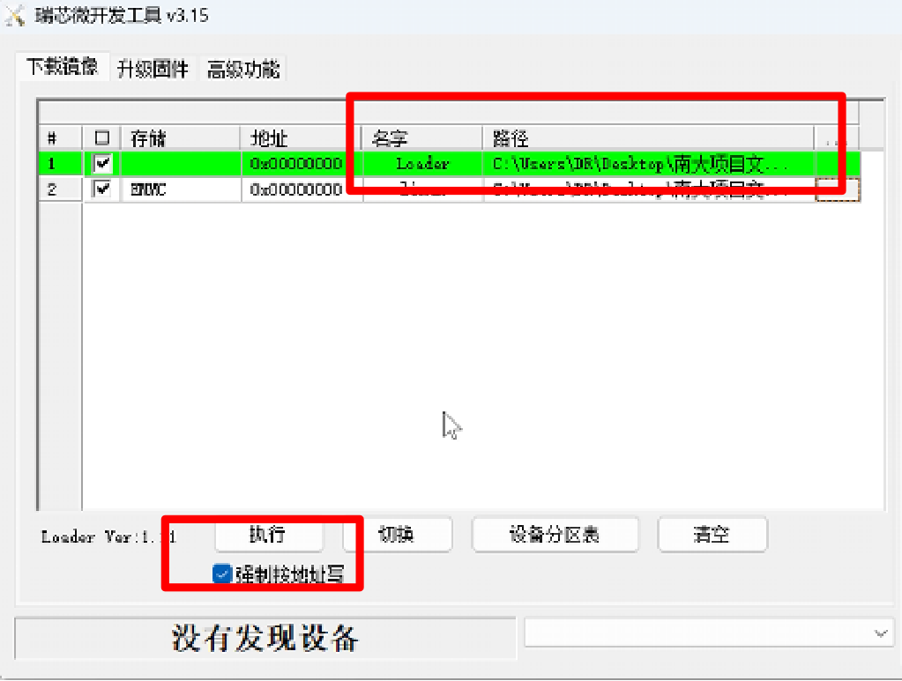
    <div style="text-align:center; font-size:1.4em; margin-top:12px; color:#333;">Loader文件选择</div>
  </div>

  <!-- 卡片2：MASKROM设备识别成功 -->
  <div style="flex:1; background:#ffffff; border-radius:16px; padding:12px; border:1px solid #eee;">
    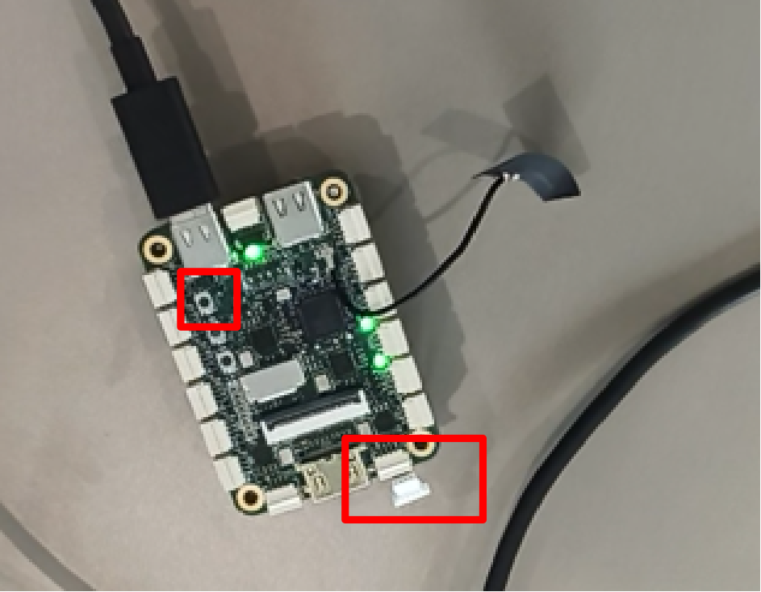
    <div style="text-align:center; font-size:1.4em; margin-top:12px; color:#333;">MASKROM设备识别成功</div>
  </div>

  <!-- 卡片3：系统镜像文件选择 -->
  <div style="flex:1; background:#ffffff; border-radius:16px; padding:12px; border:1px solid #eee;">
    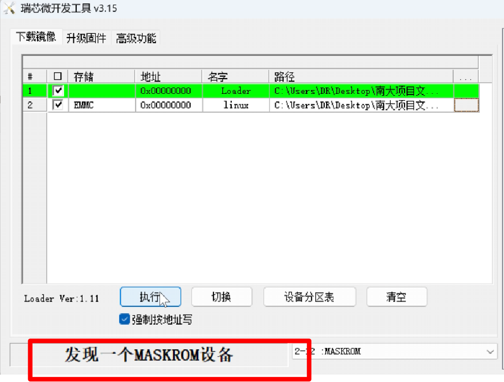
    <div style="text-align:center; font-size:1.4em; margin-top:12px; color:#333;">系统镜像文件选择</div>
  </div>
</div>


## 1.4 执行系统烧录

所有配置完成并成功识别MASKROM设备后，就可以开始执行系统烧录了。烧录过程需要一定时间，请耐心等待，期间不要断开连接或关闭烧录工具。

**操作步骤：**

1. 确认烧录工具已识别到 MASKROM 设备

2. 点击"执行"按钮，开始烧录系统镜像

3. 等待烧录进度条完成，烧录完毕后工具会显示"没有发现设备"

4. 烧录完成后，断开电源，重新上电即可启动新系统

<div style="background-color:#fffde0; border:1px solid #f4d345; padding:20px 26px; margin:16px 0; border-radius:14px; color:#222; line-height:2.4;">
  💡 <strong>注意：</strong>烧录过程中切勿断电或拔插USB线，否则可能导致系统损坏或开发板变砖。
</div>

<div style="display:flex; gap:16px; width:100%; box-sizing:border-box;">

  <div style="flex:1; background:#ffffff; border-radius:16px; padding:12px; border:1px solid #eee;">
    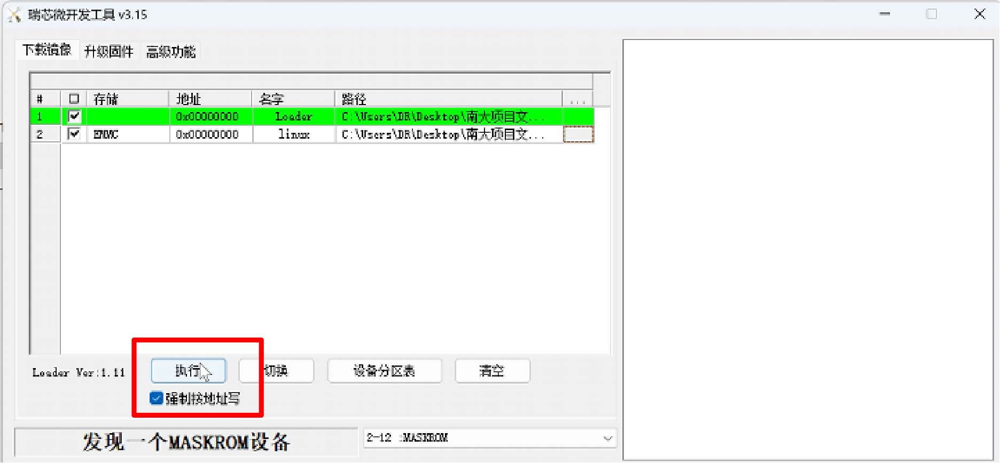
    <div style="text-align:center; font-size:1.4em; margin-top:12px; color:#333;">执行烧录镜像</div>
  </div>

  <div style="flex:1; background:#ffffff; border-radius:16px; padding:12px; border:1px solid #eee;">
    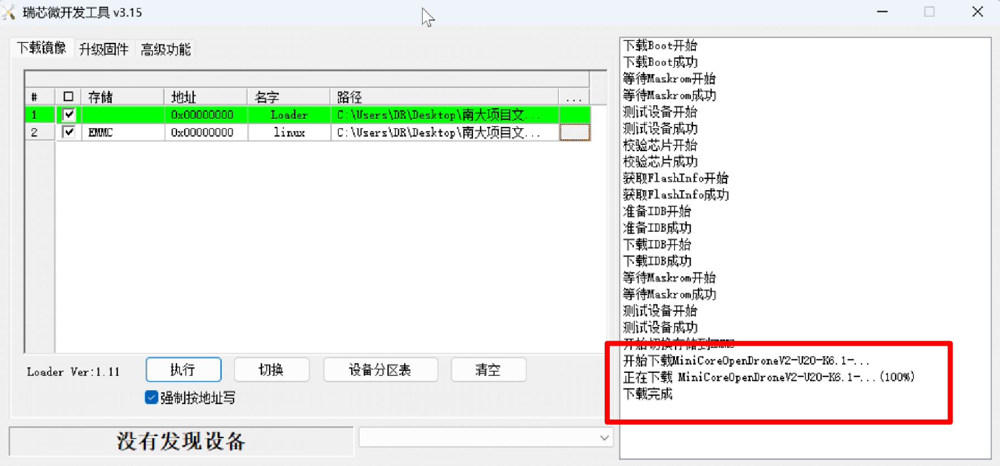
    <div style="text-align:center; font-size:1.4em; margin-top:12px; color:#333;">烧录成功完成</div>
  </div>
</div>

## 1.5 完善Ubuntu运行环境

系统烧录完成并首次启动后，需要完善Ubuntu运行环境，安装必要的软件包并进行系统配置。

**操作步骤：**

1. 连接显示器和键鼠，使用 WiFi 连接互联网

2. 打开终端，依次执行以下命令：

```Bash
sudo apt update
sudo apt install ros-noetic-plotjuggler-ros terminator ros-noetic-vrpn
sudo ln -s /usr/include/eigen3/Eigen /usr/include/Eigen
echo "127.0.0.1   minicore" | sudo tee -a /etc/hosts
```
<div style="background-color:#f0f2fc; border:1px solid #99a8f0; padding:24px 28px; margin:16px 0; border-radius:14px; color:#222; line-height:2.6;">
  💡 <strong>命令说明：</strong>
  <div style="margin‑top:12px;">
    <div>1. <code style="background:#eee;padding:2px 8px;border‑radius:4px;">sudo apt update</code>：更新软件源列表</div>
    <div>2. 安装 plotjuggler、terminator、vrpn 等常用调试工具</div>
    <div>3. 创建 Eigen 库的软链接，解决编译时头文件找不到的问题</div>
    <div>4. 将主机名 minicore 映射到 127.0.0.1，避免 ROS 网络配置报错</div>
  </div>
</div>

## 1.6 实操视频演示

<p >
  <video width="950" controls>
    <source src="https://diffrobots.oss-cn-hangzhou.aliyuncs.com/nju-wiki/7/%E7%B3%BB%E7%BB%9F%E7%83%A7%E5%BD%95.mp4" type="video/mp4">
  </video>
</p>

# 实践二：Vmware下常用调试软件安装与调试方法

## 2.1 ROS安装

ROS（Robot Operating System）是一个灵活的框架，用于构建机器人软件。在无人机开发中，ROS是不可或缺的基础平台。本步骤使用一键安装脚本快速配置ROS环境。

**操作步骤：**

1. 打开 Ubuntu 终端，输入以下命令一键配置系统源，输入数字1回车，一键配置系统源。

```Plain Text
wget http://fishros.com/install -O fishros && . fishros
```

2. 选择中科大镜像源作为系统源进行安装

3. 输入数字3 回车，选择 ROS 安装版本，等待安装完毕

<div style="background-color:#edf2ff; border:1px solid #88aaff; padding:20px 26px; margin:16px 0; border-radius:14px; color:#222; line-height:2.4;">
  💡 <strong>说明：</strong>使用 fishros 一键安装脚本可以自动配置软件源、安装 ROS Noetic 版本，并完成环境变量配置，省去手动配置的繁琐步骤。
</div>


<div style="display:flex; gap:12px; justify-content:center; margin:16px 0; align-items:flex-start; flex-wrap:wrap;">
  
  <div style="flex-shrink:0; flex-basis:52%; text-align:center; max-width:23%;">
    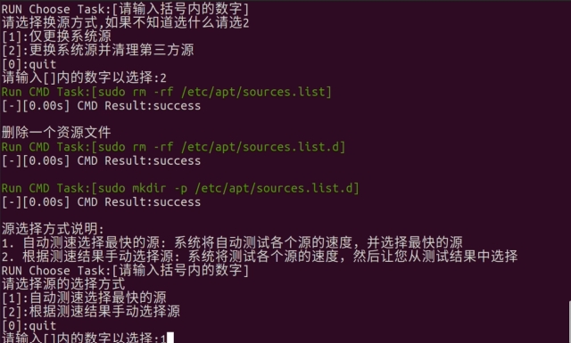
    <div style="margin-top:12px; font-size:1.1em;">步骤1：配置系统源</div>
  </div>

  <div style="flex-shrink:0; flex-basis:47%; text-align:center; max-width:31%;">
    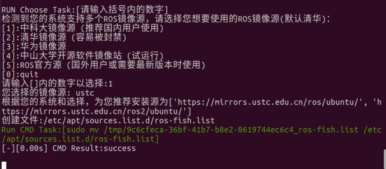
    <div style="margin-top:12px; font-size:1.1em;">步骤2：选择中科大镜像源</div>
  </div>

  <div style="flex-shrink:0; flex-basis:47%; text-align:center; max-width:40%;">
    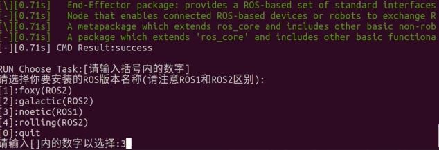
    <div style="margin-top:12px; font-size:1.1em;">步骤3：选择ROS版本</div>
  </div>
</div>

## 2.2 ROS安装视频教程

<p >
  <video width="950" controls>
    <source src="https://diffrobots.oss-cn-hangzhou.aliyuncs.com/nju-wiki/7/ros%E5%AE%89%E8%A3%85.mp4" type="video/mp4">
  </video>
</p>

## 2.3 MavROS安装

MAVROS是一个ROS软件包，它在ROS和MAVLink协议之间建立了一座桥梁。MAVLink是无人机领域广泛使用的通信协议，通过MAVROS可以实现ROS节点与PX4飞控之间的数据交互。

**操作步骤：**

1. 打开终端，输入以下命令安装 MAVROS 及相关依赖：

```Plain Text
sudo apt install -y ros-noetic-mavros ros-noetic-mavros-extras ros-noetic-mavros-msgs geographiclib-tools
```

2. 加载 ROS\-Noetic 的环境变量：

```Plain Text
source /opt/ros/noetic/setup.bash
```

3. 检查 mavros 包是否安装成功：

```Plain Text
rospack find mavros
```
<div style="background-color:#eafaea; border:1px solid #72d272; padding:20px 26px; margin:16px 0; border-radius:14px; color:#222; line-height:2.4;">
  ✅ <strong>验证：</strong>如果命令返回 mavros 包的安装路径（如 <code style="background:#eee;padding:2px 8px;border-radius:4px;">/opt/ros/noetic/share/mavros</code>），说明安装成功。
</div>


<div style="display:flex; gap:12px; justify-content:center; margin:16px 0; align-items:flex-start; flex-wrap:wrap;">
  <div style="flex-shrink:0; flex-basis:52%; text-align:center; max-width:38%;">
    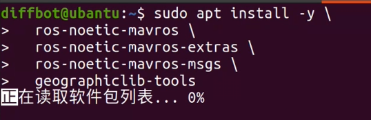
    <div style="margin-top:12px; font-size:1.1em;">MavROS安装过程</div>
  </div>

  <div style="flex-shrink:0; flex-basis:100%; text-align:center; max-width:56%;">
    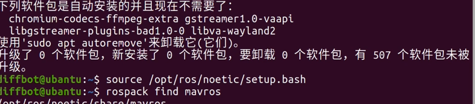
    <div style="margin-top:12px; font-size:1.1em;">检查MavROS安装结果</div>
  </div>
</div>

## 2.4 MavROS安装视频教程

<p >
  <video width="950" controls>
    <source src="https://diffrobots.oss-cn-hangzhou.aliyuncs.com/nju-wiki/7/mavros%E5%AE%89%E8%A3%85%E8%A7%86%E9%A2%91.mp4" type="video/mp4">
  </video>
</p>

## 2.5 Terminator安装与使用

Terminator是一个高级终端模拟器，允许用户在一个窗口内管理多个终端会话。在无人机开发中，经常需要同时运行多个终端（启动ROS节点、监听话题、查看日志等），Terminator的分屏功能可以大大提高工作效率。

**安装命令：**

```
sudo apt update
sudo apt install terminator
```

**使用方法：**

1. 打开 Terminator 终端

2. 在终端页面上右键点击，选择"水平分割"或"垂直分割"

3. 可以无限划分多个子终端页面，每个页面独立运行命令

**快捷键：**Ctrl\+Shift\+E 垂直分割，Ctrl\+Shift\+O 水平分割，Ctrl\+Shift\+W 关闭当前终端。

<div style="background-color:#edf2ff; border:1px solid #88aaff; padding:20px 26px; margin:16px 0; border-radius:14px; color:#222; line-height:2.4;">
  💡 <strong>快捷键：</strong><code style="background:#eee;padding:2px 8px;border-radius:4px;">Ctrl+Shift+E</code> 垂直分割，<code style="background:#eee;padding:2px 8px;border-radius:4px;">Ctrl+Shift+O</code> 水平分割，<code style="background:#eee;padding:2px 8px;border-radius:4px;">Ctrl+Shift+W</code> 关闭当前终端。
</div>


<div style="display:flex; gap:12px; justify-content:center; margin:16px 0; align-items:flex-start; flex-wrap:wrap;">
  <div style="flex-shrink:0; flex-basis:52%; text-align:center; max-width:52%;">
    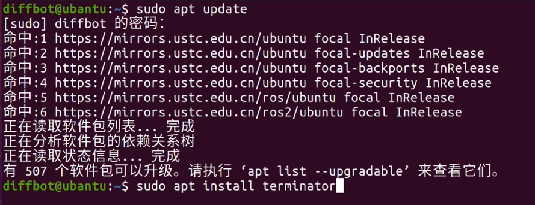
    <div style="margin-top:12px; font-size:1.1em;">安装Terminator命令</div>
  </div>

  <div style="flex-shrink:0; flex-basis:100%; text-align:center; max-width:31%;">
    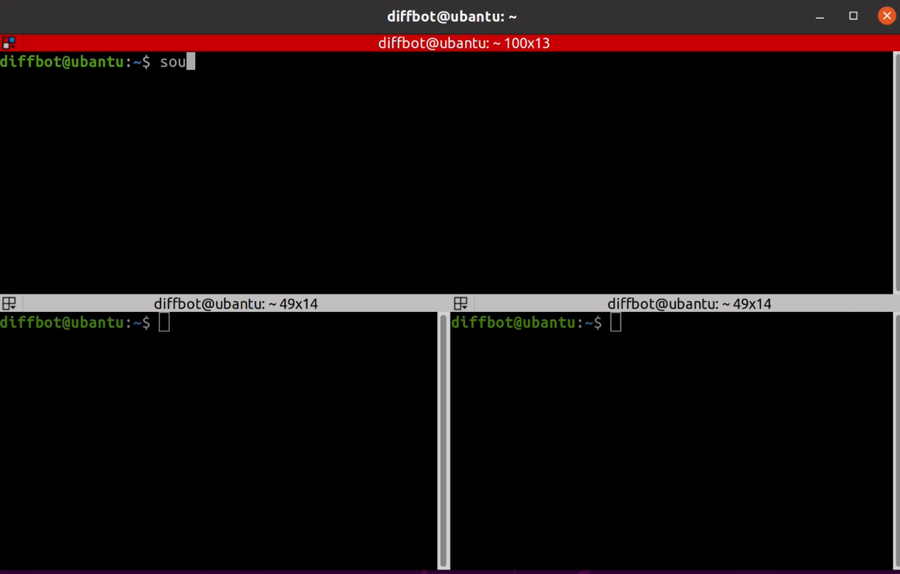
    <div style="margin-top:12px; font-size:1.1em;">Terminator多终端界面</div>
  </div>
</div>

## 2.6 Terminator安装视频教程

<p >
  <video width="950" controls>
    <source src="https://diffrobots.oss-cn-hangzhou.aliyuncs.com/nju-wiki/7/terminator%E5%AE%89%E8%A3%85%E8%A7%86%E9%A2%91.mp4" type="video/mp4">
  </video>
</p>

## 2.7 PlotJuggler安装与使用

PlotJuggler是一个专业级的开源时间序列数据可视化工具。在无人机开发中，可以用它实时绘制IMU数据、姿态信息、控制指令等ROS话题数据，方便调试和分析系统性能。

**安装命令：**

```Plain Text
sudo apt update
sudo apt install ros-noetic-plotjuggler ros-noetic-plotjuggler-ros
```

**使用方法：**

1. 打开终端，输入以下命令启动 PlotJuggler：

```Plain Text
rosrun plotjuggler plotjuggler
```

1. 等待页面打开后，在左侧选择要监听的 ROS 话题

2. 将话题拖拽到绘图区域，即可实时显示数据曲线

<div style="background-color:#edf2ff; border:1px solid #88aaff; padding:20px 26px; margin:16px 0; border-radius:14px; color:#222; line-height:2.4;">
  💡 <strong>提示：</strong>PlotJuggler 支持同时绘制多个话题的数据，可以对比分析不同传感器的输出。
</div>


<div style="display:flex; gap:12px; justify-content:center; margin:16px 0; align-items:flex-start; flex-wrap:wrap;">
  <div style="flex-shrink:0; flex-basis:52%; text-align:center; max-width:48%;">
    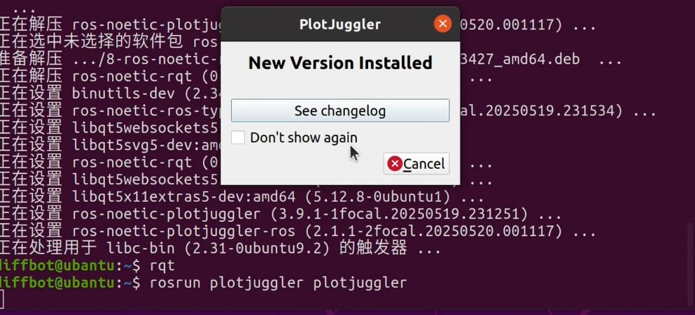
    <div style="margin-top:12px; font-size:1.1em;">启动PlotJuggler</div>
  </div>

  <div style="flex-shrink:0; flex-basis:100%; text-align:center; max-width:39%;">
    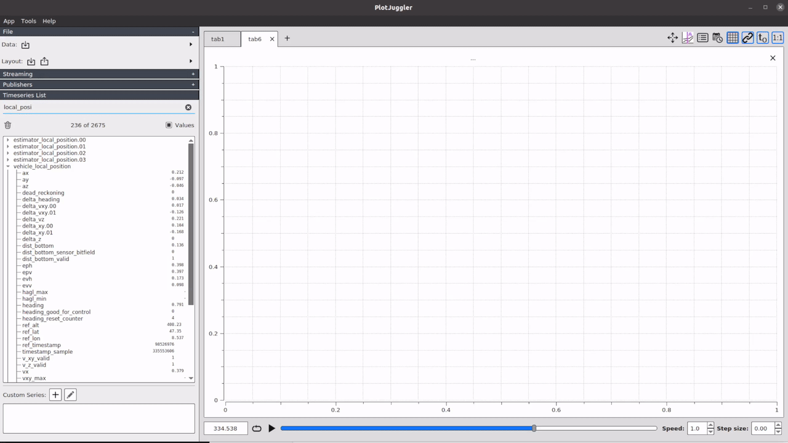
    <div style="margin-top:12px; font-size:1.1em;">PlotJuggler数据可视化界面</div>
  </div>
</div>

## 2.8 rqt安装与使用

rqt是ROS的图形化用户界面框架，它将各种常用的命令行工具以插件的形式集成到一个统一的图形界面中。通过rqt可以方便地查看话题列表、发布消息、动态调整参数、查看节点关系图等。

**安装命令：**

```Plain Text
sudo apt update
sudo apt install ros-noetic-rqt ros-noetic-rqt-common-plugins
```

**使用方法：**

1. 打开终端，输入以下命令启动 rqt：

```Plain Text
rqt
```

2. 等待页面打开后，通过菜单栏 Plugins 选择需要的工具插件

3. 常用插件包括：Topic Monitor（话题监控）、Node Graph（节点图）、Dynamic Reconfigure（动态参数调整）等

<div style="background-color:#edf2ff; border:1px solid #88aaff; padding:20px 26px; margin:16px 0; border-radius:14px; color:#222; line-height:2.4;">
  💡 <strong>提示：</strong>rqt 可以同时打开多个插件窗口，灵活布局，适合复杂的ROS系统调试。
</div>

<figure style="flex:1; text-align:center;">
    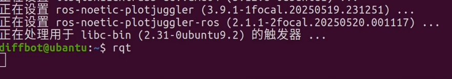
    <figcaption>启动rqt界面</figcaption>
</figure>

<figure style="flex:1; text-align:center;">
    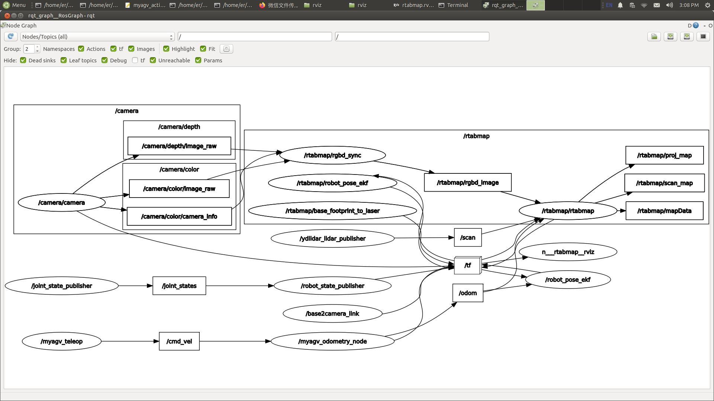
    <figcaption>rqt插件使用界面</figcaption>
</figure>

## 2.9 PlotJuggler和rqt安装视频教程

<p >
  <video width="950" controls>
    <source src="https://diffrobots.oss-cn-hangzhou.aliyuncs.com/nju-wiki/7/Rqt%E3%80%81PlotJuggler%20.mp4" type="video/mp4">
  </video>
</p>

# 实践三：Mavros与飞控实机通讯

## 3.1 配置px4\.launch文件

在启动MAVROS之前，需要先配置px4\.launch文件中的串口端口号和波特率，确保机载电脑能够正确与PX4飞控建立通信。

**操作步骤：**

1. 终端输入以下命令进入 mavros 包目录：

```Plain Text
roscd mavros
```

2. 使用 vim 编辑器打开 launch 文件：

```Plain Text
sudo vim launch/px4.launch
```

3. 输入密码后，进入 launch 文件，修改端口号（如 /dev/ttyUSB0）与波特率（如 921600）

4. 保存并退出 vim 编辑器

<figure style="flex:1; text-align:center;">
    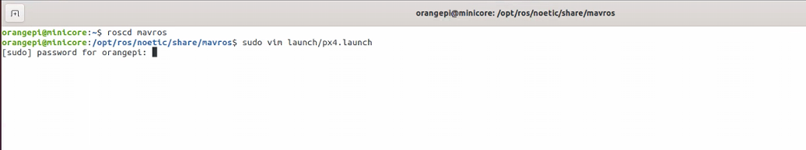
    <figcaption>进入mavros目录并打开px4.launch</figcaption>
</figure>

<figure style="flex:1; text-align:center;">
    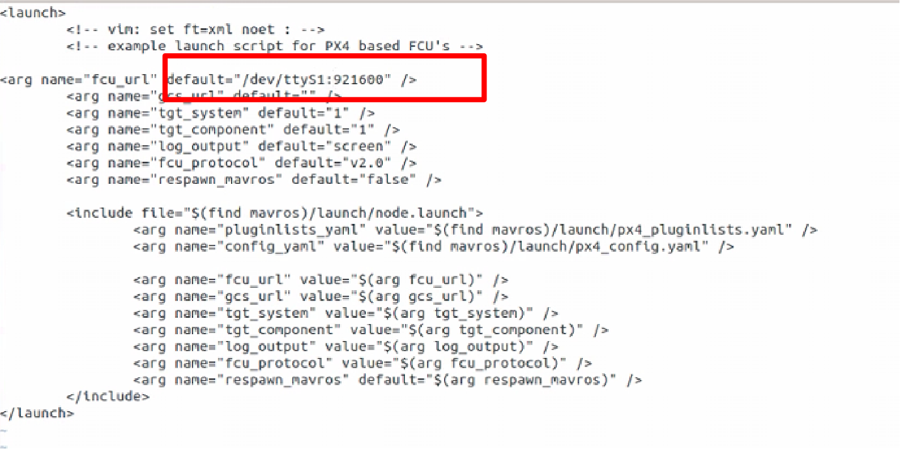
    <figcaption>修改端口号与波特率</figcaption>
</figure>


## 3.2 启动MAVROS节点与监听IMU数据

配置完成后，就可以启动MAVROS节点，建立机载电脑与PX4飞控之间的数据通道。通过监听IMU话题可以验证通信是否正常。

**操作步骤：**

1. 终端输入以下命令启动 MAVROS 节点，该命令会建立 OrangePi 开发板和 PX4 飞控之间的数据通道。

```Plain Text
roslaunch mavros px4.launch
```

2. 新建终端，输入以下命令持续监听 IMU 数据：

```Plain Text
rostop hz /mavros/imu/data
```

该命令会实时统计飞控发送姿态传感器数据的频率，判断是否成功连接飞控。

<div style="background-color:#e9f9e9; border:1px solid #7cd97c; padding:20px 26px; margin:16px 0; border-radius:14px; color:#222; line-height:2.4;">
  ✅ <strong>验证标准：</strong>正常情况下 IMU 数据发布频率约为 30‑50Hz，如果显示 <code style="background:#eee;padding:2px 8px;border-radius:4px;">"no new messages"</code> 或频率为 0，说明通信未建立，需要检查串口配置和接线。
</div>

<figure style="flex:1; text-align:center;">
    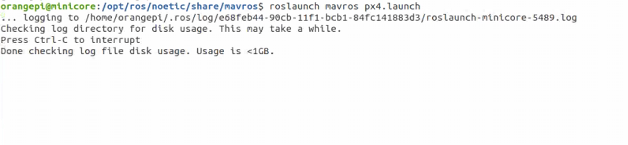
    <figcaption>启动MAVROS节点</figcaption>
</figure>

<figure style="flex:1; text-align:center;">
    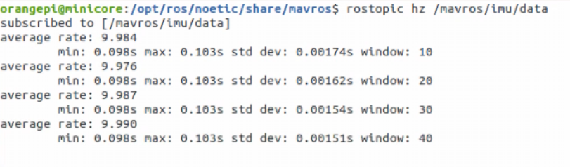
    <figcaption>监听IMU数据频率</figcaption>
</figure>

## 3.3 实时打印IMU数据

确认IMU数据频率正常后，可以进一步实时打印IMU传感器的原始数据，直观确认MAVROS和PX4通讯正常、传感器数据正在上传。

**操作步骤：**

1. 新建终端，输入以下命令实时打印 IMU 传感器原始数据：

```Plain Text
rostop echo /mavros/imu/data
```

终端会持续输出 IMU 数据，包括：

- **orientation**：四元数表示的姿态信息

- **angular\_velocity**：陀螺仪角速度数据

- **linear\_acceleration**：加速度计线性加速度数据

- **header**：时间戳和坐标系信息

<div style="background-color:#e9f9e9; border:1px solid #7cd97c; padding:20px 26px; margin:16px 0; border-radius:14px; color:#222; line-height:2.4;">
  ✅ <strong>验证：</strong>如果终端持续输出不断更新的数值，说明 MAVROS 与 PX4 飞控通讯正常，传感器数据正在实时上传。
</div>

<figure style="flex:1; text-align:center;">
    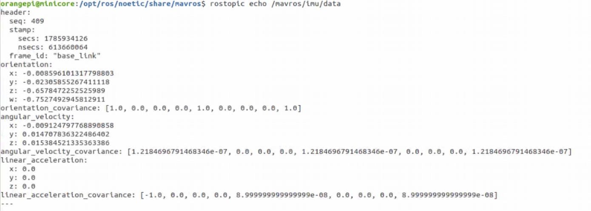
    <figcaption>监听IMU数据频率</figcaption>
</figure>

## 3.4 实操视频演示

<p >
  <video width="950" controls>
    <source src="https://diffrobots.oss-cn-hangzhou.aliyuncs.com/nju-wiki/7/%E5%AE%9E%E6%93%8D%E6%BC%94%E7%A4%BA%E8%A7%86%E9%A2%91.mp4" type="video/mp4">
  </video>
</p>

# 总结

## 1.课程要点回顾

本次实践课程完成了无人机机载电脑系统的完整环境搭建，涵盖从系统烧录到软件安装再到飞控通讯的全流程。以下是三个实践环节的核心要点：

|实践环节|核心内容|关键命令/操作|
|---|---|---|
|实践一：系统烧录|香橙派Ubuntu系统镜像烧录与环境配置|RKDevTool烧录、MASKROM模式、apt安装基础软件|
|实践二：软件安装|ROS及常用调试工具的安装与使用|fishros一键安装、MAVROS、Terminator、PlotJuggler、rqt|
|实践三：飞控通讯|MAVROS与PX4飞控的通信配置与验证|配置px4\.launch、roslaunch启动、rostopic监听IMU|

## 2.常见问题排查

**问题1：烧录工具无法识别MASKROM设备**

排查：检查驱动是否安装成功、是否移除风扇接口、按键操作是否正确（按住最左键再通电）

**问题2：ROS安装失败或源无法访问**

排查：检查网络连接、使用fishros脚本自动配置国内源、确保Ubuntu版本为20\.04（Noetic）

**问题3：MAVROS启动后无IMU数据**

排查：检查px4\.launch中的串口设备名和波特率、确认飞控已上电、检查USB串口线连接


