# 第8周：VMware虚拟机配置与Gazebo仿真环境搭建

# 实践课程大纲

本次实践课程分为两个部分，循序渐进地完成无人机仿真开发环境的搭建：

|实践环节|核心内容|目标|
|---|---|---|
|实践一：VMware虚拟机配置|安装VMware Workstation虚拟化软件，创建Ubuntu Linux虚拟机环境|为无人机仿真与开发提供运行平台|
|实践二：Gazebo + PX4仿真环境搭建|安装Gazebo仿真平台及相关依赖环境，完成PX4 SITL仿真|掌握仿真软件在无人机系统开发中的作用|

<div style="background-color:#edf2ff; border:1px solid #82aaff; padding:14px 20px; margin:16px 0; border-radius:12px; color:#333; line-height:1.8;">
  💡 <strong>实践准备：</strong> VMware虚拟机、Gazebo仿真器。
</div>

|下载链接|文件名称|用途|备注|
|---|---|---|---|
|<a href="https://diffrobots.oss-cn-hangzhou.aliyuncs.com/nju-wiki/file/VMware17.6.rar" target="_blank">📥VMware17.6</a>|VMware17.6|Vmware安装包|密钥：MC60H-DWHD5-H80U9-6V85M-8280D|
|<a href="https://diffrobots.oss-cn-hangzhou.aliyuncs.com/nju-wiki/file/ubuntu-20.04.2.0-desktop-amd64.iso" target="_blank">📥ubuntu-20.04.2.0-desktop-amd64.iso</a>|ubuntu-20.04.2.0-desktop-amd64.iso|Ubuntu 20.04安装包||
|<a href="https://diffrobots.oss-cn-hangzhou.aliyuncs.com/nju-wiki/file/PX4_Firmware.zip" target="_blank">📥PX4_Firmware</a>|PX4_Firmware|px4源码包||
|<a href="https://diffrobots.oss-cn-hangzhou.aliyuncs.com/nju-wiki/file/fly.zip" target="_blank">📥fly</a>|fly|fly代码包||

# 实践一：VMware虚拟机配置

### 1\.1 虚拟机命名与安装位置设置

首先需要创建一个新的虚拟机，为其命名并选择安装位置。

**操作步骤：**

1. 启动VMware Workstation，点击"新建虚拟机"

2. 选择通过自定义模式新建虚拟机，连续点击下一步

3. 命名虚拟机，并选择安装位置（建议选择空间充足的磁盘分区）

<div style="background-color:#ffffe6; border:2px solid #ffed66; padding:16px 22px; margin:16px 0; border-radius:14px; color:#222; line-height:2.2;">
  💡 <strong>注意：</strong>虚拟机安装位置需要预留足够的磁盘空间，建议至少100GB以上，避免后续安装ROS、PX4等开发环境时空间不足。
</div>


<div style="display:flex; gap:12px; justify-content:center; margin:16px 0; align-items:flex-start; flex-wrap:wrap;">
  <div style="flex-shrink:0; flex-basis:48%; text-align:center; max-width:44%;">
    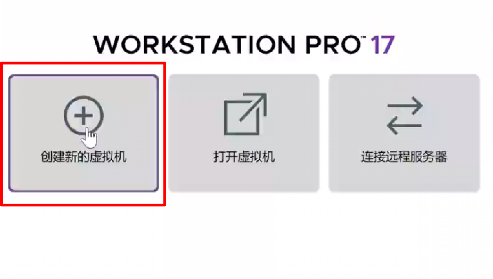
    <div style="margin-top:12px; font-size:1.1em;">创建虚拟机页面</div>
  </div>

  <div style="flex-shrink:0; flex-basis:49%; text-align:center; max-width:49%;">
    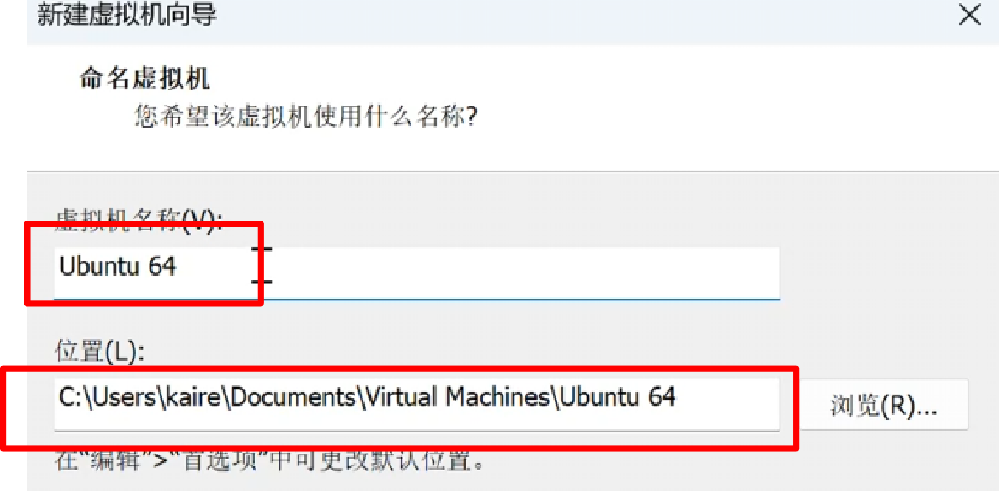
    <div style="margin-top:12px; font-size:1.1em;">虚拟机命名与安装位置页面</div>
  </div>
</div>

### 1\.2 设置虚拟机参数

创建虚拟机后，需要配置各项硬件参数，确保虚拟机有足够的资源运行Ubuntu系统和无人机仿真环境。

**操作步骤：**

1. **设置处理器参数**：处理器数量选择2个，每个处理器的内核数量选择6个，总共12个逻辑核心

2. **分配虚拟机内存**：根据安装需求分配，建议至少8GB以上，运行Gazebo仿真建议16GB

3. **设置网络类型**：选择使用网络地址转换（NAT），使虚拟机可以通过主机网络访问互联网

4. **配置ISO镜像文件**：点击"使用ISO镜像文件"，选择已下载好的Ubuntu系统镜像文件

5. **设置磁盘大小**：建议至少100GB，选择"将虚拟磁盘存储为单个文件"

6. **检查并完成**：确认所有设置无误后点击完成，等待虚拟机安装完毕

<div style="background-color:#edf2ff; border:1px solid #82aaff; padding:16px 22px; margin:16px 0; border-radius:14px; color:#222; line-height:2.2;">
  💡 <strong>参数建议：</strong>CPU核心数建议分配主机的50%-70%，内存建议分配主机的50%，这样既能保证虚拟机流畅运行，又不会影响主机系统的正常使用。
</div>

<div style="display:flex; gap:5px; justify-content:center; margin:16px 0; align-items:flex-start; flex-wrap:wrap;">
  <div style="flex-shrink:0; flex-basis:50%; text-align:center; max-width:42%;">
    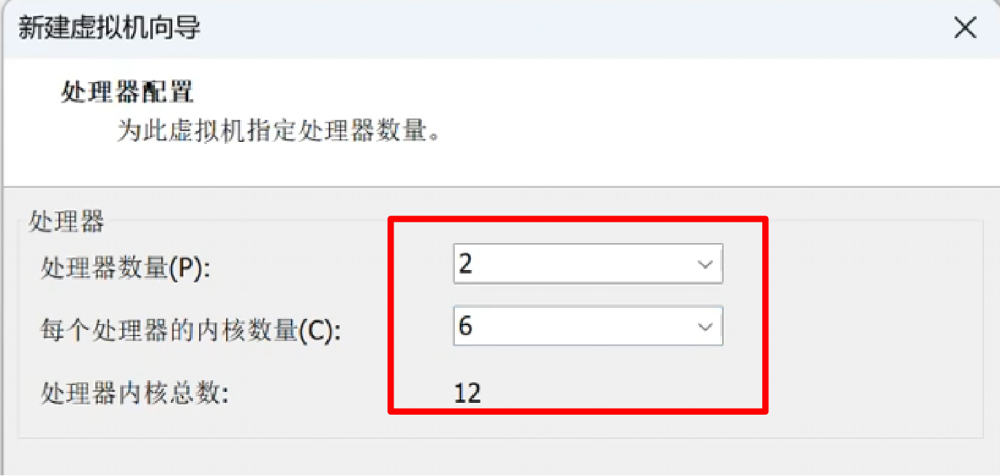
    <div style="margin-top:12px; font-size:1.1em;">步骤1</div>
  </div>

  <div style="flex-shrink:0; flex-basis:33%; text-align:center; max-width:24%;">
    
    <div style="margin-top:12px; font-size:1.1em;">步骤2</div>
  </div>

  <div style="flex-shrink:0; flex-basis:33%; text-align:center; max-width:31%;">
    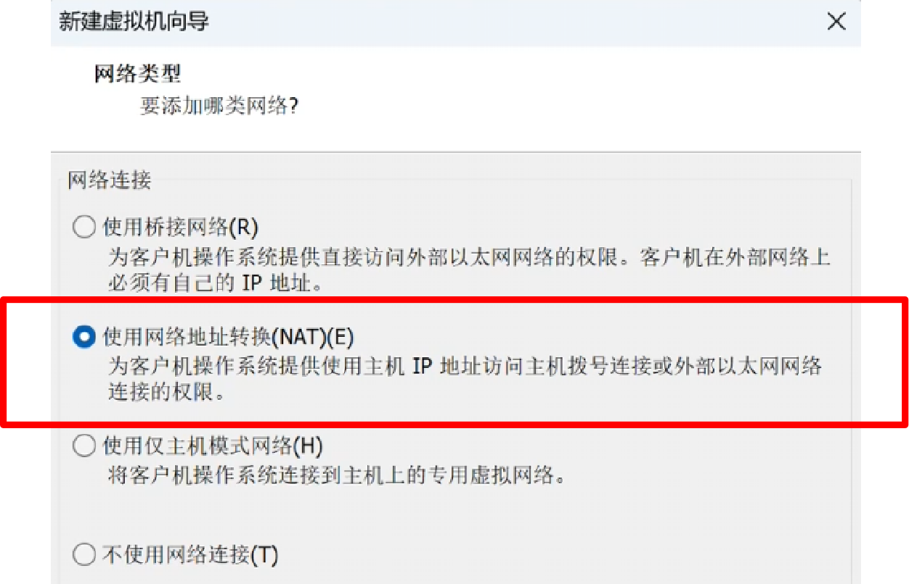
    <div style="margin-top:12px; font-size:1.1em;">步骤3</div>
  </div>
</div>

<div style="display:flex; gap:5px; justify-content:center; margin:16px 0; align-items:flex-start; flex-wrap:wrap;">
  <div style="flex-shrink:0; flex-basis:50%; text-align:center; max-width:42%;">
    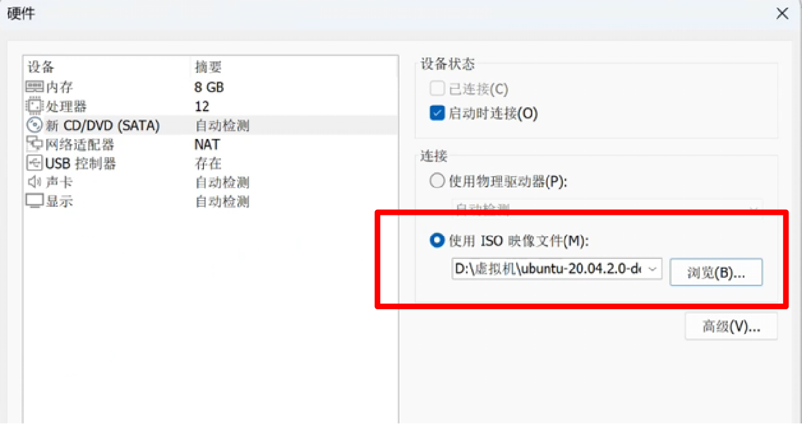
    <div style="margin-top:12px; font-size:1.1em;">步骤4</div>
  </div>

  <div style="flex-shrink:0; flex-basis:33%; text-align:center; max-width:31%;">
    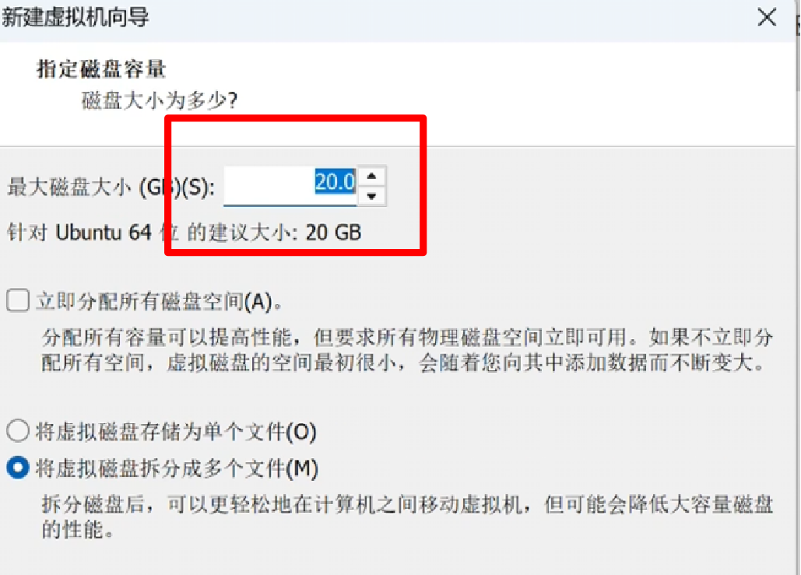
    <div style="margin-top:12px; font-size:1.1em;">步骤5</div>
  </div>

  <div style="flex-shrink:0; flex-basis:33%; text-align:center; max-width:25%;">
    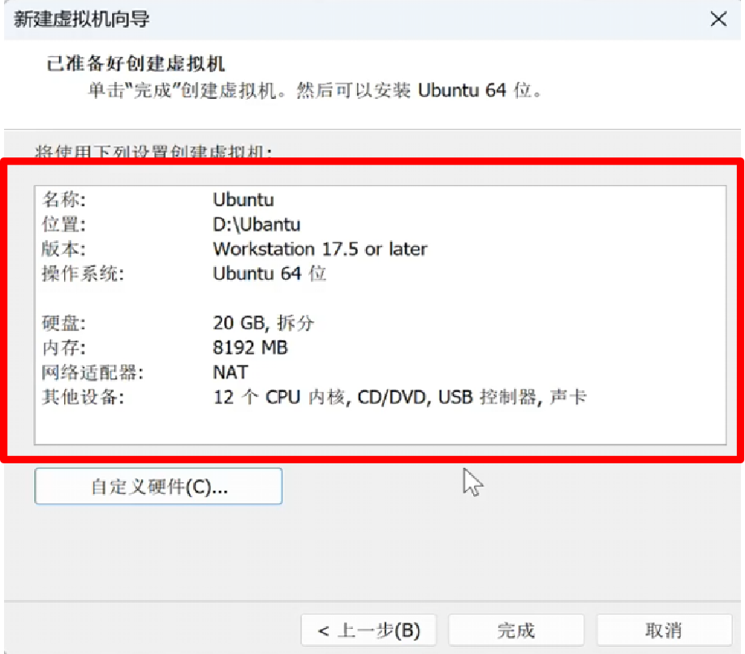
    <div style="margin-top:12px; font-size:1.1em;">步骤6</div>
  </div>
</div>

### 1\.3 **实操视频演示**

<p >
  <video width="950" controls>
    <source src="https://diffrobots.oss-cn-hangzhou.aliyuncs.com/nju-wiki/8/%E8%A7%86%E9%A2%911.mp4" type="video/mp4">
  </video>
</p>

# 实践二：Gazebo \+ PX4仿真环境搭建

PX4是一款领先的开源自动驾驶飞控软件栈，被广泛誉为无人机与智能载具的"核心大脑"。在本实践中，我们将完成PX4源码的下载与安装，为后续的仿真飞行做准备。

### 2\.1 PX4安装和使用

**操作步骤：**

1. 打开终端，cd到主目录：

```Plain Text
cd ~
```

2.  安装编译是所需要的依赖：

```
sudo apt update
sudo apt install git make cmake gcc g++ python3 python3-pip
sudo apt install gazebo libgazebo11-dev libgstreamer1.0-dev libgstreamer-plugins-base1.0-dev
pip3 install --user -r Tools/setup/requirements.txt
```

3.将下载的`PX4_Firmware.zip`进行解压，解压到根目录下，并将文件夹名称修改为：PX4_Firmware

4.对解压完毕后，进入当前目录，进行编译：

```Plain Text
cd PX4_Firmware
make px4_sitl_default gazebo
```

<div style="background-color:#edf2ff; border:1px solid #82aaff; padding:16px 22px; margin:16px 0; border-radius:14px; color:#222; line-height:2.2;">
  💡 <strong>说明：</strong>首次启动时需要编译PX4固件，可能需要较长时间（10‑20分钟），请耐心等待。后续启动会直接使用已编译的文件，速度会快很多。
</div>

<div style="background-color:#f0f4ff; border:1px solid #c5d0f0; padding:14px 20px; margin:16px 0; border-radius:12px; color:#333; line-height:1.8;">
  💡 <strong>当弹出Gazebo界面时，则表示编译成功</strong>
</div>

5. 编译完成之后，先进入到根目录，在`.bashrc`最后写入环境变化量

```
cd
sudo nano .bashrc
```

需要写入内容，直接复制粘贴进去即可：

```
# PX4 SITL Gazebo 环境配置
# catkin，编译完成才加载
if [ -f "$HOME/catkin_ws/devel/setup.bash" ];then
  source "$HOME/catkin_ws/devel/setup.bash"
fi

# 手动设置gazebo环境变量，不调用setup_gazebo.bash脚本，避免重复追加
export GAZEBO_PLUGIN_PATH=/home/gao/PX4_Firmware/build/px4_sitl_default/build_gazebo
export GAZEBO_MODEL_PATH=/home/gao/PX4_Firmware/Tools/sitl_gazebo/models
export LD_LIBRARY_PATH=$LD_LIBRARY_PATH:/home/gao/PX4_Firmware/build/px4_sitl_default/build_gazebo

export ROS_PACKAGE_PATH=$ROS_PACKAGE_PATH:/home/gao/PX4_Firmware
export ROS_PACKAGE_PATH=$ROS_PACKAGE_PATH:/home/gao/PX4_Firmware/Tools/sitl_gazebo
```

<div style="background-color:#f0f4ff; border:1px solid #c5d0f0; padding:14px 20px; margin:16px 0; border-radius:12px; color:#333; line-height:1.8;">
  💡 <strong>环境变量写入之后，<code>ctrl + x</code>进行保存退出</strong>
</div>

### 2\.2 启动PX4 SITL仿真与MAVROS

PX4源码下载完成后，就可以启动PX4 SITL软件在环仿真，同时启动MAVROS实现ROS与PX4飞控的通信。

**操作步骤：**

1. 打开终端，运行以下命令启动PX4 POSIX SITL仿真 \+ MAVROS：

```Plain Text
roslaunch px4 mavros_posix_sitl.launch
```

该命令会通过ROS启动PX4无人机软件在环仿真，同时启动mavros实现ROS与PX4飞控通信。

2. 等待Gazebo仿真页面启动，确认仿真环境正常加载

<div style="background-color:#edf9ed; border:1px solid #72d272; padding:16px 22px; margin:16px 0; border-radius:14px; color:#222; line-height:2.2;">
  ✅ <strong>验证：</strong>启动成功后，Gazebo窗口会显示无人机模型，终端会输出PX4启动日志和MAVROS连接信息。
</div>


<div style="display:flex; gap:5px; justify-content:center; margin:16px 0; align-items:flex-start; flex-wrap:wrap;">
  <div style="flex-shrink:0; flex-basis:60%; text-align:center; max-width:60%;">
    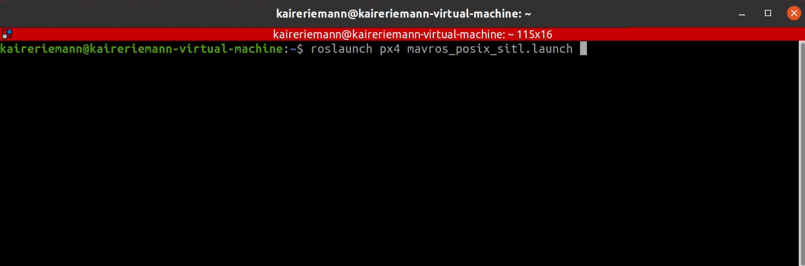
    <div style="margin-top:12px; font-size:1.1em;">PX4_SITL_MAVROS启动命令终端</div>
  </div>

  <div style="flex-shrink:0; flex-basis:50%; text-align:center; max-width:35%;">
    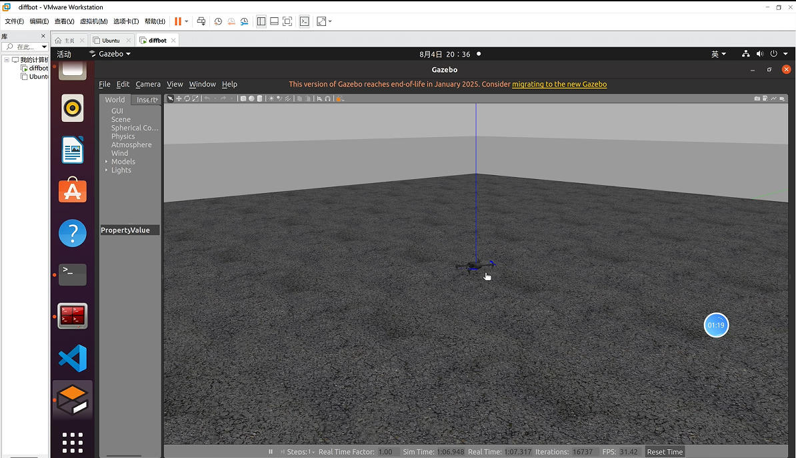
    <div style="margin-top:12px; font-size:1.1em;">Gazebo仿真页面</div>
  </div>
</div>

### 2\.3 查看话题列表

启动PX4 SITL仿真和MAVROS后，需要验证ROS与PX4仿真是否成功建立通信。通过查看话题列表可以确认无人机相关话题是否正常发布。

**操作步骤：**

1. 新建终端，运行以下命令查看当前ROS系统中所有已激活的话题列表：

```Plain Text
rostopic list
```

该命令用于检验MAVROS与PX4仿真是否成功建立通信，确认无人机相关话题正常发布。

<div style="background-color:#edf9ed; border:1px solid #72d272; padding:20px 24px; margin:16px 0; border-radius:14px; color:#222; line-height:2.3;">
  ✅ <strong>验证：</strong>正常情况下，话题列表中应包含以下关键话题：
  <ol style="padding-left:28px;margin:10px 0;">
    <li><code style="background:#f4f4f6;padding:2px 6px;border-radius:4px;">rostopic echo /mavros/state</code>：飞控状态信息</li>
    <li><code style="background:#f4f4f6;padding:2px 6px;border-radius:4px;">rotopic echo /mavros/imu/data</code>：IMU传感器数据</li>
    <li><code style="background:#f4f4f6;padding:2px 6px;border-radius:4px;">rostopic echo /mavros/local_position/pose</code>：本地位置信息</li>
    <li><code style="background:#f4f4f6;padding:2px 6px;border-radius:4px;">rostopic echo /mavros/cmd/arming</code>：解锁/上锁服务</li>
  </ol>
  如果这些话题都存在，说明MAVROS与PX4通信正常。
</div>


<div style="display:flex; gap:5px; justify-content:center; margin:16px 0; align-items:flex-start; flex-wrap:wrap;">
  <div style="flex-shrink:0; flex-basis:60%; text-align:center; max-width:57%;">
    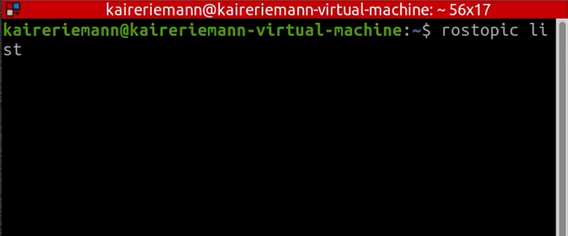
    <div style="margin-top:12px; font-size:1.1em;">查看话题列表命令</div>
  </div>

  <div style="flex-shrink:0; flex-basis:50%; text-align:center; max-width:40%;">
    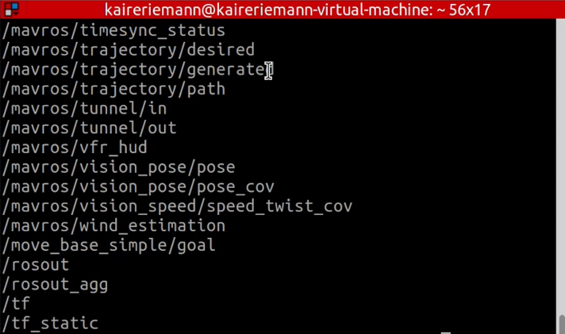
    <div style="margin-top:12px; font-size:1.1em;">话题列表输出结果</div>
  </div>
</div>

<div style="background-color:#edf9ed; border:1px solid #72d272; padding:20px 24px; margin:16px 0; border-radius:14px; color:#222; line-height:2.3;">
  ✅ <strong>验证：</strong>此时可以使用<code>rostopic echo /mavros/state</code>命令进行进一步验证
  <li>当该话题有输出信息之后，注意观察话题中<code>connected</code>的消息提示：</li>
  <li>如果显示False，则表示飞控未连接</li>
  <li>如果显示True，则表示飞控正常连接</li>
</div>

<div>
  <strong>如果<code>connected</code>显示false，排错方式：
    <ol>
      <li>打开一个新终端，进入PX4_Firmware:<code>cd PX4_Firmware</code></li>
      <li>再打开一个新终端，输入命令：<code>make px4_sitl_default gazebo</code>，并执行</li>
      <li>当命令启动成功，在末尾输出的日志中，主要观察以<code>INFO  [mavlink] mode: Onboard, data rate: 4000000 B/s</code>开头的消息提示</li>
      <li>打开<code>PX4_Firmware/launch</code>文件,修改launch文件中<code>fcu_url</code>，对接 Onboard 端口 </li>
    </ol>
  </strong>
</div>

<div style="background-color:#edf9ed; border:1px solid #72d272; padding:20px 24px; margin:16px 0; border-radius:14px; color:#222; line-height:2.3;">
  ✅ <strong>实例</strong>
  <li>终端输出消息为：<code>INFO  [mavlink] mode: Onboard, data rate: 4000000 B/s on udp port 34580 remote port 24540</code></li>
  <li>则将mavros_posix_sitl.launch文件中<code>fcu_url</code>内容替换为：<code>arg name="fcu_url" default="udp://:24540@localhost:34580"/</code></li>
  <li>说明：mavros本地端口24540，连接PX4 SITL onboard端口34580</li>
</div>

### 2\.4 Gazebo测试：解锁、上锁测试

确认MAVROS与PX4通信正常后，可以进行无人机的解锁和上锁测试，验证飞控控制指令是否能够正常下发。

**操作步骤：**

1. 新建终端，运行以下命令执行无人机解锁：

```Plain Text
rosservice call /mavros/cmd/arming "value: true"
```

2. 运行以下命令执行无人机上锁：

```Plain Text
rosservice call /mavros/cmd/arming "value: false"
```

通过这两个服务调用，可以测试无人机的解锁和上锁功能是否正常。

<div style="background-color:#ffffe8; border:1px solid #f8e248; padding:16px 22px; margin:16px 0; border-radius:14px; color:#222; line-height:2.2;">
  💡 <strong>注意：</strong>在仿真环境中解锁后，无人机的电机会开始旋转，但不会实际飞行（因为没有起飞指令）。在真机操作时，解锁后务必注意安全，远离螺旋桨。
</div>

<div style="background-color:#edf9ed; border:1px solid #72d272; padding:16px 22px; margin:16px 0; border-radius:14px; color:#222; line-height:2.2;">
  ✅ <strong>验证：</strong>解锁成功后，终端会返回<code>"success: true"</code>，Gazebo中无人机的电机会开始旋转；上锁后电机停止旋转。
</div>

<div style="display:flex; gap:5px; justify-content:center; margin:16px 0; align-items:flex-start; flex-wrap:wrap;">
  <div style="flex-shrink:0; flex-basis:60%; text-align:center; max-width:50.5%;">
    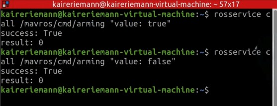
    <div style="margin-top:12px; font-size:1.1em;">启动命令终端截图</div>
  </div>

  <div style="flex-shrink:0; flex-basis:50%; text-align:center; max-width:45%;">
    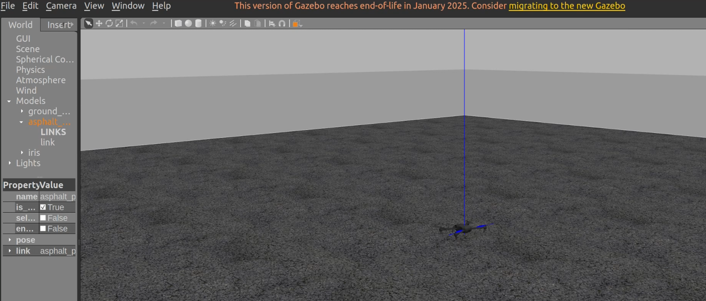
    <div style="margin-top:12px; font-size:1.1em;">Gazebo仿真测试</div>
  </div>
</div>

**实操视频演示：**

<p >
  <video width="950" controls>
    <source src="https://diffrobots.oss-cn-hangzhou.aliyuncs.com/nju-wiki/8/%E7%AC%AC%E5%85%AB%E5%91%A8-PX4%E4%BB%BF%E7%9C%9F%E7%8E%AF%E5%A2%83%2B%E8%A7%A3%E9%94%81%E4%B8%8A%E9%94%81%E6%B5%8B%E8%AF%95.mp4" type="video/mp4">
  </video>
</p>

### 2\.5 Gazebo测试：期望点位置控制

在完成基础的解锁上锁测试后，我们将进行更复杂的期望点位置控制测试。这需要使用terminator多终端工具，同时运行多个节点来完成无人机的自主起飞、指点飞行和自动降落。

#### (1) 编译fly功能包

1. 打开terminator终端，新建5个页面（用于同时运行不同的节点和命令）

2. 在页面2输入以下命令进入fly功能包目录：

```Plain Text
cd fly
```

3. 输入以下命令编译工作空间内所有功能包：

```Plain Text
catkin_make
```

4. 编译完成后，输入以下命令刷新终端环境变量，让系统找到刚编译好的ROS程序：

```Plain Text
source devel/setup.bash
```
<div style="background-color:#edf2ff; border:1px solid #88aaff; padding:18px 24px; margin:16px 0; border-radius:14px; color:#222; line-height:2.3;">
  💡 <strong>说明：</strong>fly功能包包含了无人机飞行控制的相关节点和脚本，包括真实位姿获取、飞行测试、自动起飞和自动降落等功能。每次修改代码后都需要重新编译并<code>source</code>环境变量。
</div>

<figure style="flex:1; text-align:center;">
    
    <figcaption>步骤一：打开五个终端</figcaption>
</figure>

<div style="background-color:#edf2ff; border:1px solid #88aaff; padding:18px 24px; margin:16px 0; border-radius:14px; color:#222; line-height:2.3;">
  💡 <strong>说明：</strong>
  除第一个终端外，剩余四个终端都需要先执行<code>cd fly</code>,然后再执行<code>source devel/setup.bash</code>，最后再执行相应的命令。
</div>

<div style="display:flex; gap:5px; justify-content:center; margin:16px 0; align-items:flex-start; flex-wrap:wrap;">
  <div style="flex-shrink:0; flex-basis:100%; text-align:center; max-width:36%;">
    
    <div style="margin-top:12px; font-size:1.1em;">terminator终端界面+编译fly功能包指令</div>
  </div>

  <div style="flex-shrink:0; flex-basis:100%; text-align:center; max-width:53%;">
    
    <div style="margin-top:12px; font-size:1.1em;">编译完成与source环境变量</div>
  </div>
</div>

#### (2) 启动PX4、ROS、Gazebo仿真

1. 在页面1输入以下命令，启动PX4、ROS、Gazebo无人机仿真软件：

```Plain Text
roslaunch px4 mavros_posix_sitl.launch
```

2. 等待几秒后，查看Gazebo仿真软件是否正常启动，确认无人机模型已加载

<div style="background-color:#edf2ff; border:1px solid #88aaff; padding:18px 24px; margin:16px 0; border-radius:14px; color:#222; line-height:2.3;">
  💡 <strong>提示：</strong>这一步与之前的基础测试相同，但在期望点位置控制中，我们需要同时运行更多的节点，因此使用<code>terminator</code>的多页面功能来管理不同的终端。
</div>


<div style="display:flex; gap:5px; justify-content:center; margin:16px 0; align-items:flex-start; flex-wrap:wrap;">
  <div style="flex-shrink:0; flex-basis:100%; text-align:center; max-width:65%;">
    
    <div style="margin-top:12px; font-size:1.1em;">启动PX4、ROS、Gazebo指令</div>
  </div>

  <div style="flex-shrink:0; flex-basis:100%; text-align:center; max-width:33%;">
    
    <div style="margin-top:12px; font-size:1.1em;">Gazebo仿真界面</div>
  </div>
</div>

#### (3) 启动辅助节点并自动起飞

1. 在页面2输入以下命令，启动Gazebo真实位姿获取功能，使仿真环境能够实时获取无人机真实位置与姿态信息：

```Plain Text
./sh_file/run_groundtruth.sh
```

2. 在页面3输入以下命令，启动无人机飞行测试节点，完成仿真飞行控制程序加载：

```Plain Text
./sh_file/fly_test.sh
```

3. 在页面4输入以下命令，执行无人机飞行自动起飞任务：

```Plain Text
./sh_file/takeoff.sh
```
<div style="background-color:#edf2ff; border:1px solid #88aaff; padding:20px 26px; margin:16px 0; border-radius:14px; color:#222; line-height:2.4;">
  💡 <strong>节点说明：</strong>
  <ol style="padding-left:24px; margin:8px 0;">
    <li><code>run_groundtruth.sh</code>：获取Gazebo中无人机的真实位姿，用于位置控制的反馈</li>
    <li><code>fly_test.sh</code>：启动飞行控制节点，监听期望位置指令并执行控制算法</li>
    <li><code>takeoff.sh</code>：发送自动起飞指令，无人机会上升到设定高度并悬停</li>
  </ol>
</div>

<div style="display:flex; gap:5px; justify-content:center; margin:16px 0; align-items:flex-start; flex-wrap:wrap;">
  <div style="flex-shrink:0; flex-basis:100%; text-align:center; max-width:47%;">
    
    <div style="margin-top:12px; font-size:1.1em;">启动真实位姿获取节点</div>
  </div>

  <div style="flex-shrink:0; flex-basis:100%; text-align:center; max-width:48%;">
    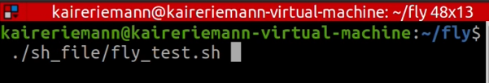
    <div style="margin-top:12px; font-size:1.1em;">启动飞行测试节点</div>
  </div>
</div>

<div style="display:flex; gap:5px; justify-content:center; margin:16px 0; align-items:flex-start; flex-wrap:wrap;">
  <div style="flex-shrink:0; flex-basis:100%; text-align:center; max-width:69%;">
    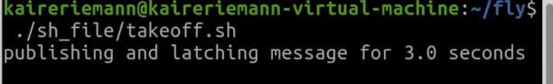
    <div style="margin-top:12px; font-size:1.1em;">自主起飞指令</div>
  </div>

  <div style="flex-shrink:0; flex-basis:100%; text-align:center; max-width:27%;">
    
    <div style="margin-top:12px; font-size:1.1em;">自主起飞界面</div>
  </div>
</div>

#### (4) 发布期望点位置控制指令并自动降落

1. 在页面5输入以下指令，让无人机飞到\(5, 0, 1\)点：

```Plain Text
rostopic pub -r 20 /setpoints_cmd quadrotor_msgs/PositionCommand 
"header:
  stamp: now
  frame_id: 'world'
position: {x: 5.0, y: 0.0, z: 1.0}
velocity: {x: 0.0, y: 0.0, z: 0.0}
acceleration: {x: 0.0, y: 0.0, z: 0.0}
jerk: {x: 0.0, y: 0.0, z: 0.0}
yaw: 0.0
yaw_dot: 0.0
trajectory_flag: 1
trajectory_id: 1"
```

2. 等待到达指定点后，输入同样的指令，将位置改为\(0, 0, 1\)，让无人机返回原点

```Plain Text
rostopic pub -r 20 /setpoints_cmd quadrotor_msgs/PositionCommand 
"header:
  stamp: now
  frame_id: 'world'
position: {x: 0.0, y: 0.0, z: 1.0}
velocity: {x: 0.0, y: 0.0, z: 0.0}
acceleration: {x: 0.0, y: 0.0, z: 0.0}
jerk: {x: 0.0, y: 0.0, z: 0.0}
yaw: 0.0
yaw_dot: 0.0
trajectory_flag: 1
trajectory_id: 1"
```

3. 等待飞行完毕后，在页面4输入以下命令，执行无人机飞行自动降落任务：

```Plain Text
./sh_file/land.sh
```
<div style="background-color:#edf2ff; border:1px solid #88aaff; padding:20px 26px; margin:16px 0; border-radius:14px; color:#222; line-height:2.4;">
  💡 <strong>参数说明：</strong>
  <ol style="padding-left:24px; margin:8px 0;">
    <li><code>-r 20</code>：以20Hz的频率持续发布指令</li>
    <li><code>/setpoints_cmd</code>：期望位置指令话题</li>
    <li><code>position: {x: 5.0, y: 0.0, z: 1.0}</code>：目标位置坐标，单位为米</li>
    <li>修改x、y、z的值即可控制无人机飞到不同位置</li>
  </ol>
</div>

<div style="background-color:#edfbeb; border:1px solid #76d870; padding:20px 26px; margin:16px 0; border-radius:14px; color:#222; line-height:2.4;">
  ✅ <strong>验证：</strong>发布指令后，Gazebo中的无人机会平稳飞向目标位置，到达后悬停。执行降落指令后，无人机会缓慢下降并接触地面，随后自动上锁。
</div>

<div style="display:flex; gap:5px; justify-content:center; margin:16px 0; align-items:flex-start; flex-wrap:wrap;">
  <div style="flex-shrink:0; flex-basis:100%; text-align:center; max-width:39%;">
    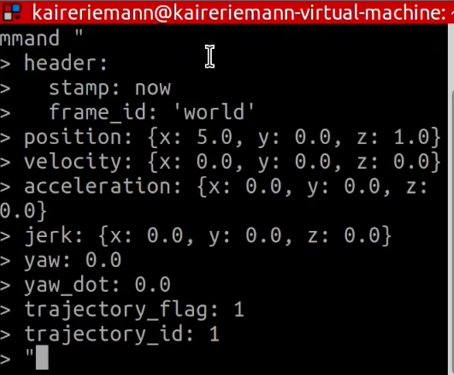
    <div style="margin-top:12px; font-size:1.1em;">无人机飞到指定点</div>
  </div>

  <div style="flex-shrink:0; flex-basis:100%; text-align:center; max-width:58%;">
    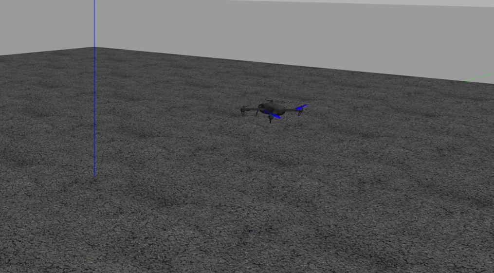
    <div style="margin-top:12px; font-size:1.1em;">自动降落界面</div>
  </div>
</div>

#### (5) 实操视频演示

<p >
  <video width="950" controls>
    <source src="https://diffrobots.oss-cn-hangzhou.aliyuncs.com/nju-wiki/8/%E7%AC%AC%E5%85%AB%E5%91%A8-%E6%9C%9F%E6%9C%9B%E7%82%B9%E4%BD%8D%E7%BD%AE%E6%8E%A7%E5%88%B6.mp4" type="video/mp4">
  </video>
</p>

### 2. 6 Gazebo测试：QGC的控制起飞与降落，虚拟摇杆的使用

除了通过命令行控制无人机外，我们还可以使用QGroundControl（QGC）地面站进行可视化的飞行控制。QGC提供了直观的界面和虚拟摇杆，可以方便地进行起飞、降落和手动飞行操作。

#### (1) 启动仿真

1. 输入以下命令，启动PX4、ROS、Gazebo无人机仿真软件：

```Plain Text
roslaunch px4 mavros_posix_sitl.launch
```

2. 等待Gazebo仿真软件启动，确认无人机模型已加载

<div style="display:flex; gap:5px; justify-content:center; margin:16px 0; align-items:flex-start; flex-wrap:wrap;">
  <div style="flex-shrink:0; flex-basis:100%; text-align:center; max-width:65%;">
    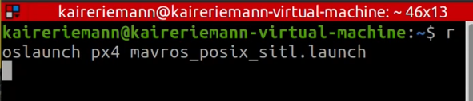
    <div style="margin-top:12px; font-size:1.1em;">启动PX4、ROS、Gazebo指令</div>
  </div>

  <div style="flex-shrink:0; flex-basis:100%; text-align:center; max-width:33%;">
    
    <div style="margin-top:12px; font-size:1.1em;">Gazebo仿真界面</div>
  </div>
</div>

#### (2) 启动QGC

1. 新建终端，输入以下命令启动QGroundControl地面站程序：

```Plain Text
./QGroundControl.AppImage
```

2. 等待QGC启动，确认与无人机成功连接（界面左上角显示连接状态）

<div style="background-color:#edf2ff; border:1px solid #88aaff; padding:20px 26px; margin:16px 0; border-radius:14px; color:#222; line-height:2.4;">
  💡 <strong>说明：</strong>QGroundControl会自动通过UDP连接到PX4 SITL仿真，无需手动配置连接参数。连接成功后，界面会显示无人机的姿态、位置、电池等实时信息。
</div>

<figure style="flex:1; text-align:center;">
    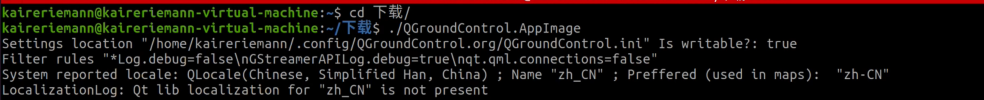
    <figcaption>启动QGC命令</figcaption>
</figure>

<figure style="flex:1; text-align:center;">
    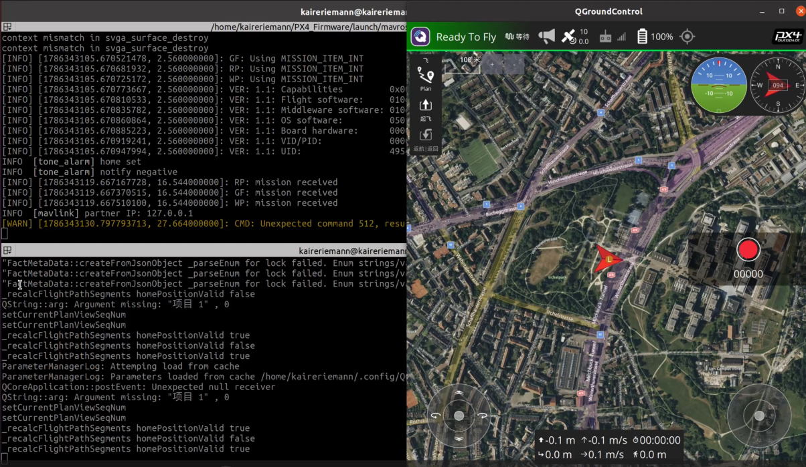
    <figcaption>QGC启动界面</figcaption>
</figure>

#### (3\) 起飞与虚拟摇杆操作

1. 点击界面起飞按键，滑动确认滑块完成解锁，无人机执行起飞动作

2. 操作界面右侧虚拟摇杆进行飞行控制：

- **偏航**：控制无人机左右旋转

- **前后**：控制无人机前后飞行

- **左右横滚**：控制无人机左右平移

- **升降**：控制无人机上升和下降

<div style="background-color:#edf2ff; border:1px solid #88aaff; padding:20px 26px; margin:16px 0; border-radius:14px; color:#222; line-height:2.4;">
  💡 <strong>操作提示：</strong>虚拟摇杆的操作方式与真实遥控器类似，左摇杆控制升降和偏航，右摇杆控制前后和左右横滚。在仿真环境中可以放心练习，熟悉操作手感。
</div>

<figure style="flex:1; text-align:center;">
    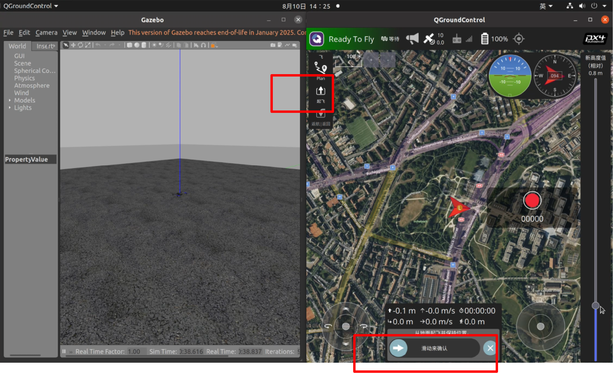
    <figcaption>QGC起飞与虚拟摇杆操作界面</figcaption>
</figure>

#### (4) 降落

1. 飞行操作完成后，点击界面降落按键，滑动确认滑块下发降落指令

2. 无人机平稳垂直下降，接触地面后自动上锁


<div style="background-color:#edfbeb; border:1px solid #76d870; padding:20px 26px; margin:16px 0; border-radius:14px; color:#222; line-height:2.4;">
  ✅ <strong>验证：</strong>点击降落后，无人机会缓慢垂直下降，接触地面后电机停止旋转并自动上锁。整个过程平稳安全，与真机操作流程一致。
</div>

<figure style="flex:1; text-align:center;">
    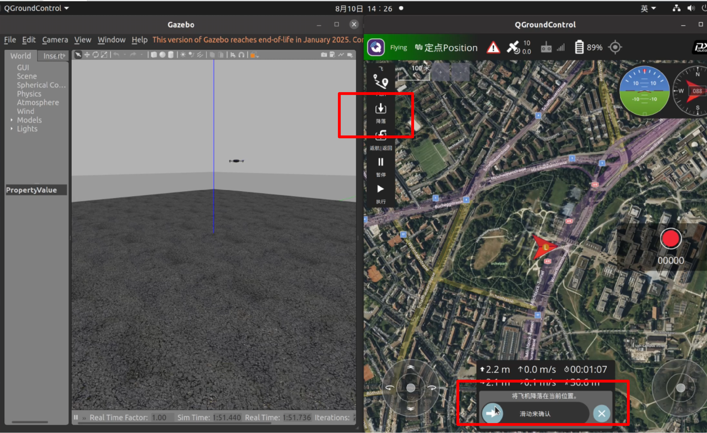
    <figcaption>QGC起飞与虚拟摇杆操作界面</figcaption>
</figure>

#### (5) 实操视频演示

<p >
  <video width="950" controls>
    <source src="https://diffrobots.oss-cn-hangzhou.aliyuncs.com/nju-wiki/8/%E7%AC%AC%E5%85%AB%E5%91%A8-QGC%E6%8E%A7%E5%88%B6%E8%B5%B7%E9%A3%9E%E9%99%8D%E8%90%BD.mp4" type="video/mp4">
  </video>
</p>

# 总结

## 1\.课程要点回顾

本周课程系统学习了VMware虚拟机配置与Gazebo仿真环境搭建，以下是核心知识点回顾：

|模块|核心内容|关键命令/操作|
|---|---|---|
|VMware虚拟机介绍|虚拟机概念、VMware产品家族、Hypervisor架构|Type 1裸金属架构 vs Type 2宿主架构|
|Gazebo仿真环境介绍|Gazebo特点、核心特性、PX4联合仿真原理|SITL软件在环仿真技术|
|实践一：VMware配置|虚拟机创建、命名、参数设置、ISO安装|CPU/内存/网络/磁盘配置<br>|
|实践二：Gazebo\+PX4搭建|PX4安装、SITL启动、话题查看、解锁上锁、期望点控制、QGC操作|roslaunch、rostopic、rosservice等命令|

## 2\.常见问题排查

**问题1：PX4克隆失败或子模块缺失**

解决方法：确保网络连接稳定，使用`--recursive`参数克隆。如果子模块缺失，可以进入PX4\-Autopilot目录运行`git submodule update --init --recursive`。

**问题2：Gazebo启动后黑屏或模型不显示**

解决方法：检查显卡驱动是否正常，虚拟机需要开启3D加速。可以尝试删除`~/.gazebo/models`目录下的缓存文件后重新启动。

**问题3：MAVROS连接失败，话题列表为空**

解决方法：检查PX4是否正常启动，确认fcu\_url和gcs\_url配置正确。可以运行`rostopic echo /mavros/state`查看连接状态，connected字段应为true。

**问题4：解锁失败，提示preflight失败**

解决方法：检查传感器校准状态，在QGC中完成加速度计、陀螺仪、磁力计校准。确保无人机处于水平状态，GPS信号良好（仿真环境中通常无需GPS）。


