# 第9周：PX4ctrl介绍与仿真练习

# 实践课程大纲

本周实践环节包含两个实验，由浅入深地掌握PX4ctrl的使用方法：

|实践环节|核心内容|学习目标|
|---|---|---|
|实践一：PX4ctrl自动起飞悬停和降落|完成无人机自主起飞、定点悬停以及自动降落全过程控制|掌握PX4ctrl基础控制流程，理解状态机切换逻辑|
|实践二：PX4ctrl 8字飞行|通过设置期望轨迹点，控制无人机按照预定路径飞行，观察无人机位置、姿态和控制状态变化|掌握轨迹跟踪控制，理解位置环控制算法|

<div style="background-color:#f0f4ff; border:1px solid #c5d0f0; padding:14px 20px; margin:16px 0; border-radius:12px; color:#333; line-height:1.8;">
  💡 <strong>实践准备：</strong>确保已完成第8周的Gazebo仿真环境搭建，PX4-Autopilot和MAVROS已正确安装并能够正常运行。所有实践均在Gazebo仿真环境中进行，无需真机。
</div>

### 代码下载
|下载链接|文件名称|
|---|---|
|<a href="https://diffrobots.oss-cn-hangzhou.aliyuncs.com/nju-wiki/file/fly.zip" target="_blank">📥fly</a>|fly代码包|

# 实践一：PX4ctrl自动起飞悬停和降落

本实践将完成无人机自主起飞、定点悬停以及自动降落的全过程控制，掌握PX4ctrl的基础控制流程。

## 1\.1 编译fly功能包

1. 打开terminator终端，新建4个页面，用于分别运行不同的程序

2. 在页面2输入以下命令进入fly功能包目录：

```Plain Text
cd fly
```

3. 输入以下命令编译工作空间内所有功能包(第八周已经编译过的话，则可以跳过此步骤)：

```Plain Text
catkin_make
```

4. 编译完成后输入以下命令刷新终端环境变量，让系统找到刚编译好的ROS程序：

```Plain Text
source devel/setup.bash
```
<div style="background-color:#f0f4ff; border:1px solid #c5d0f0; padding:14px 20px; margin:16px 0; border-radius:12px; color:#333; line-height:1.8;">
  💡 <strong>说明：</strong>fly功能包包含了PX4ctrl控制器和飞行测试程序。catkin_make是ROS的编译命令，会自动编译工作空间下的所有功能包。每次重新编译后都需要source setup.bash来更新环境变量。
</div>

<figure style="flex:1; text-align:center;">
    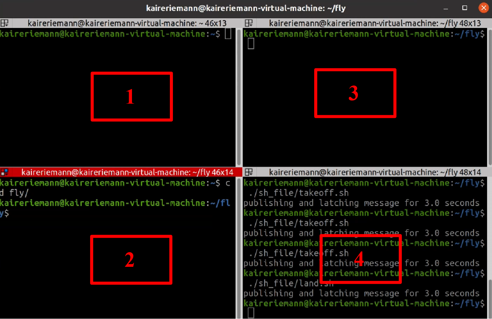
    <figcaption>terminator终端界面</figcaption>
</figure>

<div style="display:flex; gap:5px; justify-content:center; margin:16px 0; align-items:flex-start; flex-wrap:wrap;">
  <div style="flex-shrink:0; flex-basis:100%; text-align:center; max-width:39%;">
    
    <div style="margin-top:12px; font-size:1.1em;">编译fly功能包指令</div>
  </div>

  <div style="flex-shrink:0; flex-basis:100%; text-align:center; max-width:60%;">
    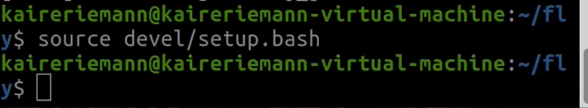
    <div style="margin-top:12px; font-size:1.1em;">刷新环境变量</div>
  </div>
</div>

## 1\.2 启动仿真软件

1. 在**页面1**输入以下命令，启动PX4、MAVROS和Gazebo无人机仿真软件：

```Plain Text
roslaunch px4 mavros_posix_sitl.launch
```

2. 等待几秒后，查看Gazebo仿真软件是否正常启动，确认无人机模型已加载

<div style="background-color:#f0f4ff; border:1px solid #c5d0f0; padding:14px 20px; margin:16px 0; border-radius:12px; color:#333; line-height:1.8;">
  💡 <strong>roslaunch源码解析：</strong> <code>roslaunch px4 mavros_posix_sitl.launch</code> 一次性启动三大组件：
  <ol style="margin:8px 0 0 24px; padding:0;">
    <li>Gazebo物理仿真环境 + 无人机模型</li>
    <li>PX4 POSIX SITL软件在环仿真飞控</li>
    <li>MAVROS节点，建立ROS与PX4飞控之间的MAVLink通信通道</li>
  </ol>
</div>

<div style="display:flex; gap:5px; justify-content:center; margin:16px 0; align-items:flex-start; flex-wrap:wrap;">
  <div style="flex-shrink:0; flex-basis:100%; text-align:center; max-width:65%;">
    
    <div style="margin-top:12px; font-size:1.1em;">启动PX4、ROS、Gazebo指令</div>
  </div>

  <div style="flex-shrink:0; flex-basis:100%; text-align:center; max-width:33%;">
    
    <div style="margin-top:12px; font-size:1.1em;">Gazebo仿真界面</div>
  </div>
</div>

## 1\.3 roslaunch源码解析

让我们深入了解`roslaunch px4 mavros_posix_sitl.launch`这个启动文件的内部结构，理解它是如何一次性启动三大组件的。

该launch文件主要包含以下几个部分：

- **Gazebo启动**：启动Gazebo仿真环境，加载无人机模型和物理世界

- **PX4 SITL启动**：启动PX4软件在环仿真飞控，模拟真实飞控的运行

- **MAVROS启动**：启动MAVROS节点，建立ROS与PX4之间的MAVLink通信

通过这个launch文件，我们可以一键启动完整的仿真环境，无需手动分别启动各个组件，大大简化了仿真环境的启动流程。

<div style="background-color:#f0f4ff; border:1px solid #c5d0f0; padding:14px 20px; margin:16px 0; border-radius:12px; color:#333; line-height:1.8;">
  💡 <strong>launch文件作用：</strong>ROS的launch文件是一种XML格式的配置文件，用于一次性启动多个ROS节点，并可以设置节点参数、重映射话题名等。使用roslaunch命令可以自动启动roscore（如果尚未启动），并按照launch文件的配置启动所有节点。
</div>


<div style="display:flex; gap:5px; justify-content:center; margin:16px 0; align-items:flex-start; flex-wrap:wrap;">
  <div style="flex-shrink:0; flex-basis:100%; text-align:center; max-width:48%;">
    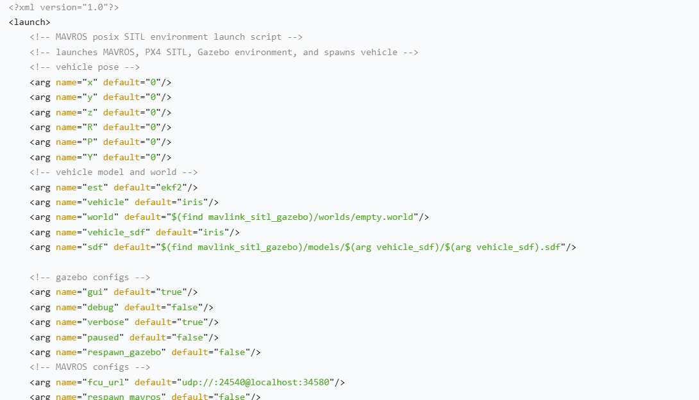
    <div style="margin-top:12px; font-size:1.1em;">px4 mavros_posix_sitl.launch源码第一部分</div>
  </div>

  <div style="flex-shrink:0; flex-basis:100%; text-align:center; max-width:50%;">
    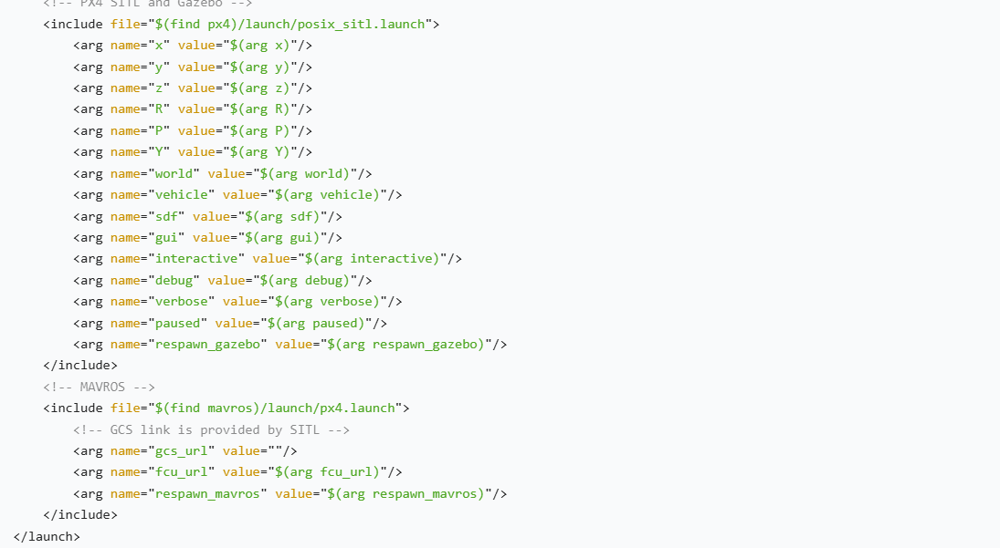
    <div style="margin-top:12px; font-size:1.1em;">px4 mavros_posix_sitl.launch源码第二部分</div>
  </div>
</div>

## 1\.4 执行程序

1. 在**页面2**输入以下命令，启动Gazebo真实位姿获取功能：

```Plain Text
cd fly
source devel/setup.bash
./sh_file/run_groundtruth.sh
```

2. 在**页面3**输入以下命令，启动无人机飞行测试节点，完成仿真飞行控制程序加载：

```Plain Text
cd fly
source devel/setup.bash
./sh_file/fly_test.sh
```

<div style="background-color:#f0f4ff; border:1px solid #c5d0f0; padding:14px 20px; margin:16px 0; border-radius:12px; color:#333; line-height:1.8;">
  💡 <strong>说明：</strong> <code>fly_test.sh</code> 这个shell脚本会先启动px4ctrl控制器，再启动fly test轨迹生成节点。px4ctrl负责接收轨迹指令并计算控制输出，fly_test负责生成测试用的期望轨迹。
</div>

3. 在**页面4**分别输入以下命令，执行无人机自动起飞和自动降落任务：

```自主起飞
cd fly
source devel/setup.bash
./sh_file/takeoff.sh
```

```自主降落
cd fly
source devel/setup.bash
./sh_file/land.sh
```

起飞与降落通过发送以下ROS话题指令实现：

```Plain Text
rostopic pub -1 /px4ctrl/takeoff_land quadrotor_msgs/TakeoffLand "takeoff_land_cmd: 1"
```

<div style="background-color:#f0f4ff; border:1px solid #c5d0f0; padding:14px 20px; margin:16px 0; border-radius:12px; color:#333; line-height:1.8;">
  💡 <strong>参数说明：</strong>
  <ul style="margin:8px 0 0 24px; padding:0;">
    <li><code>takeoff_land_cmd: 1</code>：起飞到指定高度（takeoff.sh设置为1）</li>
    <li><code>takeoff_land_cmd: 0</code>：在当前位置进行降落（land.sh设置为0）</li>
  </ul>
</div>

<div style="display:flex; gap:5px; justify-content:center; margin:16px 0; align-items:flex-start; flex-wrap:wrap;">
  <div style="flex-shrink:0; flex-basis:100%; text-align:center; max-width:48%;">
    
    <div style="margin-top:12px; font-size:1.1em;">启动真实位姿获取节点</div>
  </div>

  <div style="flex-shrink:0; flex-basis:100%; text-align:center; max-width:50%;">
    
    <div style="margin-top:12px; font-size:1.1em;">启动飞行测试节点</div>
  </div>
</div>

<div style="display:flex; gap:5px; justify-content:center; margin:16px 0; align-items:flex-start; flex-wrap:wrap;">
  <div style="flex-shrink:0; flex-basis:100%; text-align:center; max-width:53%;">
    
    <div style="margin-top:12px; font-size:1.1em;">自主起飞指令</div>
  </div>

  <div style="flex-shrink:0; flex-basis:100%; text-align:center; max-width:46%;">
    
    <div style="margin-top:12px; font-size:1.1em;">降落指令</div>
  </div>
</div>

<figure style="flex:1; text-align:center;">
    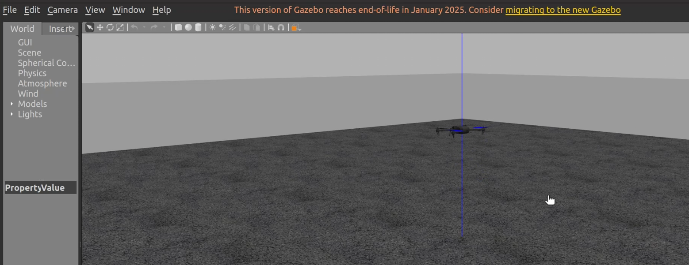
    <figcaption>自主起飞界面</figcaption>
</figure>

## 1\.5 **实操视频演示**

<p >
  <video width="950" controls>
    <source src="https://diffrobots.oss-cn-hangzhou.aliyuncs.com/nju-wiki/9/%E7%AC%AC%E4%B9%9D%E5%91%A8-PX4crtl%20%E8%87%AA%E5%8A%A8%E8%B5%B7%E9%A3%9E%E6%82%AC%E5%81%9C%E5%92%8C%E9%99%8D%E8%90%BD.mp4" type="video/mp4">
  </video>
</p>

# 实践二：PX4 ctrl 8字飞行

本实践将通过设置期望轨迹点，控制无人机按照预定的8字形路径飞行，观察无人机位置、姿态和控制状态变化，掌握轨迹跟踪控制的方法。

## 2\.1 编译fly功能包

1. 打开terminator终端，新建5个页面，用于分别运行不同的程序

2. 在**页面2**输入以下命令进入fly功能包目录：

```Plain Text
cd fly
```

3. 输入以下命令编译工作空间内所有功能包(第八周已经编译过的话，则可以跳过此步骤)：

```Plain Text
catkin_make
```

4. 编译完成后输入以下命令刷新终端环境变量：

```Plain Text
source devel/setup.bash
```
<div style="background-color:#f0f4ff; border:1px solid #c5d0f0; padding:14px 20px; margin:16px 0; border-radius:12px; color:#333; line-height:1.8;">
  💡 <strong>说明：</strong> 与实践一相比，8字飞行需要多一个页面来发布8字轨迹触发指令，因此需要新建5个终端页面。编译和环境配置步骤与实践一完全相同。
</div>


<figure style="flex:1; text-align:center;">
    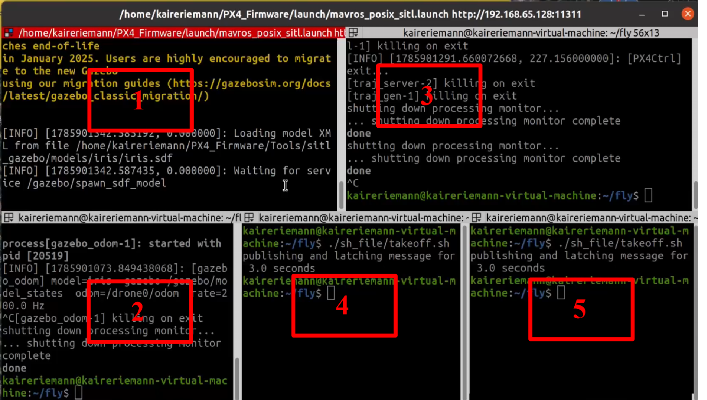
    <figcaption>打开5个终端</figcaption>
</figure>

<div style="display:flex; gap:5px; justify-content:center; margin:16px 0; align-items:flex-start; flex-wrap:wrap;">
  <div style="flex-shrink:0; flex-basis:100%; text-align:center; max-width:39%;">
    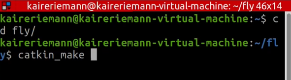
    <div style="margin-top:12px; font-size:1.1em;">编译fly功能包指令</div>
  </div>

  <div style="flex-shrink:0; flex-basis:100%; text-align:center; max-width:58%;">
    
    <div style="margin-top:12px; font-size:1.1em;">刷新环境变量</div>
  </div>
</div>

## 2\.2 启动仿真软件

1. 在**页面1**输入以下命令，启动PX4、ROS和Gazebo无人机仿真软件：

```Plain Text
roslaunch px4 mavros_posix_sitl.launch
```

2. 等待几秒后，查看Gazebo仿真软件是否正常启动

<div style="background-color:#f0f4ff; border:1px solid #c5d0f0; padding:14px 20px; margin:16px 0; border-radius:12px; color:#333; line-height:1.8;">
  💡 <strong>说明：</strong> 启动仿真软件的步骤与实践一完全相同。该命令会一次性启动Gazebo物理仿真环境、PX4 SITL软件在环仿真飞控和MAVROS通信节点。
</div>


<div style="display:flex; gap:5px; justify-content:center; margin:16px 0; align-items:flex-start; flex-wrap:wrap;">
  <div style="flex-shrink:0; flex-basis:100%; text-align:center; max-width:65%;">
    
    <div style="margin-top:12px; font-size:1.1em;">启动PX4、ROS、Gazebo指令</div>
  </div>

  <div style="flex-shrink:0; flex-basis:100%; text-align:center; max-width:33.5%;">
    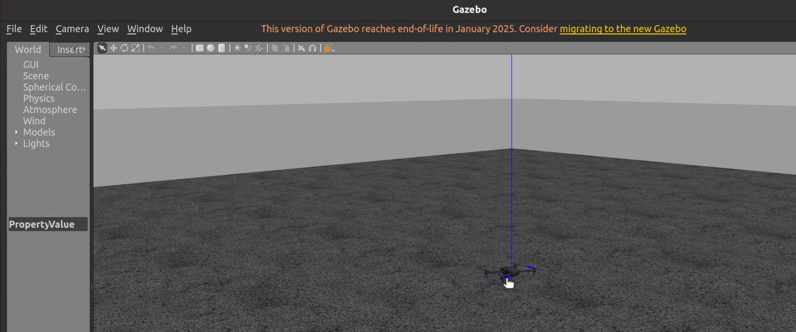
    <div style="margin-top:12px; font-size:1.1em;">Gazebo仿真界面</div>
  </div>
</div>

## 2\.3 执行程序 - 起飞

1. 在**页面2**输入以下命令，启动Gazebo真实位姿获取功能，使仿真环境能够实时获取无人机真实位置与姿态信息：

```Plain Text
cd fly
source devel/setup.bash
./sh_file/run_groundtruth.sh
```

2. 在**页面3**输入以下命令，启动无人机飞行测试节点，完成仿真飞行控制程序加载：

```Plain Text
cd fly
source devel/setup.bash
./sh_file/fly_test.sh
```

3. 在**页面4**输入以下命令，执行无人机飞行自动起飞任务：

```Plain Text
cd fly
source devel/setup.bash
./sh_file/takeoff.sh
```

<div style="background-color:#f0f4ff; border:1px solid #c5d0f0; padding:14px 20px; margin:16px 0; border-radius:12px; color:#333; line-height:1.8;">
  💡 <strong>说明：</strong> 起飞步骤与实践一完全相同。起飞后无人机会上升到预设高度并悬停，等待8字飞行指令的触发。
</div>


<div style="display:flex; gap:5px; justify-content:center; margin:16px 0; align-items:flex-start; flex-wrap:wrap;">
  <div style="flex-shrink:0; flex-basis:100%; text-align:center; max-width:31.5%;">
    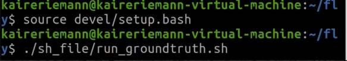
    <div style="margin-top:12px; font-size:1.1em;">启动真实位姿获取节点</div>
  </div>

  <div style="flex-shrink:0; flex-basis:100%; text-align:center; max-width:31.5%;">
    
    <div style="margin-top:12px; font-size:1.1em;">启动飞行测试节点</div>
  </div>

  <div style="flex-shrink:0; flex-basis:100%; text-align:center; max-width:35.5%;">
    
    <div style="margin-top:12px; font-size:1.1em;">自主起飞指令</div>
  </div>
</div>

<figure style="flex:1; text-align:center;">
    
    <figcaption>自主起飞界面</figcaption>
</figure>

## 2\.4 执行程序 \- 8字飞行与降落

1. 在**页面5**输入以下命令，执行无人机8字飞行任务：

```Plain Text
cd fly
source devel/setup.bash
./sh_file/pub_trigger.sh
```

该命令会发布8字轨迹触发信号，fly\_test节点收到信号后开始生成8字形期望轨迹，PX4ctrl控制器跟踪该轨迹，控制无人机飞出8字飞行路径。

2. 等待飞行完毕后，在页面4输入以下命令，执行无人机飞行自动降落任务：

```Plain Text
./sh_file/land.sh
```
<div style="background-color:#f0f4ff; border:1px solid #c5d0f0; padding:14px 20px; margin:16px 0; border-radius:12px; color:#333; line-height:1.8;">
  💡 <strong>观察要点：</strong> 在8字飞行过程中，可以观察无人机的位置、姿态和控制状态变化。注意无人机在8字轨迹转弯处的姿态变化，以及位置跟踪的精度。这有助于理解PX4ctrl位置环控制算法的实际效果。
</div>


<div style="background-color:#edfbeb; border:1px solid #88dd88; padding:14px 20px; margin:16px 0; border-radius:12px; color:#333; line-height:1.8;">
  ✅ <strong>验证：</strong> 发布8字飞行指令后，无人机会从悬停状态开始，沿着8字形轨迹飞行，完成一圈后回到起点并悬停。执行降落指令后，无人机会缓慢下降并安全着陆。
</div>


<div style="display:flex; gap:5px; justify-content:center; margin:16px 0; align-items:flex-start; flex-wrap:wrap;">
  <div style="flex-shrink:0; flex-basis:100%; text-align:center; max-width:32%;">
    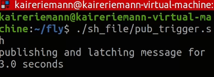
    <div style="margin-top:12px; font-size:1.1em;">8字飞行指令</div>
  </div>

  <div style="flex-shrink:0; flex-basis:100%; text-align:center; max-width:65%;">
    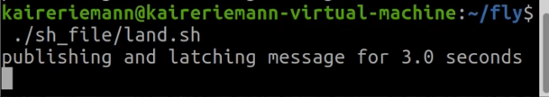
    <div style="margin-top:12px; font-size:1.1em;">自主降落指令</div>
  </div>
</div>

<figure style="flex:1; text-align:center;">
    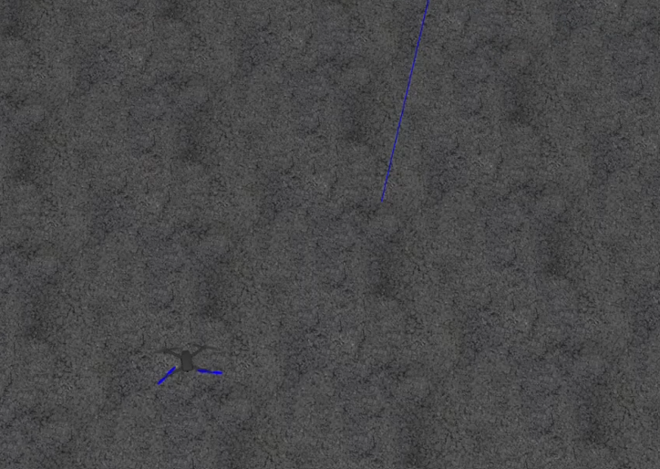
    <figcaption>8字飞行轨迹</figcaption>
</figure>

## 2\.5 **实操视频演示**

<p >
  <video width="950" controls>
    <source src="https://diffrobots.oss-cn-hangzhou.aliyuncs.com/nju-wiki/9/8%E5%AD%97%E9%A3%9E%E8%A1%8C.mp4" type="video/mp4">
  </video>
</p>

# 总结

## 1\.课程要点回顾

本周课程系统学习了PX4ctrl无人机高层控制器，以下是核心知识点回顾：

|模块|核心内容|关键概念|
|---|---|---|
|PX4ctrl代码结构|五层架构、三大核心模块、关键ROS话题|外部接口层、节点调度层、数据管理层、状态决策层、执行输出层|
|状态机FSM|四种飞行状态、状态转移链路、故障保护|MANUAL\_CTRL、AUTO\_HOVER、CMD\_CTRL、AUTO\_TAKEOFF/LAND、FAILSAFE|
|控制算法|PD串级控制、微分平坦映射、推力模型|位置环、速度环、前馈控制、期望姿态、总油门|
|实践操作|自动起飞悬停降落、8字飞行、指点飞行|catkin\_make、roslaunch、shell脚本、ROS话题指令|

## 2\.常见问题排查

**问题1：编译失败，提示缺少依赖包**

解决方法：检查是否已安装所有必要的ROS依赖包，可以运行`rosdep install --from-paths src --ignore-src -r -y`来自动安装依赖。确保工作空间结构正确，功能包目录下有package\.xml和CMakeLists\.txt文件。

**问题2：起飞指令发送后无人机没有反应**

解决方法：检查PX4ctrl节点是否正常启动，查看终端输出是否有报错。确认MAVROS与PX4飞控连接正常，`/mavros/state`话题中connected字段为true。确保无人机已解锁并处于OFFBOARD模式。

**问题3：8字飞行轨迹偏差较大**

解决方法：检查PD控制器参数是否合适，可以适当调整Kp和Kd参数。确认期望轨迹的速度和加速度设置合理，避免超出无人机的动力学限制。检查真实位姿获取节点是否正常运行，位置反馈是否准确。

**问题4：飞行过程中出现FAILSAFE故障保护**

解决方法：查看终端输出的故障原因，常见原因包括定位丢失、通信中断、控制超时等。在仿真环境中，检查Gazebo是否正常运行，位姿数据是否正常发布。确认所有节点都在正常运行，没有意外退出。


